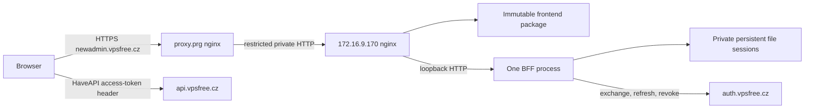

# vpsAdmin WebUI architecture and verification brief

Prepared by architect0 on 2026-09-27 for lead review and implementation assignment.
This document defines the implementation boundaries of the approved
[implementation plan](implementation-plan.md). It records source-based design
and attributes implementation/check evidence where available; it does not
certify independent review, NixOS package builds or deployment.
The operator retains production activation and secret installation.

## 1. Scope, source and decisions for the lead

Implement the existing React/TypeScript frontend and Node OAuth BFF as one
NixOS service instance at `https://newadmin.vpsfree.cz`, alongside the existing
PHP interface. Repair the documented verification, correctness and localization
defects; preserve the existing interaction and mutation safeguards. Keep the
OpenStreetMap/Nominatim behavior unchanged as directed. The source-contained
`docs/design/` handbook is the maintained specification. Root `UI_REDESIGN.md`
is now a compatibility navigation page pointing to that handbook; it is neither
a competing specification nor a missing requirement to recover.

Adoption baselines and source authority:

| Repository | Baseline | Ownership |
| --- | --- | --- |
| `vpsadmin-webui` | `e7ce3d73e799fc60e5933fe23bdb3a979eb4d6b9`, clean session branch `2026-09-27-newadmin-integration` in its canonical session worktree | Frontend, BFF, packages, module, tests and reusable docs |
| `vpsfree-cz-configuration` | `1e8dae229fbe4201b5e1f110721f0f63c4b46944`, clean registered session branch/worktree | Site input/channel, VPS, proxy, DNS, monitoring and operations |
| `vpsadmin` | Services pin `a65a4dfeb92a59df4a80a737a20bcbf8558793ff`; reference head `7045c81b3a5be312eac0d41e8a44f783340abb9f` | Read-only API and terminology authority |
| Workspace | Project-map feature commit `f12ecd1a`; lead owns tracking, publication and review coordination | Coordination only |

The packaging reconciliation below targets combined commit
`9835d077d3cb21f62921039d22c95e184ef65a59`; the primary review checkout
remains at `1949f28689e944554a5dee970ce281a7181b1b73`. Its source comparison
and the lead's locked-toolchain quick/build evidence supersede the adoption
snapshot for packaging implementation. They do not establish deployment status.

The lead reports the new GitHub origin is still empty. Preserve upstream history
and authorship. Registered default branch `main` is metadata, not proof of the
remote's behavior or approval to publish an initial default branch. GitHub may
designate the first pushed feature branch as the default, so a feature-shaped
branch name does not make that first push safe under the workspace integration
gate. Verify remote/default behavior before publication; if no route preserves
the default-branch boundary, obtain explicit user integration approval for the
named repository and target before pushing. Prepare and review local commits
and use local flake override builds meanwhile. Do not enable imported autonomous
issue/deployment runners.

The configuration checkout hook returned nonzero outside its Nix shell because
gems were missing. Subsequent configuration hook setup and commits must run in
`nix develop`; do not bypass Overcommit. Both worktree branches were verified
locally. The architect's initial remote check failed on an SSH configuration
permission check, but the lead subsequently ran a successful
`git ls-remote upstream refs/heads/main`, fetched upstream and fast-forwarded the
clean feature branch from `49c6a51d` to `e7ce3d73`. The architect confirmed the new
local head, clean tracked files and complete four-commit delta. Freshness is
verified at this checkpoint; the earlier transport failure is not a remaining
blocker.

The added commits are `2ee601a` (sidebar release receipt), `ca51e4f`
(self-contained documentation pointers), `17177ab` (documentation-audit fixtures)
and merge `e7ce3d7`. Their source changes in `outageBadges.ts` and `index.css` are
comments only. The delta changes no runtime behavior, BFF/API contract, package
lock, translation catalog or deployment interface. REQ-004 now records the prior
sidebar release; its 256px/full-label behavior remains the accepted baseline.
Do not treat the upstream work log's earlier test receipts as fresh verification
of this session's eventual implementation candidate.

The adoption design audit depended on `git ls-files -z`, which cannot inspect
an ordinary Nix source without `.git`. The committed verification repair now
uses deterministic filesystem enumeration while retaining the root
`UI_REDESIGN.md` bridge, external-reference rejection and symlink checks.
Packaging must preserve the complete audit input and run the audit on the actual
unpacked source. Do not add Git to the BFF runtime or hide source directories to
avoid audit findings. No architecture or deployment redesign is needed for this
upstream delta.

### Material design decisions and constraints

1. **Bounded runtime configuration:** the lead accepted public `/config.json` for
   the new required BFF bootstrap while retaining `/config.js` for compatibility.
   This gives fetch-level cancellation, MIME/size checks and data validation
   without evaluating downloaded JavaScript. Both the BFF endpoint and required
   frontend bootstrap are implemented; package and site routing must preserve
   this interface.
2. **Pagination limits:** `order=asc` alone is not a universal fix. At the site
   API pin, non-admin IP addresses sort by `user_id DESC, id ASC`; interface
   ordering uses IP version/interface order. Accounting uses strict time/byte
   cursors without a tie-breaker. Implement honest bounded/incomplete behavior
   wherever lossless traversal cannot be established. Do not claim all records
   are reachable through an unproven cursor or add backend changes implicitly.
3. **Container profile dependency:** `profiles/ct.nix` resolves the `vpsadminos`
   role. The new host therefore needs `os-staging` as well as `nixos-stable` and
   `vpsadmin-webui`; omitting it breaks evaluation even though no vpsAdmin runtime
   services are required on this VPS.
4. **Existing handbook limits remain real:** pending user-data/IP-history/
   dataset cursor work and the dev soft-delete retention policy are not fixed
   by packaging. A built preview and a fully certified default replacement have
   different acceptance scopes. Keep their limitations in the release receipt;
   do not import rejected backend PR44 or pending dependent frontend PRs.

No implementation blocker prevents starting repository/tooling work. The user
identifies VPS 30431 as a fresh NixOS container on vpsAdminOS and directs 26.05;
use explicit `system.stateVersion = "26.05"` for the candidate. Before activation,
the operator must confirm its first-install value, architecture and network/boot
baseline, as detailed in the site brief. OAuth client
policy/values and actual deployed API revision are needed before live
certification/activation. License/notice intent and initial repository publication
remain lead/owner decisions, not values to invent from the npm manifest. If no
safe branch-only publication route exists, remote-lock configuration builds are
approval-dependent; this does not prevent local implementation and override builds.

## 2. Boundaries and invariants



- The BFF handles OAuth/session transport. It is not a general API proxy.
  `/session.json` deliberately gives the authenticated browser its access token;
  refresh tokens and client/signing secrets stay server-side. API CORS and
  `X-HaveAPI-OAuth2-Token` remain part of the release contract.
- One BFF process owns one local file store. Its queue encloses session load,
  one-use OAuth state consumption, refresh, logout and final save. No cluster
  workers, overlapping service instances, shared filesystem, Redis migration,
  second VPS or sticky-session infrastructure is introduced.
- Backend authorization remains authoritative. UI gates fail closed on unknown
  permissions/states; member ownership, admin My view and support restrictions
  survive refactoring. An error must not become an empty successful result.
- Preserve mutation target/value snapshots, operation locks, accepted-versus-
  completed state, action receipts and uncertain-result reconciliation.
  Authentication recovery, bootstrap retry and reload never replay writes.
- No database schema, API resource, node protocol, CLI, Terraform provider or
  generated fleet configuration contract changes are planned. No coordinated
  update of running vpsAdminOS nodes is required.
- Public configuration contains no credentials. Persistent state, signing keys
  and session tokens never enter the Nix store, build output, browser logs,
  health-check output, traces committed to Git or public release evidence.
- Keep legacy UI/API/auth/console/download routes and the old clankerdev
  deployment intact. The new origin has fresh host-only cookies and browser
  storage; do not widen cookies to share a parent domain.

## 3. WebUI interfaces, packaging and localization

### Flake and packages

Initial supported build system is `x86_64-linux`, subject to confirming VPS
architecture. Do not claim another system merely by listing a flake attribute.
Use a supported pinned Node 24 toolchain from the selected Nixpkgs revision for
both packages and the development shell; confirm exact availability/version
during implementation. Keep CI/local npm on that tested runtime. Reassess the
jsdom/encoding patches against it before retaining any compatibility shim.

| Interface/path | Contract |
| --- | --- |
| `flake.nix`, `flake.lock` | Lock Nixpkgs and `vpsadmin`; expose packages, module, development shell and explicit checks |
| `packages/frontend.nix`, `packages.<system>.frontend` | Separate root-lock `npmDepsHash`; production Vite build; `$out` contains only public `dist/` contents |
| `packages/bff.nix`, `packages.<system>.bff` | Separate `bff/package-lock.json` hash; production dependencies; no npm build phase; executable `$out/bin/vpsadmin-webui-bff` wraps pinned Node and immutable server files |
| `nixos/modules/webui.nix`, `nixosModules.default` | Reusable `services.vpsadmin-webui` module; no concrete site addresses or secret contents |
| `devShells.<system>.default` | Node/npm, repository check/format tools and browser provisioning compatible with the repository Playwright wrapper |
| `checks.<system>.*` | Module, provenance, source and package checks plus a separately identifiable NixOS integration test; retain unit tests in the locked npm lane and avoid running long checks as quick evaluation |

The committed standalone flake pins `inputs.vpsadmin.url` to
`github:vpsfreecz/vpsadmin/a65a4dfeb92a59df4a80a737a20bcbf8558793ff`
as well as recording that revision in its lock. Preserve this explicit API
reference unless a documented prerequisite requires another revision.
Make `vpsadmin.inputs.nixpkgs.follows = "nixpkgs"` when composing the standalone
UI flake, leaving vpsAdminOS's own inputs intact. The site replaces the complete
`vpsadmin` input with `vpsadminServices`; its existing dependency graph then owns
the nested follows. Validate the effective lock graph instead of adding circular
follows or attempting to force all staging/production Nixpkgs inputs together.
Input resolution/source checks must not instantiate the API or a kernel build.

Pass `VITE_BUILD_SHA` explicitly from immutable source metadata; `.git` is absent
from Nix sources. Preserve `build-info.json` schema and provide BFF revision
metadata independently, e.g. under `$out/share/vpsadmin-webui-bff/`. Dirty/local
prototype builds must not advertise a clean release SHA. A clean full commit and
matching frontend/BFF derivations are required for a release receipt. Do not
copy `node_modules`, `.env`, source maps containing private material, deployment
backups or source trees into the public webroot. Build/install dependencies only
in the build environment; deployed hosts do no npm installation or compilation.

### Bootstrap and public runtime contract

Select the required BFF mode at build time (`VITE_RUNTIME_MODE=bff` for
the Nix frontend, already selected by `npm run build`). Do not discover whether
configuration is mandatory from the same optional configuration that may be
missing. Preserve explicitly selected
standalone/legacy development modes and their existing tests; production cannot
enter those modes as an error fallback.

The accepted and implemented public bootstrap contract is:

- Generate one public configuration object in the BFF. JSON returns
  `{schemaVersion: 1, api: {url, version}, webuiNext: {...}}`; keep the existing
  `window.vpsAdmin` assignments in `/config.js` as a projection of that object.
  `webuiNext` contains the current login/logout/password-recovery/passkey fields,
  HaveAPI header/meta settings, root base path and `legacyUrl` when configured.
  Neither endpoint contains session state or tokens.
- Required bootstrap fetches same-origin `/config.json`, rejects redirects,
  validates JSON MIME, a bounded response body (64 KiB) and schema, then fetches
  `/session.json` with same-origin credentials and no-store. Use an overall
  15-second bootstrap deadline with cancellation; a test can inject a shorter
  deadline. Do not leave response-body reads outside that deadline.
- Require valid absolute API/auth/legacy URLs and explicit version/header
  settings; reject credentials embedded in URLs, invalid schemes and unexpected
  cross-origin login/logout/session endpoints. Production origins use HTTPS;
  allow HTTP only through an explicit isolated-test/development option.
- Validate session shape before installing any state. Preserve
  `accessToken`, `sessionKey`, `sessionExpiresAt`, including the all-null anonymous
  form. Never persist BFF access/refresh tokens in browser storage. A successful
  anonymous result clears prior standalone credentials as the current code does.
- Missing, stalled, malformed or wrong-MIME configuration/session responses show
  the existing early bilingual failure surface with an explicit retry. Keep this
  surface independent of lazy locale chunks. Retrying installs only the current
  attempt's validated result; late responses must not restore stale credentials.
  Do not log response bodies or credentials in technical details.

Preserve the implemented startup validation for required URLs, canonical origin,
port and positive bounded durations/limits. Avoid permissive `parseInt` accepting
trailing junk. Revoke URL is required by the Nix production mode. Validate secret
presence/strength and writable session storage before listening, reporting only
the setting name or failure class. Preserve host-only Secure/HttpOnly/SameSite=Lax
cookies, session regeneration, expiry, one-use state and same-origin controls.

### Correctness work and extraction boundaries

Affected source starts at `src/app/runtimeBootstrap.ts`, `src/bootstrap.ts`,
`src/app/config.ts`, `src/lib/auth/bffSession.ts`, `bff/server.js`,
`src/lib/api/{haveapi,networkInterfaces,ipAddresses,networking,actionStates}.ts`
and `src/pages/app/vps/VpsNetworkPage.tsx` with its cards/editors. Find further
critical permission/destructive call sites before changing their decoders.

For collections, return data with explicit completeness/continuation/error
information rather than dropping metadata in `.data`. Use a small domain helper
with page/request bounds, cancellation, ID deduplication, cursor progress checks
and unchanged owner/filter context. Only enable continuation when both selected
ordering and server cursor semantics are established at the pinned API. Sort
complete display data locally when necessary; do not page on a display sort.

Evidence at `a65a4dfe`:

| Resource | Source contract | Implementation consequence |
| --- | --- | --- |
| Network interfaces | HaveAPI adds the ID predicate but no ordering; neither the resource nor model supplies an order | No proven ID traversal at this pin; use the bounded completeness contract in the collection-correctness addendum |
| Host IP addresses | `asc` orders by ID; `interface` orders by IP version/interface order | Use the proven ID path for traversal; preserve display grouping separately |
| IP addresses | Admin `asc` is ID; non-admin `asc` prepends owner grouping; `interface` is not ID order | Do not equate `asc` with global ID order for member/support responses |
| Network accounting | `from_date` or `from_bytes`; strict comparisons on nonunique values | Do not reuse an ID paginator or certify totals from a capped response |

When the API cannot prove a complete collection, show a localized partial-data
state, suppress complete-total claims, and prevent controls whose safety depends
on the missing membership/availability data. Offer only supported filtering or
bounded refresh paths; do not promise a Load more path that skips rows. A capped
result with unknown continuation remains potentially incomplete. Test newly
created-object discovery through supported direct fetch or refreshed filters;
absence from a partial list is not proof a write failed. A lead decision is
required if supported member behavior cannot meet this bounded contract.

Decode positive resource IDs, permission booleans, known states and mutation
receipts at adapter boundaries. Model unknown state explicitly. Extract network
queries and cohesive operation editors/hooks without building a universal
workflow engine. Keep query keys with adapters and keep operation-specific
snapshots, locks and reconciliation visible and testable.

### Localization authority and coverage

Add `docs/agent-instructions/localization.md` and its AGENTS route in the same
work package as the locked input. Require resolving the input from the UI flake,
reading its `docs/i18n-cs.md` and relevant localization procedure, and recording
the exact revision. Validate this example from the finished flake:

```sh
vpsadmin_source=$(nix eval --raw --impure --expr \
  '(builtins.getFlake (toString ./.)).inputs.vpsadmin.outPath')
cat "$vpsadmin_source/docs/i18n-cs.md"
```

Do not apply vpsAdmin's PHP gettext/YAML regeneration commands to TypeScript
catalogs. Do not copy a second glossary or silently use a floating/sibling source
if input resolution fails. This design read the guide at the services pin;
implementation records its own effective pin, including the site override.

Use the TypeScript compiler API to inspect literal catalog definitions before
spread/composition: both quote styles, all module exports, duplicate keys,
en/cs key sets, placeholders and plural categories. Reject nonliteral definitions
the checker cannot interpret rather than silently ignoring them. Runtime parity
alone cannot detect overwritten duplicates. Fix L1–L14 from
[translation-review.md](translation-review.md), including the rendered
`{n}`/`{count}` mismatch, conflicting mailer key and Login/Nickname test.

Track editorial coverage by every catalog module and BFF/early-bootstrap/lazy
error copy. Use `tc` where inflection is needed, testing 0/1/2/4/5/11 and applicable
fractions. Preserve runtime placeholders, URLs, units, keyboard/accessibility
labels and operation semantics. Keep API-provided transaction labels authoritative.
Use informal singular Czech explanations and infinitive action labels; distinguish
Shutdown/Vypnout from Poweroff/Vynutit vypnutí after checking the action.

The implementer owns catalog mechanics and agreed wording edits; the lead owns
the final context-aware English/Czech writing pass with the writing skill. The
reviewer checks terminology/fidelity and coverage. Follow the KB impact workflow,
recording that current legacy PHP captures do not certify the React preview.
Assess/add independent UI/API bindings only within lead-approved KB scope;
retain legacy evidence and do not publish pages or replace screenshots silently.

## 4. Reusable NixOS service contract

The module owns an nginx static/BFF vhost and
`vpsadmin-webui-bff.service`. Keep the existing `vpsadmin.webui` PHP options
separate. Proposed stable options under `services.vpsadmin-webui`:

| Option | Meaning/default |
| --- | --- |
| `enable` | Enable this service, false by default |
| `frontendPackage`, `bffPackage` | Matching flake packages, explicitly overridable |
| `publicOrigin` | Required canonical HTTPS origin; derive nginx host and exact `/oauth/callback` URI |
| `api.url`, `api.version` | Required endpoint/version; site uses `https://api.vpsfree.cz`, `7.0` |
| `oauth.authorizeUrl`, `tokenUrl`, `revokeUrl`, `passwordRecoveryUrl` | Explicit provider endpoints; site values from the runbook |
| `oauth.scope`, `oauth.type` | `all`, `web_server` |
| `legacyWebuiUrl` | Optional URL exposed as `webuiNext.legacyUrl`; site sets legacy origin |
| `haveApi.authHeader`, `haveApi.metaNamespace` | `X-HaveAPI-OAuth2-Token`, `_meta` |
| `environmentFile` | Required absolute **string** path read by systemd at runtime; never a Nix path value or `readFile` |
| `cookieName`, `bffPort` | `vpsadmin_webui_session`, `3001`; BFF binds `127.0.0.1` |
| `nginx.enable`, `nginx.listenAddress`, `nginx.port` | true, loopback by default, 80; site selects private address |
| `nginx.trustedProxyAddresses` | Exact trusted edge addresses/CIDRs, empty by default; required for external forwarded HTTPS |
| `nginx.allowedClientAddresses` | Backend source allowlist, separate from proxy trust; default loopback |
| `security.consoleOrigins`, `security.frameOrigins` | Reviewed extra origins required by the deployed API/integrations; no blanket `https:`/`wss:` default |

Validate option combinations and reject unsafe/malformed origins/ports. Secret
variables `OAUTH_CLIENT_ID`, `OAUTH_CLIENT_SECRET`, `SESSION_SECRET` come only from
the operator environment file; public settings are generated by the module.
Document systemd environment-file syntax and precedence. The packaging addendum
below records the exact option-to-environment mapping. No generic public
`extraEnvironment` secret escape hatch is needed for the initial contract.

Use the fixed `StateDirectory=vpsadmin-webui` and dedicated system user/group
`vpsadmin-webui-bff`; there is no public state-directory option. Keep restrictive
state ownership, `StateDirectoryMode=0700`, `UMask=0077`, one Node process and
automatic restart on failure. Start after networking and create
`/var/lib/vpsadmin-webui/sessions` with mode 0700 and the dedicated owner before
BFF execution. Before first activation, the operator must verify the reserved
path's absence or existing BFF ownership and its mount/symlink identity, as
specified in the runbook. Creating only the StateDirectory parent is
insufficient: startup requires the child to exist and rejects a symlink in its
place. Ensure storage is writable.
Use `NoNewPrivileges`, empty capabilities, private temporary files/devices,
`ProtectSystem=strict`, `ProtectHome` and suitable kernel/control-group protection.
Test the sandbox with Node; do not enable `MemoryDenyWriteExecute` without proving
JIT compatibility. Add no compiler, database, PHP, Redis or RabbitMQ service/build
dependency to the BFF runtime. Verify the realized Node/wrapper closure before
claiming that it excludes shells or npm. The state directory is outside that
closure.

Systemd reads `/private/vpsadmin-webui.env` as root. The service user need not read
`/private` directly. Missing files/placeholders/invalid secrets must fail startup
without printing their values. First installation creates new state; packaging
does not migrate or copy sessions from the old hostname. Restarts retain state
and the stable signing secret. Service shutdown/restart must not overlap two
writers to the store.

## 5. nginx routing, headers, assets and proxy trust

| Request | Backend handling and cache contract |
| --- | --- |
| `/`, application deep links | Current `index.html`; revalidate (`no-cache`), never immutable |
| `/build-info.json` | Static JSON, revalidate, exact-file 404 |
| `/assets/*`, favicon and other declared static files | Exact-file lookup; hashed assets immutable; missing assets 404, never SPA HTML |
| `/config.json`, `/config.js` | Exact BFF routes, JSON/JavaScript MIME respectively, no-store, nosniff |
| `/session.json` | Exact BFF route, same-origin JSON, no-store, CORP same-origin and current Vary contract |
| `/oauth/` prefix | BFF; no SPA fallback, no caching; keep redirects, errors and Set-Cookie |
| `/healthz` | Exact BFF route; small anonymous liveness response; no credentials or readiness overclaim |
| `/config.local.js` in production | 404; never load a local override in required BFF mode |

Treat `/oauth` without the trailing slash explicitly (reject or canonicalize
without losing query data); it must not become a successful SPA route. Keep proxy
timeouts slightly longer than bounded provider requests so error responses can
reach the browser. Do not add proxy caches to auth/config/session paths.

Normalize the two-hop path instead of increasing Express's numeric hop count:

1. Edge vhost overwrites `Host` and `X-Forwarded-Host` with the canonical host,
   sets `X-Forwarded-Proto=https` on the TLS path, and sets a **single**
   `X-Forwarded-For=$remote_addr`. Drop untrusted `Forwarded`/alternate identity
   headers. Do not append client-supplied forwarding chains.
2. Backend accepts the edge only from its metadata-resolved address
   (`172.16.9.140` at this baseline). Trusted scheme values are exactly `http` or
   `https`; malformed/comma-separated values fail. Resolve client IP only from
   that peer's normalized header, then emit one normalized address to the BFF.
   Non-edge health-check callers cannot assert HTTPS/client identity.
3. BFF trusts loopback nginx only (address-based `loopback` is preferred), and
   remains bound to loopback. It receives the public HTTPS scheme and real client
   address even though the edge/backend transport is HTTP. No arbitrary trust
   of the entire private address range or `trust proxy=true`.
4. Audit the *rendered* nginx config for duplicate `proxy_set_header` directives:
   the edge already enables `recommendedProxySettings`. Use per-location
   overrides/default disabling as needed to emit exactly one intended value.
   Apply backend ACLs to the original socket peer if nginx real-IP rewriting is
   enabled; an ACL on rewritten `$remote_addr` can reject legitimate clients or
   admit spoofed peers. Test that interaction explicitly.

This follows the [Express proxy trust contract](https://expressjs.com/en/guide/behind-proxies/).
The approved private HTTP hop assumes the internal network is suitable for
bearer/session traffic; confirm that deployment assumption. If transport
encryption is required, route that scope change through the lead.

The backend owns the application CSP; the edge owns TLS/HSTS. Preserve nosniff,
frame/referrer and BFF response-specific headers through both layers. Avoid a
second blanket CSP that intersects incorrectly with the passkey page's
response-specific OAuth-origin policy. Repeat required security headers in
locations that override nginx `add_header` inheritance and test final responses,
including errors.
Retain the existing inline bootstrap hash generation/audit. Permit the exact
Nominatim and OpenStreetMap origins already needed by the accepted behavior;
mock them in tests. Console/download origins require actual pinned API evidence.

OAuth callback query strings contain credentials. Disable access logging for
`/oauth/` at **both** hops or use a dedicated format without query strings,
Referer or credentials. Never log session bodies, authorization headers or
upstream token responses. Health checks record status/MIME/shape, not bodies
containing a logged-in session.

Choose tested user-driven chunk recovery for the initial service instead of a
mutable asset retention cache. `lazyRoute.tsx` already recognizes missing chunks;
complete bilingual handling for route, locale and bootstrap chunks. An old tab
gets a useful reload action, never an automatic mutation retry or reload loop.
Warn before discarding an unsaved draft where applicable; retain existing
persisted uncertain-operation locks across a chosen reload. An immutable Nix
generation alone does not serve old asset URLs. Exercise upgrade *and rollback*
with an already-open tab before accepting this policy.

## 6. Site configuration and dependency ordering

The site implementation brief at the end of this document records the inspected
configuration conventions, exact remaining files and local build procedure.

In configuration `flake.nix`, add input `vpsadminWebui` with Nixpkgs following
`nixpkgsStable` and `inputs.vpsadmin.follows = "vpsadminServices"`. Add channel
`vpsadmin-webui` mapping role `vpsadmin-webui` to `vpsadminWebui`. The existing
channel named `vpsadmin` maps to `vpsadminServices`; do not follow a nonexistent
input named `vpsadmin` or move the production/staging API pins.

Source-to-site ordering is mandatory because the canonical origin is empty:

1. Commit and review the WebUI feature candidate, preserving its upstream
   history; quick checks must pass before independent review.
2. Before **any first push**, inspect the canonical remote's branch/default
   state and establish whether publishing the candidate will designate its
   branch as default. A missing remote HEAD or empty branch list does not prove
   a safe branch-only route. Do not test the behavior with a real push, bootstrap
   another branch or change the default as a workaround for the approval gate.
3. If evidence establishes a branch-only route that leaves default branches
   untouched, publish the reviewed feature revision through that route. Otherwise
   stop publication until the user explicitly approves integration of
   `vpsfreecz/vpsadmin-webui` into the named target default branch; record that
   approval before executing it. Review, build or implementation approval does
   not supply integration approval. Verify both the published head and actual
   remote default after an authorized publication.
4. Introduce the configuration input/channel mapping. Once publication is
   authorized and complete, use the published ref in the source URL if the
   fetcher needs it; verify the exact commit is fetchable in a clean context.
5. Inside the configuration worktree's `nix develop`, pin the published commit:

   ```sh
   confctl inputs channel set --commit vpsadmin-webui vpsadmin-webui FULL_WEBUI_COMMIT
   ```

6. Inspect the generated lock diff, including the effective
   `vpsadminWebui.inputs.vpsadmin -> vpsadminServices` follows and unrelated-input
   stability. Record the published UI SHA, effective API SHA and configuration
   SHA, then build the exact feature configuration.

Keep generated input commits separate from functional changes and preserve
their generated messages. Repeat the publication-boundary check and publish/pin
sequence after a material UI fix. Do not manually edit the lock or invent/publish
`main` to make Nix fetch succeed.

While publication is pending, continue package/module/VM and site configuration
evaluation/builds with a local flake input override using the supported Nix/confctl
mechanism. Preserve `vpsadminWebui.inputs.vpsadmin.follows = "vpsadminServices"`
in that composition and verify the effective source/API revisions. Record the
committed local source, override arguments and build scope; do not commit local
paths into the deployable lock or describe override results as remote-lock
certification. If no safe branch-only route exists, mark final remote-lock builds
as awaiting explicit integration approval, not as a failed build or a reason to
stop independent local work. After authorized publication, regenerate the pin
through confctl and validate the final remote-lock configuration. Subsequent
normal published updates use `confctl inputs channel update --commit` through
the same channel.

| Files | Required implementation |
| --- | --- |
| `flake.nix`, generated `flake.lock` | New input/channel and isolated confctl-managed published revision; local overrides before publication |
| `cluster/cz.vpsfree/vpsadmin/int.vpsadmin-webui1/module.nix` | `spin=nixos`, VPS 30431, `172.16.9.170/32`, host `vpsadmin-webui1.int.vpsfree.cz`, `nixos-stable`/`os-staging`/`vpsadmin-webui` channels, node exporter, manual-update tag, service checks |
| Same host `config.nix` | Import `environments/base.nix`, `profiles/ct.nix` and the input's UI module; resolve `flakeInputs.${inputsInfo."vpsadmin-webui".input}`; pass matching packages/public settings and explicit `system.stateVersion = "26.05"`; confirm first-install value and networking before activation |
| Generated `cluster/cluster.nix` | Register the new machine through `confctl rediscover`; inspect its netboot-list hook and preserve unrelated generated entries |
| `cluster/cz.vpsfree/containers/prg/proxy/config.nix` | Metadata-resolved backend, new HTTPS/ACME vhost, normalized forwarding and credential-safe logging |
| Proxy `module.nix` | Local HTTPS static and BFF checks for the new host, keeping current checks |
| Both `configs/{public-dns,internal-dns}/zone.vpsfree.cz.` | `newadmin IN CNAME proxy.prg.vpsfree.cz.` and increased serial |
| Internal zone only | `vpsadmin-webui1.int IN A 172.16.9.170`; no invented backend AAAA |
| `health-checks/vpsadmin-webui.nix` | Separate new-service checks for nginx/BFF unit state, static provenance, liveness and anonymous session shape |
| `modules/clusterconf/monitor/http.nix` and `rules/vpsadmin.nix` | New static/BFF probe entries and alert mapping, plus BFF service alert; retain PHP checks |
| `tests/prometheus/newadmin-rules.{nix,yml}`, `flake.nix` check output | Focused alert fixtures for failed/missing service, missing scrape, endpoint failure and certificate expiry |
| Site `docs/operations/` and `mkdocs.yml` | Reusable installation/settings/monitoring/recovery procedure and index link |

Do not import `../common/all.nix` or `../common/webui.nix` on the new host: these
pull vpsAdmin overlay/service defaults intended for the old service group.
The container profile's OS input is sufficient. Restrict private port 80 to the
edge plus explicitly chosen health-check sources; keep port 3001 unreachable
off-host. Default module loopback access is not permission to open port 80 to
the entire management network. Preserve required SSH/node-exporter policies.

Monitoring must distinguish static availability, BFF liveness and actual login
certification. Public probes for `/build-info.json` (or a stable frontend marker)
and `/healthz` need body/status checks and explicit TLS-expiry coverage; the
inspected configuration has no certificate-expiry alert to inherit. Add their
names to the existing explicit alert map; adding a probe alone does not ensure
an alert. Ensure node-exporter includes the BFF unit. Test a stopped/missing unit
and absent scrape series as well as ordinary failure, without inventing token-
collecting synthetic login monitors.

DNS consumers/build targets, subject to final diff confirmation:

```text
cz.vpsfree/vpsadmin/int.vpsadmin-webui1
cz.vpsfree/containers/prg/proxy
cz.vpsfree/containers/ns1
cz.vpsfree/containers/prg/int.ns1
cz.vpsfree/containers/brq/int.ns1
cz.vpsfree/containers/prg/int.mon1
cz.vpsfree/containers/prg/int.mon2
```

Public secondaries receive zone transfers; verify propagation rather than
deploying unrelated machines. Both monitors also consume the internal zone.
No wildcard cluster build/deploy is necessary.

## 7. Compatibility, activation and recovery

| Boundary | Supported transition/recovery |
| --- | --- |
| Old PHP/new UI | Coexist at distinct origins; preserve old deep links, routes and maintenance access |
| Browser/BFF | Retain `/config.js` and session JSON shape; adding the JSON route preserves older clients. The current JSON decoder rejects unknown fields, so future schema extensions need coordinated compatibility handling. Upgrade BFF before relying on the new frontend; switching paired generations can briefly require reload |
| Browser state | Preserve existing preferences/tasks/locks formats and identity scoping; new origin starts fresh. No new broad domain cookie or storage migration |
| File sessions | Preserve current file/session shape, owner and secret on restart/rollback; incompatible changes need versioning or deliberate reauthentication |
| UI/API | Source compatibility target is pinned, site override recorded separately, deployed revision verified separately. No claim of arbitrary old/new API compatibility |
| Config/NixOS | New option namespace is independent of legacy modules; explicit source and OS pins; fresh-host stateVersion `26.05` verified before activation and retained across later upgrades |
| DB/node/clients | No migration or protocol change and no coordinated fleet update |

Keep exact frontend/BFF/config/API revisions, derivations and previous system
generations in the rollout receipt. The frontend SHA does not prove BFF or API
provenance. API feature probes/real tests must cover current settings PUT,
action states, networking, permissions, OAuth/recovery/passkeys, console and
downloads. Missing capability is a documented incompatibility, not permission
for an invented request or an unapproved backend fix.

The [deployment runbook](deployment-runbook.md) remains proposed until matched
to implemented options and tested commands. Operator sequence: confirm VPS and
network/OS facts, install root-only environment file and dedicated OAuth client,
retain generations, dry-activate exact machines, activate UI VPS and verify the
private path, publish both DNS views, activate edge/ACME, then complete public
acceptance. DNS must reach the edge for HTTP ACME validation. Monitoring may see
a short expected outage during this sequence; account for it operationally.
Agents may prepare/build isolated candidates; they do not activate, install
secrets, register a client or perform a production login under this assignment.

Use callback `https://newadmin.vpsfree.cz/oauth/callback`, login-start URI
`https://newadmin.vpsfree.cz/oauth/login`, a nondefault client with refresh-token
issuance, and the site's approved token/SSO policy. Password recovery uses
`https://auth.vpsfree.cz/oauth2/password-reset`, while OAuth token/authorize/revoke
use the inspected `/_auth/oauth2/` routes. Passkey relying-party origin remains
the authentication origin. Verify these contracts against the deployed API.

For software rollback, restore the recorded paired frontend/BFF/config generation
and compatible live sessions. Do not restore old session snapshots over rotated
refresh tokens. If recovery cannot preserve the session contract, deliberately
invalidate sessions and reauthenticate. A UI rollback cannot undo API mutations.
First-install rollback disables/reverts the new service/vhost and preserves
legacy access. DNS rollback republishes previous contents with a **higher**
serial; blindly activating an old zone serial is insufficient. Retain branches,
VPS and session records; no lifecycle cleanup is part of this handoff.

## 8. Acceptance and verification plan

### Quick checks before committed-change review

Run known short checks in each repository's declared Nix shell. Long or uncertain
dependency installs/suites/builds go to a fresh watcher under the monitor skill.
No tests/builds were launched by this design assignment.

1. Clean locked dependency installs; exact Node/npm/browser provisioning recorded.
   Lint with incremental React Hooks/accessibility rules and formatter checks;
   types for source, tooling/config/E2E boundaries and checked BFF interfaces.
2. Full catalog-definition integrity and design-documentation checks; focused
   bilingual rendered count/login/action cases; startup validation, required
   bootstrap failures, session races and collection completeness regressions.
   Preserve the root redesign navigation page and external-reference rejection;
   exercise the documentation audit without `.git` as well as in a checkout.
3. Nix syntax/format and module evaluation for disabled/enabled states,
   invalid/missing options, exact secret-path handling, effective vpsAdmin
   follows and independent PHP module coexistence. No build for a syntax check.
4. Zone validation with the repository environment's tools, serial increase and
   intended record checks; inspect rendered nginx headers/routing; Prometheus
   rule validation and focused alert tests where rules change.
5. Required repository hooks active/passing. Fix the configuration shell/hook
   setup. Inventory complete final commits/diff, superseded approaches and
   **no migrations**, then pass the committed candidate to mandatory independent
   review before long integration verification. This brief is not that review.

The required CI contract must include production build, design/architecture
audits, lint/types, localization, script/BFF/unit tests. Preserve meaningful
structural limits; use narrow justified exceptions or refactor rather than
silently resetting the baseline. Correct UI-string test-fixture classification
without reducing product coverage. Install Chromium in every job that starts
it, including script tests, and use the repository wrappers. Pin worker count
(start with two) and run desktop/mobile as independent stages. Diagnose all
29 recorded browser failures against the current source; five passing reruns
are not resolution of the other 24. Check official upstream versions before
adding/changing GitHub Actions dependencies.

### Longer checks after independent review

Use fresh policy-selected Luna/low verification watchers for authorized builds,
browser suites, CI and VM/real-API runs. Lead handles diagnosis/retries and
acceptance; watchers do not edit or deploy. Stop an unexpected local kernel
build and investigate cache/provenance under the verification procedure.

| Check | Required evidence |
| --- | --- |
| Immutable packages | Frontend and production-only BFF build from locked source; no host npm; matching provenance; no secret/source leakage in public output |
| Production browser smoke | Built assets through packaged nginx/BFF; deep links, assets and 404s; both languages, desktop/mobile, focus/keyboard/errors; source CSP audit plus emitted-header behavior |
| NixOS topology VM | Edge TLS → private nginx → loopback BFF with mock OAuth; real forwarded scheme/IP, spoof resistance, backend ACLs, no duplicate headers, secure cookie/callback, one-use state and canonical host |
| Session/state VM | Concurrent refresh/logout, stale responses, anonymous/no-origin/cross-origin requests, provider timeouts, malformed replies, missing secrets, store permissions and restart persistence; no cross-user cache leakage |
| Upgrade/rollback VM/browser | Open old tab, switch package generations, lazy route/locale failures and controlled reload; unchanged state loads after restart/rollback; no automatic write replay |
| Real pinned API | Owned isolated cluster, exact UI/API pins, member/support/admin scopes, >100 interfaces/>250 addresses, adversarial ordering/ties, incomplete states, settings, OAuth/recovery/passkeys, action receipts, console/download |
| Data preservation | Synthetic payload/checksum survives each tested restore/migrate/data-preserving storage operation; uncertain/rejected writes are not resubmitted blindly |
| Site machines | Local override builds may proceed before publication, with exact source/API provenance recorded. Final `confctl build` of each target uses the remote-lock feature configuration and depends on authorized publication; closure/config diff shows no unrelated service changes |

Use bridge networking for the owned isolated cluster. Never run historical live
scripts against shared dev/production endpoints by default. Mock external maps
in fixtures without changing product calls. Record browser support separately;
Chromium desktop/mobile evidence does not certify Firefox/WebKit. Measure initial
and route/locale payload performance before setting a small documented budget.

Acceptance is complete when the intended commits and documentation are reviewed,
required checks and exact machine builds pass, translations have recorded full
module coverage, remaining unsupported API behavior is explicitly scoped, and
the operator has a tested runbook/rollback receipt. Production operation and
default-interface readiness remain separate claims. Merge approval is separate
from implementation/build/review approval.

## 9. Implementer work partition and handoff

The retained implementer owns application/configuration edits. Lead owns
coordination, material scope decisions, final language pass and acceptance;
architect owns this brief/prototypes and clarifications. Use bounded work
packages with reviewable commits:

| Subsystem | Deliverable | Dependency/exit |
| --- | --- | --- |
| Source and toolchain | Repository identity/provenance, flake/input/dev shell, locked-guide AGENTS route, source-contained docs | Confirm baseline/import scope; restore reproducible tool/hook setup; no activation |
| Verification tooling | Required checks, archive/Nix-safe documentation audit, AST i18n validation, runtime/tooling type/lint boundaries, justified structural fixes | Baseline failures classified and focused checks green; preserve external-reference rejection and declared fixture dependencies; no blanket suppression |
| BFF and bootstrap | Preserve implemented configuration validation and accepted JSON route; exact auth/state tests | Compatible JS/session endpoints retained; production bootstrap validated |
| Collection correctness | Collection completeness, critical decoders, cohesive network hooks/editors | Owner/order/cursor evidence and honest partial results; mutation invariants covered |
| Localization | Full catalog/BFF/bootstrap copy pass and rendered regressions | Mechanical catalog checks, pinned vocabulary; lead editorial pass and KB impact record |
| NixOS packaging | Frontend/BFF derivations, reusable service, nginx/CSP/proxy contract, VM/browser test definitions | Stable source/toolchain and BFF interfaces; no real secrets; tests are prepared before review and run in the required order |
| Site integration | Site input/channel, host/proxy/DNS/monitoring and operations docs | Local override work can proceed; final remote pin requires verified safe publication or explicit integration approval; confirmed host facts before activation-ready config |
| Release verification | Whole-branch review, isolated integration/package/machine builds, final operator bundle | Local and remote-lock evidence distinguished; remote-lock completion gated on authorized publication; known limits and rollback proven; user deploys |

Verification tooling, BFF/bootstrap and collection correctness can be separate
bounded assignments after source/toolchain setup; avoid simultaneous edits
to shared catalogs/bootstrap/BFF files. Site integration depends on stable module options,
not completion of every unrelated language edit, but final machine builds must
use the final reviewed UI revision. Keep input-generated commits separate.

Update the WebUI handbook's architecture/API/verification/operations/decisions,
`WORK_LOG.md` and applicable REQ-009/056–066 statuses with implementation, keeping
prepared/tested/deployed distinct. Put reusable site operations in configuration
docs; keep exact rollout revisions/results in the session runbook/receipt.
The lead should link this brief from `state.md` and `portal.yml` and retain its
normal tracking cadence; this architect assignment edits only `design.md`.

Design verification performed: identity/env match, required workspace procedures,
affected repository guidance and source/document cross-checks. Local branch and
baseline checks passed; no application/config files changed. Lead verified remote
freshness at `e7ce3d73`; architect reviewed the four added commits and recorded the
Nix documentation-audit implication above. `report_to_lead` is not exposed in this
thread's tool catalog; the final report must be delivered through the available
team channel when the lead resumes, without pretending that tool ran.

Stable session portal:
https://vpsfree-cz.workspace.aitherdev.int.vpsfree.cz/2026-09-27-newadmin-integration/

## Verification repair at the source-adoption baseline

Inspected `2fad90b0d3cdc629d81b4d2ed3656e67b17f4fa3` on 2026-09-27 while
implementer0 owned catalog integrity. This historical brief records the bounded
verification proposal at that revision; the packaging reconciliation below
records the later committed-source state. During this investigation, no workflow,
application or test was edited and no long check was started. A read-only
calculation from that commit's Git archive reproduced the structural scanner's
metrics in under one second: **892 casts / 63 files over 500 lines / 7 over
1,000**, against baseline **1,156 / 53 / 9**, with **44 files** violating one or
more per-file rules. The totals improving in two dimensions do not cancel the
per-file regressions. Tests remain part of the measured `src` population.

### Structural policy and bounded scope

Keep `scripts/fixtures/structural-baseline.json` and the existing rule meanings.
Do not regenerate the baseline, exclude test files, count fewer kinds of casts,
raise the global 500-line allowance to 63, or substitute a changed-files-only
check. Add complete machine-readable violation output: the current console
report truncates each category to eight files and cannot serve as the debt
inventory. Include rule, path, old/current metric and aggregate excess.

The verification assignment repairs the gate, not 44 unrelated controllers.
Submit the inherited violations to the lead/reviewer as explicit debt dispositions.
Prefer fixing small causes in separately assigned application work; the collection
correctness assignment owns substantive network/controller extraction. If temporary
exceptions are accepted, put them in a separate reviewed ledger, not in the
baseline: exact path/rule, adoption source revision and content hash, bounded
metric allowance, concrete rationale, owner
and removal condition. No wildcard, global catch-all or automatic acceptance of
all 44 files. Report raw failures and accepted exceptions separately. A source
change invalidates its inherited exception until debt is removed or the narrow
change is reviewed; stale/resolved/deleted-path entries fail validation and must
be removed. Derive any aggregate adjustment solely from active reviewed entries
and continue checking both global and per-file rules. Do not allow a removed
exception to create spare allowance for another file.

Lead acceptance of such a ledger is a prerequisite to a green structural gate
with remaining inherited debt. Until then, keep the gate visibly failing rather
than labeling the baseline repaired. Add focused audit tests for new casts,
threshold crossing, growth, unlisted paths, changed/expired-by-condition entries,
resolved debt and global masking. Keep automatic baseline writing outside CI.

### One check contract with distinct execution costs

Define the following package-script/job mapping and document it in
`docs/design/VERIFICATION.md`; make `ci:pr`/`ci:check` use the same required
non-E2E set rather than maintaining different audit lists. Local aggregate
commands may require prepared Chromium, but the quick command must not.

| Lane | Required contents and execution |
| --- | --- |
| `ci:quick` | Environment, design docs, lint/types, catalog-integrity checks, CSP and all currently declared architecture audits, including structural and UI strings. No browser launch, dependency install or production build. Use narrow test-fixture classification for the known UI-string false positives. |
| Unit/script/BFF | Existing unit and nonbrowser script suites plus BFF tests; keep full coverage. Treat aggregate suite duration as measured/uncertain and use a watcher locally. |
| Production build | Explicit `npm run build` required by PR/release CI; record build SHA. This is currently absent from all four workflows. |
| Browser script regression | Move `live-vps-certification-browser-proxy.test.mjs` into an explicit `scripts/browser-tests/` bucket, adjust only imports, and run it in a provisioned required job. Preserve its no-redirect/no-write-replay assertions. Ensure script-test selection covers every test exactly once across both buckets. |
| PR desktop/mobile | Independent matrix entries invoking `e2e:pr:desktop` and `e2e:pr:mobile`, `fail-fast: false`, two workers each. Avoid the current `&&` chain that hides mobile after desktop failure. Distinct report/artifact names per project. |
| Release | Same non-E2E gates plus separately reported broad desktop/mobile, later packaged frontend/nginx/BFF smoke and pinned-API/VM evidence. Existing nightly/full tests supplement these gates. |

Run short focused audit tests and relevant static checks before committed-change
review. Only after mandatory review launch long browser/build/integration
verification through fresh policy watchers. A job named quick is not a waiver
of the one-minute rule: measure it and delegate if it becomes long. Do not raise
retry/time limits or remove assertions to resolve the 29 historical failures;
preserve first-attempt diagnostics and record their actual causes. The verification
repair prepares and validates orchestration; it does not certify all browser
failures resolved.

### Toolchain, browser and Action versions

All workflows currently select Node 22 and globally force npm 9.9.4 despite
the adopted Node 24 shell. Use `node-version-file: .node-version`; align
`.node-version` and `.nvmrc` to the exact locked Nix Node version
(lead verified **24.21.0**),
and remove the unrelated npm downgrade. Record/check the bundled npm version
in both environments; resolve any mismatch deliberately rather than silently
running different installers. Keep `npm ci` and both dependency audit thresholds;
cache keys for jobs installing the BFF must include both lockfiles. Registry
advisory audits are online CI evidence, not a hermetic Nix check.

The wrapper claims Playwright is outside the lock, but the adoption source
already locks `@playwright/test` **1.61.0**. Make `scripts/playwright.mjs` invoke that installed
CLI without `npx -y` downloading another graph; check `e2e/PLAYWRIGHT_VERSION`
against the installed/locked version and reject mismatch. Keep its existing
shortcut and explicit local-container behavior. Every job that launches Chromium
must run `npm run e2e:install -- --with-deps chromium` through that wrapper.
For the browser-script job set its executable explicitly to the installed
Playwright Chromium path: its current automatic `findSystemChromium()` otherwise
prefers an unrelated runner browser. Keep automatic system detection/policy
relaxation out of normal CI. Nix browser checks use a declared matched browser
closure and explicit executable, never an install-time network fallback.

Official release pages checked on 2026-09-27 recommend these exact `uses:` refs
for the existing GitHub-hosted Ubuntu jobs:

| Action | Latest release checked / proposed ref |
| --- | --- |
| Checkout | [`actions/checkout@v7.0.1`](https://github.com/actions/checkout/releases/tag/v7.0.1) |
| Node setup | [`actions/setup-node@v7.0.0`](https://github.com/actions/setup-node/releases/tag/v7.0.0), upgrading the current v6 |
| Artifacts | [`actions/upload-artifact@v7.0.1`](https://github.com/actions/upload-artifact/releases/tag/v7.0.1) |

The setup-node v7 metadata retains `node-version-file`/npm cache inputs and runs
on Node 24; its [documented minimum runner](https://github.com/actions/setup-node/blob/v7.0.0/README.md)
is 2.327.1. Checkout's v7 fork protection does not require an unsafe opt-in for
the current `pull_request` trigger. Retain `contents: read` and ordinary PR
triggers. If implementation uses SHA pins, resolve the exact release SHAs from
these official tags; this brief does not invent hashes. Recheck releases if the
workflow implementation is delayed materially.

### Archive-safe design audit

Use one deterministic filesystem enumerator for checkout **and** archive/Nix
sources, replacing the unconditional `git ls-files` call. Walk regular
`.md/.ts/.tsx/.css` source files in sorted order; explicitly prune `.git`,
`node_modules`, `dist`, `.vite`, `work`, `artifacts`, `playwright-report` and
`e2e/test-results`. Do not use a broad hidden-file or whole-test-tree exclusion;
include newly added source files before staging. Do not traverse symlinks outside
the source root; reject an unsupported source symlink rather than silently
dropping coverage. No Git index creation, network or repository mutation is
needed for the audit.

Retain the root `UI_REDESIGN.md`, local-link checks, requirement uniqueness and
references, inventory drift checks, and external-reference detection in both
docs and source. Valid in-repository bridge links and historical mentions still
pass. Update `scripts/design-docs.test.mjs` to prove identical detection on a
plain temporary source tree and a checkout, including an untracked bad reference,
an external source-comment reference, missing bridge/broken link, and excluded
generated output. Remove fixture `git init/add` as a runtime prerequisite for
the archive cases. A plain copied/archive fixture passing these checks is quick
evidence; packaging checks must also exercise the actual cleaned Nix source.

### Intended files and exit evidence

The verification assignment owns `package.json` check scripts, `.node-version`,
`.nvmrc`, the four
`.github/workflows/*.yml`, `scripts/{audit-structural-budgets,audit-design-docs,
playwright}.mjs`, their focused tests, the browser-test relocation, any approved
debt ledger, and verification/work-log documentation. Touch the lockfile only
for an actual dependency change; the wrapper repair needs no Playwright upgrade.
Add Nix tool/check wiring during packaging; the adoption flake does not expose
package or browser checks. The catalog-integrity assignment owns i18n audit and
catalog edits; merge script-list changes after its handoff and preserve its checks.

Exit evidence: full structural inventory/dispositions with unchanged historical
baseline; positive and negative gate fixtures; identical checkout/archive design
audit results; explicit test-bucket coverage; resolved Node/npm/Playwright
versions; reviewed workflow/check mapping and valid YAML. Long build/browser/CI
results remain separately required and are not claimed by this addendum.

## Packaging and NixOS module implementation brief

Reconciled against combined WebUI commit
`9835d077d3cb21f62921039d22c95e184ef65a59`, based on rewritten history
`38db062b64d28c9fc8a0761ff1121b454bc38a35`. Direct comparison with the
inspected review snapshot `1949f28689e944554a5dee970ce281a7181b1b73`
shows unchanged BFF/bootstrap code, package manifests, both npm lockfiles,
flake lock, build-info code and design-documentation audit. The flake differs
only in its explanatory comment. The combined network-list changes do not
alter these runtime/package interfaces. The primary review checkout remains
at its existing snapshot; no branch was moved for this comparison.

The lock selects Nixpkgs 26.05
`5e2305d577ca00acbba631b05cb1094d172b29f3` and vpsAdmin
`a65a4dfeb92a59df4a80a737a20bcbf8558793ff`. The lead's locked-shell evidence
records Node 24.21.0/npm 11.19.0 and passing `ci:quick` and production build
on this combined head. Those checks establish application build evidence;
the flake still has no Nix packages, module or package/VM checks to certify.
Packaging must consume the implemented environment/bootstrap contract below.
The single VPS, private edge-to-backend HTTP hop, one file-session writer and
site `vpsadminWebui.inputs.vpsadmin.follows = "vpsadminServices"` remain fixed;
the owning API channel is `vpsadmin`, role `vpsadmin`.

### Evaluated packaging choices and limits

Source inspection of the pinned `buildNpmPackage` implementation and npm hooks
supports two separate derivations, each explicitly setting `nodejs =
pkgs.nodejs_24`. This implementation accepts `nodejs` as a derivation argument
and selects matching npm hooks. Its default `fetchNpmDeps` receives `src` and
`sourceRoot`; the install hook runs offline `npm ci --ignore-scripts`, then
`npm rebuild`. Do not globally disable scripts: frontend tooling needs its
normal dependency setup and the root version check must remain executable.

| Output | Source, dependency and install choice |
| --- | --- |
| `packages.x86_64-linux.frontend` | Clean complete repository source; root `package-lock.json`; its own `npmDepsHash`; retain dev dependencies for Vite/TypeScript. Run the archive-safe design audit before `npm run build`, with required BFF mode selected. Override `installPhase` to install only reviewed `dist/` public files directly under `$out`. |
| `packages.x86_64-linux.bff` | Clean `bff/` subtree as `src`, so fetch and install both find its independent lockfile. Its own `npmDepsHash`, `npmInstallFlags = [ "--omit=dev" ]`, and `dontNpmBuild = true` because its manifest has no build script. Custom install copies production `node_modules`, `package.json` and the reviewed runtime module graph under `$out/lib/vpsadmin-webui-bff`; exclude test/fixture/env files. Provide `$out/bin/vpsadmin-webui-bff` and separate revision metadata. |

Use the normal fetcher format initially; these are two projects, not npm
workspaces, so neither `npmWorkspace` nor fetcher version 2 is needed merely to
support two locks. Avoid setting only `npmRoot = "bff"` on a root-source build:
the config hook can change directory while the default dependency fetcher still
reads the root lock. The subtree approach keeps both phases aligned. Preserve
pre/post install hooks around each custom install phase; it replaces the
default `npm pack`/prune install logic, so explicitly own production-only BFF
installation. Compute and review both hashes independently; do not share a hash
or regenerate either lock just to obtain a successful Nix build.

Use a binary wrapper with an absolute Node executable, preferably the matching
`nodejs-slim_24` runtime after closure verification. The build toolchain remains
full `nodejs_24` with npm. Check copied dependency shebangs and runtime references
before claiming the closure excludes full Node/npm. There is no host-side npm,
PM2, writable source deployment or build-on-start. Section 4's runtime dependency
restriction means no added service/build-tool dependency; an absence-of-shell
claim needs actual closure evidence, not just a wrapper choice.

These are source-evaluated choices, **not successful Nix evaluation/build
evidence**. `nix eval --offline --no-write-lock-file` could not connect to the
daemon socket in this architect sandbox (`Operation not permitted`). A read-only
dummy-store attempt could not resolve the pinned source locally; network fallback
could not resolve GitHub. No source substitution, lock change or build was used
to work around that limitation. The lead/implementer must run the evaluations
below in the normal repository Nix environment.

### Immutable provenance and complete source checks

Construct both outputs from one cleaned flake source and one metadata value.
Pass full `self.rev` as `VITE_BUILD_SHA` for a clean Git-backed release; preserve
the existing schema-1 `build-info.json` fields and write matching BFF metadata
outside the public root. Add explicit validated build-time dirty-state input to
`build/buildInfo.ts`: today it silently reports `dirty=false` without `.git`.
For a dirty checkout, carry the underlying revision plus `dirty=true`; a path
source with no trustworthy revision must say unknown/non-release. Do not turn
`dirtyRev` into apparently clean provenance by stripping its suffix alone. A
release check requires a clean full 40-character SHA and equality across the
two outputs. Do not derive identity from `lastModified` or the package version.

The design audit already discovers source without Git. Keep the root
bridge, all linked documentation, source/comments and generated inventory in the
clean source, with TypeScript available for `design-inventory.mjs`. Exclude
generated trees and private/env material, not directories merely to hide audit
findings. Run the same audit on the actual unpacked derivation source without
`.git`, and retain its external-reference and symlink rejection. Public output
must contain no BFF source/dependencies, documentation, local config examples,
env files or unintended source maps. Both packages must build with network
access confined to their fixed-output dependency fetches.

### Module gaps, account decision and runtime contract

The current flake exports only `devShells`; it has no `packages`, `checks` or
`nixosModules`. Add `self` to the output arguments, the package/check outputs and
`nixosModules.default`. Implement section 4's options with disabled-by-default
behavior, lazy required options, typed package overrides and enabled-state
assertions. Resolve defaults from this WebUI flake's packages for the host
system. Do not use `pkgs.vpsadmin-webui`: the pinned vpsAdmin overlay already owns
that name for PHP. Importing the new module must not enable the legacy overlay,
PHP, database, Redis, RabbitMQ or API services. Retain explicit matching package
overrides for site composition; verify effective Nixpkgs and API follows there.

**Accepted by the lead on 2026-09-27:** use the dedicated Unix user/group
**`vpsadmin-webui-bff`**. The pinned
`nixos/modules/vpsadmin/webui.nix` already assigns `vpsadmin-webui` to PHP-FPM.
Sharing that identity would defeat the promised independent state access when
both modules are enabled on one machine. Keep the service name, option namespace,
cookie name, secret-file path and `/var/lib/vpsadmin-webui` state path unchanged.
This is a pre-deployment correction, not a migration of existing accounts or
sessions. Section 4 now records the accepted account name; retain
`StateDirectory=vpsadmin-webui`.

Fix `StateDirectory=vpsadmin-webui` in the module, with no public override;
use mode 0700, UMask 0077, and the absolute session subdirectory
`/var/lib/vpsadmin-webui/sessions`. Add explicit creation
of that child before execution, with the dedicated account and mode 0700;
StateDirectory alone creates only the parent. The BFF checks that the child
already exists, is not a symlink and permits its private write probe before
binding (`bff/runtime-config.js:78`). The immutable executable runs one Node
process as the dedicated account. Preserve state and signing secret on
restart/rollback. Use a root-read
mandatory `EnvironmentFile` string path, never `types.path`, `readFile` or a Nix
secret value. The supported file contains only the three secret variables in
the runbook. Document that systemd environment-file assignments override ordinary
`Environment` entries; do not present module-owned public settings as protected
from arbitrary extra assignments in that file. Validate effective settings at
startup without logging credentials. Missing/invalid secret configuration must
fail closed. Apply section 4's hardening, including writable state under
`ProtectSystem=strict`; leave Node JIT-compatible memory permissions intact.

### Committed runtime settings and compatibility

Section 4 records the accepted options; the state-directory override is removed
by the lead's 2026-09-28 decision. No replacement public option is required.
Use this mapping for the service environment, matching
`bff/runtime-config.js:104` and the runbook's public settings block:

| Module input | Runtime variable/value |
| --- | --- |
| Production service | `BFF_RUNTIME_MODE=production`; set `NODE_ENV=production` for the Node service |
| `publicOrigin` | `PUBLIC_ORIGIN`; derive `OAUTH_REDIRECT_URI` as exactly `<origin>/oauth/callback` |
| `api.url`, `api.version` | `API_URL`, `API_VERSION` |
| `oauth.authorizeUrl`, `oauth.tokenUrl`, `oauth.revokeUrl` | `OAUTH_AUTHORIZE_URL`, `OAUTH_TOKEN_URL`, `OAUTH_REVOKE_URL` |
| `oauth.passwordRecoveryUrl` | `PASSWORD_RECOVERY_URL` (no `OAUTH_` prefix) |
| `oauth.scope`, `oauth.type` | `OAUTH_SCOPE`, `OAUTH_TYPE`; module defaults `all`, `web_server` |
| `haveApi.authHeader`, `haveApi.metaNamespace` | `HAVEAPI_AUTH_HEADER`, `HAVEAPI_META_NAMESPACE`; module defaults `X-HaveAPI-OAuth2-Token`, `_meta` |
| `legacyWebuiUrl` | Optional `LEGACY_WEBUI_URL`; omit when unset |
| `cookieName` | `SESSION_COOKIE_NAME` defaults to `vpsadmin_webui_session` |
| Fixed module state | `SESSION_STORE_PATH=/var/lib/vpsadmin-webui/sessions`; no public path override |
| `bffPort` | `PORT`, module default 3001; `BFF_PORT` is an alias, not a second required assignment |
| Runtime environment file | `OAUTH_CLIENT_ID`, `OAUTH_CLIENT_SECRET`, `SESSION_SECRET` only |

Emit required values even when they equal the module defaults: production BFF
does not supply legacy fallbacks for the API, HaveAPI, scope/type, cookie or
store settings. `DOMAIN` is optional; omit it or derive it from the public
origin's host, including port when present. Conflicting port aliases fail
startup. OAuth authorize/token/revoke URLs must share an HTTPS origin, and
password recovery must use that origin too; only a matching optional
`client_id` query is accepted and the BFF adds it when absent. Preserve the
runbook's distinction between `/_auth/oauth2/` provider endpoints and
`/oauth2/password-reset` recovery. Module assertions should reject invalid
combinations before activation, with BFF startup validation retained.

Numeric defaults remain refresh skew 60 seconds, session maximum age 30 days,
OAuth state and pre-authentication age 10 minutes, login limit 20 per 10 minutes,
provider fetch timeout 10 seconds and response limit 64 KiB
(`bff/runtime-config.js:9`). The browser has one 15-second deadline for config
and session bootstrap together. Keep these initial defaults; a later timeout
override must account for that browser deadline and session queue delay.

The BFF binds `127.0.0.1` and trusts loopback proxy headers
(`bff/server.js:199`, `:427`). The route and host-only Secure/HttpOnly/SameSite=Lax
cookie contract in sections 4 and 5 matches source. The JSON config contains
schema version 1, API URL/version and only the declared `webuiNext` fields;
the base path is empty. Session JSON contains exactly `accessToken`, the
noncredential 64-hex-character `sessionKey`, and `sessionExpiresAt`, or all
three null when anonymous. The frontend rejects extra keys in either object
(`src/app/runtimeBootstrap.ts:76`, `:120`), so future field additions need
coordinated schema compatibility. Do not inject nginx-only CSP options into
these objects. Impersonation uses the separate token-provider header in BFF
mode (`src/app/config.ts:350`); the module's HaveAPI header remains the OAuth
header. No new token-header option is needed for this pinned site contract.

The BFF README still describes required frontend bootstrap as a later change
(`bff/README.md:73`); the implementer should reconcile that historical wording
with the already implemented production build during packaging documentation.

### nginx implementation and focused VM coverage

Use explicit vhost `listen` entries for the configured private address/port;
never inherit wildcard listeners accidentally. Implement section 5's exact
config/session/health routes and OAuth prefix, missing-asset 404s, SPA deep links,
cache separation, query-log suppression and static/BFF CSP ownership. Disable
`recommendedProxySettings` **on the new proxy locations** at both hops and emit
the complete intended forwarding headers once. The pinned nginx module's
recommended fragment appends X-Forwarded-For and supplies `$scheme`; inheriting
it would break the deliberate single-address/public-HTTPS contract. Preserve
the shared edge's settings for its other vhosts.

Prefer retaining the backend socket peer in `$remote_addr`, checking its ACL
there, and separately validating/extracting the edge's single forwarded client
address; only use real-IP rewriting with explicit original-peer ACL evidence.
Trust scheme/client headers only from configured edge addresses. Exact origin
validation must prevent nginx/CSP injection through option strings. Keep TLS/HSTS
at the edge, static CSP at the backend, and response-specific OAuth/passkey CSP
from the BFF. Verify `add_header` inheritance on successful/error responses and
that hashed assets, HTML, JSON and OAuth each retain the intended policy.

Expose one focused `checks.x86_64-linux.nixos-webui` using the pinned Nixpkgs
`pkgs.testers.nixosTest` machinery. Use edge/backend/client machines, a local mock
OAuth provider and fixture certificates; no real accounts, secrets, DNS or production
API access. Production startup requires HTTPS API/provider/recovery URLs even
for these fixtures. Serve the mock provider over HTTPS with a trusted fixture
CA and keep its authorize/token/revoke/recovery endpoints on the same origin.
Do not select `legacy-test` or disable certificate validation to make the
production module test pass. Its scenarios are:

- Real TLS edge → restricted backend nginx → loopback-only BFF; foreign peers
  denied, hostile forwarding/Host headers rejected or normalized, trusted client
  identity preserved, and monitor peers unable to assert HTTPS.
- Static/deep-link success, missing assets and `/config.local.js` returning 404,
  correct JSON/JavaScript MIME and cache/security headers, canonical redirects,
  secure host-only cookie, one-use OAuth state and passkey response-specific CSP
  through both hops; no callback code/token in access logs or service journal.
  Match `bff/passkey-page.js:setPasskeyHeaders` at the tested revision: its current
  policy is `default-src 'none'; style-src 'unsafe-inline'; base-uri 'none'; form-action <authOrigin>; frame-ancestors 'none'`,
  substituting the configured HTTPS authentication origin. Assert that neither
  hop adds the static CSP: its `form-action 'self'` would block the registration
  handoff to the authentication origin. Preserve this existing application policy.
- Synthetic login/session survives BFF restart with the same runtime state and
  secret; state is private to its account. Missing/invalid environment fails
  startup. Verify shutdown before restart so two writers never overlap.
- Disabled module has no service/vhost/account side effects. Enabled module and
  legacy PHP configuration can coexist without package/user/state collisions.
  Add a focused previous/new matching-package rollback fixture when both
  candidate outputs exist; browser old-tab recovery remains a separate check.

### Verification coverage at the VM candidate

Source reconciliation on 2026-09-28 inspected exact candidate
`600748e01caa00d06b32564fec6b2629ccac0c26`. Its flake exports `module-eval`,
`nixos-webui`, `provenance`, `source-contents` and `package-contents` under
`checks.x86_64-linux`. The lead reports successful normal-environment evaluation
of `nixos-webui.drvPath`; that is derivation evaluation, not a VM test result.
Pinned Nixpkgs `5e2305d577ca00acbba631b05cb1094d172b29f3` defines the helper in
`pkgs/build-support/testers/default.nix:214`; the old top-level alias throws
(`pkgs/top-level/aliases.nix:1568`). The fixture uses the supported helper.

**Accepted by the lead on 2026-09-28:** do not require additional flake outputs
named `design-docs` or `bff-unit` before package/VM integration builds. The
existing gates below replace that earlier naming prescription and retain all
behavioral coverage.

| Required evidence | Existing implementation and limit |
| --- | --- |
| Documentation audit on the candidate | `npm run ci:quick` invokes `audit:design-docs`, including inventory and external-reference checks. It does not run BFF tests. |
| Documentation audit without Git on the packaged source | `packages/frontend.nix` runs `node scripts/audit-design-docs.mjs` in `preBuild`; `nix/source.nix` removes `.git` while retaining the audit inputs. A successful frontend package build supplies this evidence. `source-contents` alone does not. |
| BFF behavior tests | Root `npm run test:bff` runs every `bff/*.test.js`; `npm run ci:tests` includes it with the script and frontend unit suites. Use the pinned Nix shell and both unchanged npm lockfiles. The BFF package does not itself execute these tests. |
| Package/service behavior | The existing content/provenance checks, both package builds, rendered nginx checks and separate `nixos-webui` VM run remain required. None substitutes for BFF unit coverage. |

Thus the missing names are not an implementation gap; a missing locked BFF-test
receipt would be a verification gap. `ci:quick` plus an npm production build is
insufficient. Before long integration, require the locked nonbrowser suites or
equivalent complete coverage with recorded source/test/lock/toolchain identity.
Reuse prior receipts only when that identity is proven unchanged; do not infer
it from a passing module evaluation. `.github/workflows/ci.yml` also invokes
`ci:quick` and `ci:tests` separately, but its definition is not a remote CI result.
A standalone `nix flake check` does not cover every npm gate and, without
`--no-build`, includes the long VM build/run. No application check or build was
executed by this reconciliation; the following sequence makes the coverage split
explicit.

The lead subsequently reported passing checks on exact reconciliation head
`881447938feb30f32d991692f495811e4d15ac8c`: pinned root/BFF `npm ci`, all 1,628
nonbrowser tests, `ci:quick`, the npm production build, flake no-build evaluation
and all ten module assertions. This records the lead's evidence for that
candidate, not a rerun by the architect. It supplies the locked npm/evaluation
coverage described above; Nix package realization, the Gitless package-build
audit, rendered nginx and VM/browser runtime evidence remain distinct gates.

### Exact implementation and verification order

1. Use the committed BFF/frontend contract above. Add
   `packages/{frontend,bff}.nix`, module, source/provenance helper, `tests/nixos/`
   fixtures and handbook/work-log updates.
   Retain named `module-eval`, `provenance`, `source-contents`, `package-contents`
   and `nixos-webui` checks; expose the module fixture's assertion results through
   `checks.x86_64-linux.module-eval.passthru.results` for build-free inspection.
2. In `nix develop`, confirm `node --version`, `npm --version`, then run the
   affected `nixfmt --check` files and focused build-info/script regressions.
   Require `npm run ci:quick` and the nonbrowser `npm run ci:tests` gate, which
   includes the full BFF suite. Install dependencies from both lockfiles when
   needed, following the repository's npm-ci setup; record exact source and
   toolchain identity. Delegate suites of uncertain duration to the watcher.
   Obtain the two dependency hashes with pinned
   `prefetch-npm-deps package-lock.json` and
   `prefetch-npm-deps bff/package-lock.json` (add that tool to the shell).
   Dependency setup of uncertain duration uses the watcher; preserve the locks.
3. Run `nix eval --json .#checks.x86_64-linux.module-eval.passthru.results`
   for disabled, valid, invalid and legacy-coexistence fixtures; force every
   assertion. Then `nix flake check --no-build --no-write-lock-file --option
   allow-import-from-derivation false`. Inspect both package dependency-cache
   derivations, effective input follows and rendered service/nginx settings.
   These are evaluation gates, not package or VM success.
4. Commit the intended changes with hooks and obtain mandatory independent
   review. Resolve findings before the long integration phase. The lead may
   assign ordinary dependency-fetch/build diagnosis earlier as needed, but must
   keep it distinct from integration acceptance.
5. Through the required watcher, realize the small `module-eval`, `provenance`
   and `source-contents` checks, then build `.#bff` and `.#frontend`, followed by
   `.#checks.x86_64-linux.package-contents`. The frontend build runs the design
   audit on the cleaned Gitless source; the prior locked npm lane supplies BFF
   unit evidence. Check equal provenance, production runtime closure and public
   contents; inspect the realized nginx configuration with its matching nginx
   binary before running the VM test.
6. Run `.#checks.x86_64-linux.nixos-webui` through the watcher. Then run the
   separate packaged desktop/mobile browser smoke and old-tab upgrade/rollback
   checks. Provision the locked Chromium explicitly; do not fold these runs
   into `ci:quick` or confuse existing Vite/mock browser evidence with packaging.
7. Evaluate/build the affected site machines using the local WebUI input override
   and unchanged `vpsadminServices` follow mapping. Remote-lock builds remain
   gated on safe, authorized publication to the currently empty origin; the
   first-feature-branch/default-branch approval issue in section 6 still applies.

   Lead's read-only confctl inspection found no obvious input-override pass-through
   in its build command. After site configuration adds the input, evaluate the
   candidate command
   `nix build --override-input vpsadminWebui path:<registered-WebUI-worktree>
   --no-write-lock-file .#confctl.build.<machineKey>.toplevel` directly, using
   confctl's actual machine key. This is a proposed local-source build route,
   not an executed command or remote-lock certification; keep the API follows
   mapping intact. Do not assume `confctl build` forwards arbitrary Nix flags.

### Reconciliation outcome and remaining gates

The lead accepted the runtime-variable mapping, explicit `sessions/` child
creation, strict JSON compatibility and HTTPS mock-provider fixture on
2026-09-27 as implementation guidance. The final consistency pass retained
these decisions and aligned the overview, runtime dependency wording and
implementer partition with the committed-source reconciliation.

The initial runtime reconciliation required no extra module option. Its exact
environment mapping, child-directory creation, strict JSON compatibility and
production HTTPS fixtures clarify the accepted contract. The later accepted
state-directory decision removes the configurable state path; the verification
decision above uses existing gates without dropping coverage. Keep one instance,
the unchanged OpenStreetMap/Nominatim behavior, `newadmin.vpsfree.cz` and user-run
deployment.

The initial source-only review left package/module implementation and dependency
hashes open; that historical status is superseded by the candidate reconciliation
above. Required remaining proof includes realized package contents/provenance,
the Node runtime closure, rendered nginx, NixOS VM behavior and packaged
browser/rollback checks. Site acceptance also requires its scoped evaluation and
builds, installed-machine facts and API-derived origins. Remote-lock certification
still depends on safe authorized publication under section 6. Earlier architect
Nix evaluation was blocked by the sandbox; this document pass did not retry it
or treat the lead's successful npm/evaluation checks as realized-package proof.

This reconciliation changed only this design document. No application/configuration
edits, dependency installs, builds, secret access, publication or deployment were
performed. The lead owns tracking and independent-review reconciliation.

## Authoritative BFF session and impersonation

The lead accepts explicit production BFF mode with an explicitly selected
standalone development/test path. In BFF mode, validated same-origin
`/session.json` is authoritative: anonymous means no auth, regardless of old
window tokens, stored OAuth tokens or impersonation records. Before mounting the
app or starting API queries, clear old/unbound/mismatched impersonation state and
retain it only when its stored binding matches the validated noncredential
`sessionKey`. Never bind an old record to the current key as a migration. A
missing/malformed session response fails bootstrap; it is not permission to
restore stored credentials. Storage removal failure must not restore eligibility.
Standalone selection retains its existing explicit token behavior.

Review of WebUI `9e2f1f575a33b15780218a16519ba0383c339a38` supports this fix:
BFF logout destroys/revokes its OAuth session and redirects without executing
`OAuthLogoutPage`, while `getRuntimeConfig` currently prioritizes the stored
impersonation token. Preserve these additional invariants in implementation:

- Separate validated **base BFF identity** from effective API auth. The existing
  `getBffSessionKey()` calls `getRuntimeConfig()` and is valid only for effective
  OAuth auth; calling it from config selection creates a cycle and it currently
  returns undefined during impersonation. Refactor the shared state boundary.
  Token rotation retains the binding; login regeneration/account switch clears
  it. Capture the binding before creating an impersonation token and reject a
  late result if the base identity changed; do not bind it to a newer login.
- Banner, start/end controls, idle handling and request headers must use the
  same validated impersonation decision. Keep caches and pending results scoped
  to effective identity, and clear them on identity changes. An impersonation
  failure must not silently restore administrator auth and replay the request.
- Check provider-specific headers: `haveapi.ts` currently applies the configured
  OAuth header to token auth too. Pinned HaveAPI uses
  `X-HaveAPI-OAuth2-Token` for OAuth and `X-HaveAPI-Auth-Token` for token sessions.
  Bound impersonation must select the token provider's header without losing
  standalone/custom-provider compatibility or sending either token twice.
- Test anonymous bootstrap after direct BFF logout, old/unbound/malformed records,
  mismatched/new-login keys, same-session reload and token rotation, inaccessible
  storage, slow creation across logout, expiry and explicit standalone mode.
  Assert zero API requests with discarded tokens and no identity-changing replay.

At this historical design stage, the lead assigned the provider-header correction
above to the bootstrap implementer; this records the assignment's scope. The
later committed-source packaging reconciliation records the resulting contract.

**Accepted preview-use limitation (lead, 2026-09-27):** this is a browser
restoration/identity fix, not revocation of the separate API token. The current
impersonation token is
`renewable_auto` with a 20-minute interval; that is not a fixed 20-minute maximum
lifetime. BFF logout only knows its OAuth tokens, and an already-running second
tab need not bootstrap again. On any detected anonymous/changed BFF session,
clear the binding and stop acting under it; focus/pageshow revalidation improves
detection but does not provide instantaneous server revocation. If logout must
immediately terminate every impersonation tab/token, the lead must authorize a
separate revocation/lifetime design. Do not claim that guarantee from the bootstrap
identity change or automatically retry a mutation during revalidation.

**Narrow follow-up proposal, not implementation authorization:** reuse the
validated BFF session reader for single-flight revalidation on focus/pageshow
and before a borrowed-token mutation. While identity is unknown, suspend that
mutation; on anonymous/mismatched identity, discard impersonation, cancel stale
reads and clear identity-scoped caches. A network failure offers explicit retry,
never administrator fallback or automatic write replay. Abort cannot undo an
already submitted write. A same-origin cross-tab logout notification may trigger
earlier checks, but carries no credentials and is only a hint: direct BFF logout
and suspended tabs can miss it.

For app-controlled End impersonation/Logout, attempt the existing
`POST /user_sessions/:id` close action for the exact borrowed session while its
token is still available, then clear local state and continue BFF logout even
if closure fails. The pinned API permits a user to close its own session; test
that path with the token-provider header and report failed closure honestly.
Do not restore stale credentials after an anonymous bootstrap to attempt cleanup,
or scan/close unrelated sessions. Separately consider replacing `renewable_auto`
with an explicitly approved short `fixed` lifetime through the existing token
creation API; that bounds residual use but changes long-running impersonation
behavior. Neither measure guarantees immediate all-tab revocation. That stronger
guarantee needs an authoritative server-side binding/revocation design, including
logout/creation races and failure recovery, outside the accepted bootstrap and
collection-correctness scope.

## Collection correctness and extraction

Historical review baseline: WebUI feature head
`9e2f1f575a33b15780218a16519ba0383c339a38`; implementer0's then-uncommitted
bootstrap edits were outside this source review. The locked
vpsAdmin revision remains `a65a4dfeb92a59df4a80a737a20bcbf8558793ff`, API
version 7.0. Its packaged `Gemfile.lock` and `gemset.nix` select **HaveAPI 0.29.8**,
whose retained tag resolves to `22fae15809b37e66ffea53a1162544e6321d09ab`.
Evidence below is source inspection and small predicate counterexamples, not a
live API test or proof of the deployed production revision.

### Proven traversal matrix

HaveAPI's `actions/paginable.rb` permits `limit` 0–1000; its
`model_adapters/active_record.rb` aliases `with_pagination` to ascending primary
key filtering (`primary_key > from_id`) but **does not add ORDER BY**. Omitting
the limit is unbounded; zero is an empty limit, not a completeness mechanism.
`actions/default.rb` returns `_meta.total_count` only when `_meta.count=true`
and the resource implements counting. That count is a separate query before the
list, not a cursor, transaction snapshot or proof of stable page membership.

All routes below are relative to the configured `/v7.0` base. Cursor support
depends on the effective API actor/role, not the UI's admin-mode toggle.

| Collection/route | Pinned predicate and order | Client behavior |
| --- | --- | --- |
| `/host_ip_addresses` | `host_ip_addresses.id > from_id`; explicit `order=asc` sorts that ID for all authorized roles | Safe ascending-ID traversal for unchanged supported filters. `order=interface` sorts IP version/interface order and is not an ID traversal. |
| `/ip_addresses`, effective API admin | `ip_addresses.id > from_id`; `order=asc` explicitly sorts that ID | Safe ascending traversal. `interface` is incompatible; `desc` is not a server choice. Fix current admin code that omits `desc` on the request but uses a descending/minimum-ID cursor. |
| `/ip_addresses`, every non-admin role | Same `id >` predicate, but `asc` orders `user_id DESC, id ASC` | No general ID traversal, even for VPS/interface-scoped lists: nullable/other owner groups are not proven constant. Member requests cannot add `user` to partition the groups; it is not whitelisted. |
| `/network_interfaces` | `id > from_id`, no resource/model/default ORDER BY; no supported `order` input | Bounded single response only. Existing backend specs check `id > boundary`, not exhaustive ordering; they do not establish a cursor contract. |
| `/ip_address_assignments` | `id > from_id`, ordered by `from_date DESC/ASC` for `newest/oldest`, no ID tie-breaker | No lossless ID continuation in either mode. Includes the active-assignment source used by `UserNetworkPage`, not just the history screen. |
| `/network_interface_accountings` | Removes `from_id`; strict `< from_date` for descending created/updated times, or `<`/`> from_bytes` for descending/ascending sums | No ID traversal and no tie-safe scalar continuation. Monthly rows have a composite database key and no output `id`; remove the false required-ID TypeScript assumption. |
| `/network_interface_accountings/user_top` | Strict `SUM(bytes_in)+SUM(bytes_out) < from_bytes`, descending metric order | Bounded top-N result, not a complete ranking or total; tied users can be skipped. `q` is not a supported filter. |
| `/network_interface_monitors` | Cursor uses primary key `network_interface_id`; default order is `-bytes` | Bounded live sample. `order=id` emits unqualified SQL: it can resolve the joined interface ID in a simple admin query but becomes ambiguous with VPS joins, including member scope. Do not expose it as a general ID-order capability. |
| `/action_states` | Custom pending-only query: `id > from_id` for both orders; `oldest` sorts ID ASC, `newest` ID DESC | `oldest` aligns with the predicate, but this client contract retains bounded pending-list behavior and makes no complete-traversal claim here. Absence never proves completion or releases a local lock. Poll each known receipt ID. |
| `/vps_user_data`, `/datasets` | User-data has no explicit order; datasets sort `full_name` while filtering `id > from_id` | Existing pending backend limitations remain. Do not enlist either in a universal ID paginator or claim their open requirements are fixed by the collection-correctness work. |

The resource evidence is in `api/lib/vpsadmin/api/resources/{network_interface,
host_ip_address,ip_address,ip_address_assignment,network_interface_accounting,
network_interface_monitor,vps_user_data,dataset}.rb`,
`api/lib/vpsadmin/api/action_state.rb` and the corresponding models/schema.
Counterexamples: member order `[100,101,1,2]` with limit 2 loses IDs 1/2 after
`from_id=101`; an unordered interface page `[30,10]` can lose remaining ID 20;
three equal-byte rows with limit 2 lose the third under a strict byte cursor.
Sorting/deduplicating the received page cannot recover records never returned.

### Request, completeness and safety contract

Use a small explicit ascending-ID loader only for host IP addresses and
effective-admin IP addresses under the matrix's supported filters/order. Start
without `from_id`; request `order=asc` where supported and pass the last validated
ID unchanged as the next cursor (**not** ID+1). Freeze API origin/version,
effective identity, owner/VPS/interface filters, includes, order and limit for
the traversal. Use namespaced resource inputs plus global `_meta.count=true`
where supported; retain response metadata instead of returning only `.data`.
Do not send unsupported `q`, `desc`, non-admin `user`, or invented ordering keys.
Nested includes use the supported `__` paths; expanded relations may still be
absent due to permissions, and must not be replaced by guessed ownership.

Lead-accepted initial budgets: 250 rows/page, at most 20 sequential requests and
5,000 collected rows, a 10-second request timeout and 30-second overall deadline.
Validate these budgets with focused tests and performance evidence; changes need
an explicit recorded rationale. Propagate AbortSignal. Decode positive
safe-integer IDs, require strict page
order and IDs beyond the previous cursor, and stop on duplicates/nonprogress or
contradictory metadata. Deduplication must not conceal a contract failure. An
uncapped short/empty page exhausts the proven traversal; a full final page at a
budget boundary remains partial. Counts can detect inconsistency but must not
drive unvisited page jumps. These guarantees cover a quiescent filtered set;
concurrent reassignment/insertion is not a snapshot and still requires refresh
and mutation-time validation.

For unproven ordering, use one bounded response (up to the server maximum 1000),
with count metadata where valid. A short response can exhaust that bounded
query; a full response remains potentially incomplete. Increasing a supported
limit replaces the snapshot rather than appending a supposed next page. Offer
real filters/direct lookup, refresh and the relevant legacy fallback; label
client-side search/sorting as covering loaded rows. Do not invent timestamp
epsilon cursors, probe ID ranges or omit limits to make the list look complete.

Return an explicit result carrying rows, completeness, reason, optional validated
count and supported continuation. Preserve loaded rows on later-page failure
with partial/error status; distinguish that from an authoritative empty list.
Cancel/discard late results when identity, filters, VPS or mode changes. Query
and cursor keys include that context; legacy unsafe cursor URLs must reset with
an explanation instead of silently resuming. Browser back/forward and limit
changes must not resurrect a cursor from another scope.

Partial data must remain visible with localized status and retry/filter actions.
Counts and traffic sums are loaded-row values, never complete inventory totals.
No 'no available address', 'no dependencies' or completed-operation inference
may follow from absence in a partial list. Disable operations whose selection,
uniqueness, impact preview or absence check requires unseen membership. A
targeted operation such as PTR edit/rename may remain usable after authoritative
object/permission validation; do not disable every control indiscriminately.
Route-via choices must be known assigned host addresses on the selected interface
and IP family, validated again before submission. Never select a hidden default
from incomplete options. For an accepted create, use its returned ID/direct Show
to discover the object; a partial refreshed list is not evidence of failure and
must not trigger a retry. Backend permission/conflict checks remain authoritative.

### Decoder and component boundaries

- Keep transport/envelope/auth recovery in `haveapi.ts`; add focused decoders in
  the owning `networkInterfaces`, `ipAddresses`, `networking` and `actionStates`
  adapters. `expectArray` is not row validation. Preserve missing, explicit null,
  malformed and valid references distinctly; accept only documented legacy
  representations. Validate permission/state booleans literally, positive safe
  IDs, finite counters and nonnegative integer count metadata. Unknown fields
  may survive, but unknown safety facts must not become false/free/enabled.
- Accounting is not an identified-resource list. Do not invent IDs or deduplicate
  by interface/month: its database key also includes owner, which is absent from
  the output. A malformed/missing counter must not silently contribute zero to
  a claimed total. Keep action-state `finished`, `status` and `can_cancel`
  unknown when invalid; only confirmed terminal status settles a known action.
  Preserve ambiguous-write locks and `MissingActionStateError`; synchronous
  host-address Create is allowed its actual object receipt without inventing an
  asynchronous action-state requirement.
- Extract `useVpsNetworkQueries` with adapter-owned keys and completeness, then
  cohesive interface, PTR/host-address and route/ownership editors/hooks from
  `VpsNetworkPage`. Retain captured VPS/target/identity, generation-specific
  local locks, preflight, receipt tracking and reconciliation in each operation.
  Keep `VpsNetworkModel` for pure grouping/display/validation. Include
  `UserNetworkPage`, `AssignIpAddressModal`, `useIpRouteViaAddresses`, host/admin
  IP lists, assignment history and traffic cards in the affected-consumer audit;
  their present caps and `.data` projections lose completeness.
- Do not globally change `useKeysetPagination`, counted jumps or descending
  helpers on behalf of unreviewed resources. Fix the supported call sites and
  make their traversal direction/capability explicit. Treat the separately
  promised `ResourcePackageDetailPage` typed-form/section extraction as its own
  bounded correctness task. Remove resolved structural-ledger entries; never
  regenerate the baseline or rehash inherited exceptions to conceal changed source.

### Verification, compatibility and lead decisions

Quick fixtures must exercise three-plus safe pages, exact-limit and empty end,
ID gaps, min-versus-max cursor regression, duplicate/reordered/nonprogress pages,
malformed rows/counts, fetch failure after page one, every bound and cancellation.
Reproduce owner-grouped IDs, unordered interfaces, nonmonotonic history IDs/tied
dates, accounting metric ties/zero bytes/no ID, and pending action disappearance.
Assert no unsupported continuation request. Render complete/partial/error/empty
states in cs/en; prove affected safety gates, retained safe targeted edits,
direct discovery after create, and no duplicate mutation. Test scope switches,
stale responses, identity/impersonation changes, browser history and locks during
the extraction. Run focused adapter/model/component/script tests, typecheck,
catalog/design/structural audits and `ci:quick` before committed-change review.

After review, use the watcher for isolated pinned-API and desktop/mobile checks:
seed adversarial ordering and boundary ties, run admin and non-admin requests,
compare all expected IDs only where traversal is promised, and verify bounded
fallback and real mutation rejection elsewhere. Mock pages prove client behavior,
not SQL ordering. Do not modify the backend or import its pending/rejected PRs to
obtain passing tests. No live API or browser checks ran in this design follow-up.

New WebUI with this API pin uses the matrix above; older/unknown API revisions
fall back to bounded reads unless their exact contract has been established.
API version `7.0` or the presence of `from_id` alone is insufficient capability
evidence. Retain legacy documented resource-reference shapes while rejecting
malformed authority/receipt fields. A future backend must explicitly supply a
matching total order and cursor (including tie-breakers) before enabling more
traversal; negotiate that additively without silently changing old-client
defaults. The collection-correctness work changes no persisted backend schema,
daemon protocol or API defaults.

**Accepted by the lead on 2026-09-27:** collection correctness stays client-only
at pinned API `a65a4dfe`, with no backend scope expansion. Prove traversal only for host IPs
and effective-admin IPs; member IPs, unordered interfaces, assignment/history,
accounting and other unproven lists retain explicit partial state and safety
gates. The initial budgets above are accepted subject to focused test/performance
evidence. Full member inventory completeness cannot be promised at this pin.
Unsupported `desc`/interface controls must become honest display sorting or be
removed; they must not imply complete traversal. The bootstrap's lack of immediate
cross-tab/borrowed-token revocation is recorded as a preview-use limitation;
the follow-up proposal is separate work. The accepted single-instance topology
and API-input mapping are unchanged.

## Site configuration implementation brief

Inspected on 2026-09-28 in the registered
`worktrees/2026-09-27-newadmin-integration/vpsfree-cz-configuration` worktree:
branch `2026-09-27-newadmin-integration`, clean at
`1e8dae229fbe4201b5e1f110721f0f63c4b46944`. Its only repository instruction
file is root `AGENTS.md`; the workspace's routed procedures also apply.
The lock selects confctl `7bee58a52372b95c2198ce3f2a719807a3c2c66b`,
Nixpkgs stable `5e2305d577ca00acbba631b05cb1094d172b29f3` and API services
`a65a4dfeb92a59df4a80a737a20bcbf8558793ff`. The source files below were read;
no configuration, lock, machine or secret was changed or fetched.

### Files, registration and dependency mapping

Section 6's file table is the implementation scope. Add the two new machine files
and `health-checks/vpsadmin-webui.nix`; extend the edge's existing `config.nix`
and `module.nix`, both named DNS zones and the monitoring map/rules. Add reusable
operations at `docs/operations/newadmin-webui.md` and link it from `mkdocs.yml`.
The new Prometheus fixture pair follows `tests/prometheus/process-count-rules.nix`:
render actual rule groups, then run `promtool check rules` and `promtool test rules`.
Expose it as `checks.x86_64-linux.newadmin-prometheus-rules`.

`int.webui1` and `int.webui-dev` establish the metadata layout, node exporter and
health-check conventions. Their PHP imports, development account, `auto-update`
tag and `system.stateVersion = "22.05"` are not values to copy to the new service.
Use the accepted VPS ID/address/name, `spin = "nixos"`, `manual-update`, and
channels `nixos-stable`, `os-staging`, `vpsadmin-webui`. The host `config.nix`
imports `../../../../environments/base.nix`, `../../../../profiles/ct.nix`, and
`flakeInputs.${inputsInfo."vpsadmin-webui".input}.nixosModules.default`.
Select its matching frontend/BFF packages for `pkgs.stdenv.hostPlatform.system`.
Do not import `common/all.nix` or `common/webui.nix`; those install the legacy
vpsAdmin module/overlay and PHP configuration. The container profile requires
the `vpsadminos` role supplied by `os-staging` even without API services.

Add `vpsadminWebui` to the site flake with `inputs.nixpkgs.follows =
"nixpkgsStable"` and `inputs.vpsadmin.follows = "vpsadminServices"`.
Map channel `vpsadmin-webui`, role `vpsadmin-webui`, to that input. The existing
API channel `vpsadmin` already maps its role to `vpsadminServices`; do not change
it or the staging/production API/OS pins.

The repository imports generated `cluster/cluster.nix`; creating a directory
alone does not register a machine. At the inspected confctl pin, `rediscover`
first writes the sorted module list (`cli/configuration.rb:100`), then calls
`scripts/discover_netbootable.rb`. That hook uses `MachineList` →
`NixFlake#list_machines` → `confctl.machinesJson`. This serializes cluster metadata,
including the channel names as strings; it does **not** force `buildPlan`, resolve
those roles or evaluate a machine's `config.nix`. The channel option is
`listOf str`, without membership validation. Thus declaring `vpsadmin-webui` in
the new metadata does not itself require that channel or its input to exist
during discovery. This is source inspection, not an executed rediscovery check.

Use this order in the configuration Nix shell:

1. Keep the current resolvable flake/input/channel graph. Add the final machine
   metadata, `config.nix` and referenced health-check files; metadata imports
   must remain independent of the unpublished input. Stage only owned new files
   so Git-flake inventory evaluation can see them. The new metadata may already
   list `vpsadmin-webui`; its system configuration is not buildable at this step.
2. Run `confctl rediscover` with its normal hook. Review the single new entry in
   `cluster/cluster.nix` and confirm `cluster/netbootable.nix` is unchanged for
   this non-netboot VPS. Discovery is metadata validation, not proof that the
   channel resolves. Record any failure and stop; do not bypass the hook.
3. Add the root `vpsadminWebui` input and channel mapping, then use the explicit
   local override below for all evaluation/builds until publication is possible.
   Review the registration and mapping together; do not deploy the intermediate
   registration-only state. After remote pinning, rerun ordinary rediscovery and
   require no generated diff.

The CLI has no override pass-through for this hook. If the new root input has
already been added, it must first be deferred from that local candidate under
the implementer's normal diff review; running discovery against an unresolvable
root graph is not a fallback. No configuration or generated file was changed
to exercise this sequence in the design task.

### Site values and unresolved installed-machine facts

Set these public values under `services.vpsadmin-webui`, using the accepted
runtime-variable mapping and runtime-only environment-file handling above:

| Options | Site value |
| --- | --- |
| `enable`, `publicOrigin` | `true`, `https://newadmin.vpsfree.cz` |
| `api.url`, `api.version` | `https://api.vpsfree.cz`, `7.0` |
| `oauth.authorizeUrl` | `https://auth.vpsfree.cz/_auth/oauth2/authorize` |
| `oauth.tokenUrl`, `oauth.revokeUrl` | `https://auth.vpsfree.cz/_auth/oauth2/token`, `https://auth.vpsfree.cz/_auth/oauth2/revoke` |
| `oauth.passwordRecoveryUrl`, `oauth.scope`, `oauth.type` | `https://auth.vpsfree.cz/oauth2/password-reset`, `all`, `web_server` |
| `legacyWebuiUrl` | `https://vpsadmin.vpsfree.cz` |
| `haveApi.authHeader`, `haveApi.metaNamespace` | `X-HaveAPI-OAuth2-Token`, `_meta` |
| `environmentFile`, `cookieName`, `bffPort` | String `/private/vpsadmin-webui.env`, `vpsadmin_webui_session`, `3001` |
| `nginx.enable`, `nginx.listenAddress`, `nginx.port` | `true`, the new host metadata's primary address (`172.16.9.170`), `80` |
| `nginx.trustedProxyAddresses` | Only metadata-resolved `proxy.prg` (`172.16.9.140/32`) |
| `nginx.allowedClientAddresses` | That edge, loopback and this host's own private address for local checks; no management-wide range |
| `security.consoleOrigins`, `security.frameOrigins` | Exact reviewed API-returned origins; final lists require the evidence described below |

The module fixes state at `/var/lib/vpsadmin-webui` and sessions in its
`sessions/` child. Do not assign `services.vpsadmin-webui.stateDirectory`, even
to the old default. Perform the runbook's reserved-path inspection before first
activation; the fixed path is not proof that an existing tree belongs to this BFF.

The configured edge exposes `console.vpsfree.cz` and `goresheat.vpsfree.cz`, but
their existence does not prove the API's current `remote_console_server` or
`/system_configs/webui/goresheat_url` values. Read those through an approved
read-only API check before finalizing the allowlists. Both console and heatmap
render in iframes (`VpsConsolePage.tsx`, `NodeHeatmaps.tsx`), so their verified
HTTPS origins must reach `frame-src`, not just `connect-src`. Keep the existing
map origins enabled; do not replace missing evidence with wildcard CSP origins.

**Fresh-host direction and remaining activation facts:** the user confirms a
fresh NixOS container on vpsAdminOS and selects 26.05. Use explicit
`system.stateVersion = "26.05"` for the candidate; this supersedes the earlier
requirement to withhold all host builds pending installed-machine inspection.
The operator still confirms the actual first-install state version, architecture,
interfaces/routes, current generation and SSH host identity before activation.
An `x86_64-linux` evaluation/build proves that target only, not the installed
architecture. The operator also owns OAuth policy/registration and the
environment file; no machine or secret was inspected for this brief.

### Fresh container baseline reconciliation

Compared the existing configuration worktree, clean at
`41161b971930418e6a776cd5399331d570237c54`, with `int.webui1`, `int.webui2`,
`int.api1`, the recent `containers/int.blog`, and shared base/container modules.
This comparison uses the original registered checkout, not a second site
worktree. The minimal implementer change is confined to
`cluster/cz.vpsfree/vpsadmin/int.vpsadmin-webui1/config.nix`:

1. Replace its intentional failing assertion at lines 27–34 with
   `system.stateVersion = "26.05";`, retaining the operator check in the
   [deployment runbook](deployment-runbook.md#preflight-before-any-activation).
2. Remove `services.vpsadmin-webui.stateDirectory` at line 66. The final module
   has no such option; it fixes `/var/lib/vpsadmin-webui` and its `sessions/`
   child. Removing the assignment changes neither the persistent path/account
   nor the environment-file and signing-secret compatibility contract.

The channel selects software: `flake.nix:9,122` maps `nixos-stable` to
`nixpkgsStable`, whose lock revision is
`5e2305d577ca00acbba631b05cb1094d172b29f3` on `nixos-26.05`.
`system.stateVersion` instead selects compatibility defaults for state created
at the initial installation; it must not advance merely when that input does.
The fresh-container direction justifies 26.05 here. Neighboring service hosts
retain `22.05` (`int.webui{1,2}/config.nix:13`, `int.api1/config.nix:33`);
the recent blog container explicitly uses `26.05` (`containers/int.blog/config.nix:9`).
Those values illustrate different installation baselines, not competing channel
versions. Before activation, compare the chosen value with the original
provisioning/configuration record; `nixos-version` or the current channel alone
does not prove the first-install value. Stop activation and reconcile/rebuild
if the actual baseline differs; do not silently upgrade existing state defaults.

Keep the host's current three imports and metadata. The shared configuration
already supplies the following; no duplicate host settings are warranted:

| Concern | Existing owner and minimal host decision |
| --- | --- |
| Container boot/network policy | `profiles/ct.nix:8–20` resolves the `os-staging` container module, disables DHCP and resolved, and sets the container startup timeout. Keep this established service-container import; do not add a VM bootloader, disk layout, guessed interface/gateway or copied hardware configuration. Verify provisioned interfaces/routes before activation. |
| DNS, SSH and administrative access | `environments/base.nix:50–59,104` supplies internal resolver defaults, enables SSH and selects site administrator/builder keys; confctl supplies hostname/domain from metadata. Preserve the host-key/access preflight; no new key material or SSH settings are needed from this comparison. |
| Monitoring/logging | `modules/cluster/default.nix:30–82` defaults both on; `modules/module-list.nix` includes shared monitoring and NixOS logging. `modules/system/monitoring.nix:99–168` enables the node exporter, container collectors and monitor-source firewall rules. Keep `services.node-exporter = { };` and the new service checks. Do not copy the blog host's monitoring/logging disables or target-IP override. |
| Web service exposure | Keep the existing private-address listener and proxy/self HTTP firewall ACLs, loopback BFF, manual-update tag and one instance. They are service-specific additions already present at the inspected head. |

No further missing boot/network/SSH/monitoring setting is evidenced by these
neighbors and shared modules. The container import is verified at the site
boundary; this read-only comparison did not evaluate its full dependency closure
or inspect the installed VPS.

**Build versus activation:** the two source corrections above are concrete
evaluation blockers at the inspected site head when paired with the final
module. Once corrected, local-source evaluation/builds may target
`x86_64-linux` with the exact clean WebUI candidate below; no outstanding
installed-machine fact prevents that candidate check. Keep its target explicit
in the receipt. Actual architecture/first-install/network/SSH facts, reserved
state-path ownership, secrets/OAuth and API-derived frame origins remain
activation/live-feature prerequisites. Empty frame-origin lists do not themselves
prevent a build, but do not certify console/heatmap functionality. Ordinary
remote-lock builds additionally require authorized publication and channel pinning.
This assessment ran no Nix evaluation/build and changed no site source or lock.

### Edge, DNS and monitoring behavior

Resolve the new backend in `proxy/config.nix` with `confLib.findMetaConfig`,
matching adjacent services. Add `newadmin.vpsfree.cz` with `enableACME = true`,
`forceSSL = true`, and private HTTP upstream on port 80. Preserve all existing
vhosts and HAProxy backends. Disable inherited `recommendedProxySettings` on
each new proxy location and implement section 5's canonical Host, HTTPS scheme
and single client-IP forwarding. Restrict backend port 80 in both firewall and
nginx using the original socket peer; the self/loopback health sources must not
gain forwarded-header trust. Keep 3001 loopback-only. Public HTTP probes use the
edge; monitor IPs need exporter access, not additional backend HTTP access.
The existing exporter module adds firewall rules for metadata-defined monitors.

Apply OAuth query-log suppression to the TLS vhost and HTTP redirect path so a
stray callback code cannot enter either log. Preserve ACME challenge handling,
Set-Cookie and BFF response-specific OAuth/passkey CSP. HSTS belongs at the edge;
static CSP belongs at the backend. Health checks must exercise actual rendered
headers at both hops.

Add `newadmin IN CNAME proxy.prg.vpsfree.cz.` in both DNS views and
`vpsadmin-webui1.int IN A 172.16.9.170` in the internal view only. The inspected
serials are public `2026012300` and internal `2026090600`, using date/counter
form. At implementation, choose a current `YYYYMMDDnn` value strictly greater
than each latest serial; do not freeze today's candidate or reuse an old serial
on rollback. Check public zone syntax directly and internal syntax after its
`@fqdn@` replacement, which differs by consumer. Both views already resolve the
edge to public IPv4/IPv6; no new private AAAA record is implied.

Keep section 6's seven build targets: new UI host, edge, public primary, both
internal DNS hosts and both monitoring hosts. The latter also load internal DNS.
Public secondaries receive transfers; inspect propagation rather than deploying
them for this zone-only change. Registration additionally changes generated
inventory seen by monitoring/logging consumers; inspect their evaluated diffs
and expand build scope only if effective configuration changes require it.

Add public probe keys `newadmin_vpsfree_cz` (`/build-info.json`, stable schema/SHA
body checks) and `newadmin_bff_vpsfree_cz` (`/healthz`, exact `ok`) to `http.nix`
and both keys to `rules/vpsadmin.nix`'s explicit `httpSites` map. The existing
factory probes every 300 seconds over IPv4; IPv6 remains a separate acceptance
check. It creates availability/exporter alerts but no certificate-expiry alert.
Add a warning for the new HTTPS target's certificate, proposing 14 days
remaining as its initial threshold, with focused tests; retain ordinary TLS
validation. The lead should confirm this new warning policy before implementation.

Add a BFF unit alert covering inactive **and missing** `active` series for this
host, plus missing scrape-target coverage; `== 0` alone cannot see absent data.
Use the actual `infra` labels (`fqdn`, `instance`, `alias`) and test empty/absent
series. The NixOS container exporter already enables `--collector.systemd` and
AF_UNIX access, so verify the unit metric before adding redundant global flags.
Keep all PHP alerts. Add `healthChecks.systemd.unitProperties` for nginx/BFF and
bounded local checks for static content, health and anonymous JSON. On the edge,
follow the existing `curl --resolve newadmin.vpsfree.cz:443:127.0.0.1` pattern.
Use no cookies and explicit same-origin request metadata for the session probe;
assert all three null fields and emit only success/failure, never a token body.

### Local-source checks and publication ordering

Pinned confctl's `cli/app.rb:719` exposes build concurrency controls, with no
input-override option. `nix_flake.rb:104` builds `.#confctl.build.<key>.toplevel`
and its autoRollback output. The key is escaped and hashed;
resolve it from `confctl.machineKeys`, never replace slashes by guesswork.
Its Nix arguments include `--impure`, `--no-write-lock-file` and normally
`--no-update-lock-file`. Direct local evaluation must allow the new overridden
input to be resolved in memory, so omit `--no-update-lock-file` and retain
`--no-write-lock-file`.

After the package/module candidate, new input/channel and machine registration
exist, use the following from the configuration feature worktree's Nix shell.
Use the existing registered `worktrees/2026-09-27-newadmin-integration/vpsadmin-webui`
checkout, now verified clean at `881447938feb30f32d991692f495811e4d15ac8c`.
Set `WEBUI_CANDIDATE_PATH` to that absolute path and `WEBUI_CANDIDATE_REV` to
the reviewed full 40-character package/module commit. Keep one working checkout
per repository as directed by the user; this procedure requires no new worktree.
Check registration against this session's portal and Git worktree inventory.
Require a clean exact head and agreement with the finished package/module
outputs before running the commands; do not race edits in the implementer's
worktree. These commands are prepared, not executed by this design task:

```bash
set -euo pipefail
: "${WEBUI_CANDIDATE_PATH:?Set the existing registered WebUI checkout path}"
: "${WEBUI_CANDIDATE_REV:?Set the reviewed full package/module commit}"
webui_source=$(realpath -- "$WEBUI_CANDIDATE_PATH")
[[ "$WEBUI_CANDIDATE_REV" =~ ^[0-9a-f]{40}$ ]]
test "$(git -C "$webui_source" rev-parse HEAD)" = "$WEBUI_CANDIDATE_REV"
test -z "$(git -C "$webui_source" status --porcelain --untracked-files=all)"
site_args=(--impure --no-write-lock-file --override-input vpsadminWebui "path:$webui_source")
site_key=$(nix eval "${site_args[@]}" --raw .#confctl.machineKeys \
  --apply 'keys: keys."cz.vpsfree/vpsadmin/int.vpsadmin-webui1"')
nix eval "${site_args[@]}" --json ".#confctl.inputs.${site_key}"
nix eval "${site_args[@]}" --option allow-import-from-derivation false \
  --raw ".#confctl.build.${site_key}.toplevel.drvPath"
# After quick checks and independent review, through the required watcher:
nix build "${site_args[@]}" --no-link --json ".#confctl.build.${site_key}.toplevel"
```

Repeat key resolution/build for the other exact affected names. Direct builds
do not register a confctl deployment generation or authorize deployment. The
site enables impure evaluation; keep the intended evaluation system explicit
in the receipt. Record the actual source outPath and Git revision/dirty state,
and inspect the resolved flake graph's API/Nixpkgs follows. A clean checkout
does not give a `path:` flake Git revision metadata: retain the package's honest
unknown/non-release marker and the separate exact source receipt. confctl's
`mkRoleInfo` reads the on-disk lock, so `inputsInfo.rev` can be absent/stale under
an override and is not proof of the source used. Do not certify a path build as
a clean remote release merely because that field names a published revision.

Remote-lock certification requires both safe source publication and a generated
initial lock entry. The origin was initialized and the reviewed feature source
published by the first-pin checkpoint below; publication alone does not resolve
confctl's missing-node bootstrap. Follow **Initial WebUI channel lock bootstrap**
below before relying on `confctl inputs channel set --commit vpsadmin-webui
vpsadmin-webui FULL_WEBUI_COMMIT`. Inspect the complete lock diff and run normal
scoped `confctl build` without overrides. Keep generated input commits separate
and run the declared hooks in `nix develop`; the earlier missing-gem hook failure
does not authorize bypassing them.

### Acceptance, recovery and remaining decisions

Quick checks cover formatting/hooks, generated registration, roles/follows,
module assertions, rendered source ACLs/headers, substituted DNS zone syntax,
Prometheus rule fixtures and documentation links. After independent review,
use monitored package/topology and exact-machine builds. Prove forbidden source
access, spoofed-header rejection, secure cookies, canonical routing, asset 404s,
anonymous JSON, stopped/missing BFF alerts, DNS records and IPv4/IPv6 TLS before
the operator's final login/recovery/passkey/console checks. Keep application
quick/build receipts separate from site or installed-machine evidence.

The user activates the UI host, DNS consumers and edge in the runbook's order;
DNS must reach the edge for ACME. Preserve old UI/API/auth routes and paired
package generations, live session state and signing secret. Roll back software
without restoring stale refresh-token files; republish restored DNS contents
with higher serials. The lead has reconciled the runbook's former asset-retention
wording: test an already-open tab against the restored immutable package; if a
chunk is unavailable, preserve unsaved work before a controlled reload. Do not
assume assets from another generation remain available. Retain these open-tab
upgrade/rollback checks without introducing a mutable asset cache.

No topology change is required. Installed-machine facts, final API-derived frame
origins, package/module outputs and authorized remote publication remain gates
at their respective stages. The discovered registration hook, lock-metadata
limitation and missing certificate-expiry alert are explicit implementation and
verification follow-ups; the runbook conflict is resolved. This assignment
changes only this brief; implementation and every production action remain
with their existing owners.

## Dedicated persistent state directory decision

**Accepted by the lead on 2026-09-28:** remove the public
`services.vpsadmin-webui.stateDirectory` override and fix the module's state
directory to `vpsadmin-webui`. Keep account `vpsadmin-webui-bff`, service name,
`/var/lib/vpsadmin-webui/sessions`, permissions and persistent-session behavior
unchanged. The accepted single-instance deployment needs no state-name override.
This supersedes the configurable-state rows in section 4, the runtime-variable
table and the site-values table, now reconciled above; the site must omit that
option. The deployment runbook records the operator prerequisite before first
activation.

Evidence inspected at WebUI `51c98bcaedeacdf42e64db43af85d32545d8c476`:

- `nixos/modules/webui.nix:18` derives the entire state path from the option;
  lines 257–260 expose arbitrary names. The assertion at lines 374–378 checks
  spelling only, so `vpsadmin` passes. Lines 414–438 use that path for the account
  home, session-child creation, systemd `StateDirectory` and `ReadWritePaths`.
- Pinned vpsAdmin `a65a4dfeb92a59df4a80a737a20bcbf8558793ff` defaults its shared
  state root to `/var/lib/vpsadmin` (`nixos/modules/vpsadmin/main.nix:39`). The
  PHP module derives `/var/lib/vpsadmin/webui` (`webui.nix:61`), creates it as
  `vpsadmin-webui:vpsadmin-webui` mode 0750 (lines 210–212) and uses that account
  for PHP-FPM and its home (lines 216–217 and 289–294). Selecting `vpsadmin` in
  the BFF option therefore targets the parent of legacy PHP state and potentially
  other vpsAdmin component state, not an independent directory.
- Locked Nixpkgs `5e2305d577ca00acbba631b05cb1094d172b29f3` selects systemd
  **260.4** (`pkgs/os-specific/linux/systemd/default.nix:204`). NixOS passes
  `serviceConfig` into the unit's `[Service]` section
  (`nixos/lib/systemd-lib.nix:825`). The locally available systemd 260.4
  `systemd.exec(5)` confirms: an existing state directory with a different owner
  or group causes recursive ownership adjustment; mode is also adjusted.
  Matching ownership at the top skips descendant ownership adjustment, which
  is an optimization, not a collision safeguard. State survives unit stop.
  The [official systemd manual source](https://github.com/systemd/systemd/blob/main/man/systemd.exec.xml)
  documents the same behavior. These are source/manual checks, not a live test.

A name denylist or a check against the enabled PHP option cannot establish
exclusive ownership of existing on-disk state, other services or an inactive
legacy installation. Retaining arbitrary names plus documentation leaves the
avoidable failure mode in place. Fixed state removes this configuration mistake
without inventing a state-migration feature. It does not protect against an
operator explicitly overriding the generated unit or mounting unrelated data
at the reserved path.

For first activation, confirm the fixed path is absent or already belongs to
this BFF, including its mount/symlink identity; stop on foreign state rather than
repairing it with recursive chown. A check in this unit's `ExecStartPre`, or the
BFF's directory validation, is too late to protect a colliding tree: systemd
sets up execution directories before running those commands (see the upstream
[execution setup](https://github.com/systemd/systemd/blob/main/src/core/exec-invoke.c)).
Keep the existing unprivileged creation of `sessions/`; it is not an
ownership-migration step.
The runtime environment file remains restricted to the three documented secret
variables and must not override `SESSION_STORE_PATH`.

**Compatibility and implementer scope:** default installations retain the same
path, account, cookie, signing secret and session format, so restart and matching
package rollback require no data move or reauthentication. Removing the option
intentionally rejects any explicit assignment, including a redundant default;
remove that assignment from the site candidate. No deployed custom-path consumer
is recorded for this new, unmerged module. If one is reported, stop and plan its
explicit migration; do not auto-copy sessions or restore stale refresh tokens.
The implementation covers the module, `tests/nixos/module-eval.nix`, relevant
service/operations docs and work log, plus removal of any site assignment.
The lead assigned it to a separate registered WebUI VM worktree; retain the
module/site review snapshots until their current reviews report. Afterward,
rewrite the introducing unpublished commits as directed by the lead, rather
than adding cleanup commits. These documentation changes do not modify either
review snapshot or claim that the implementation has landed.

**Focused verification:** evaluate the disabled/enabled/coexistence fixtures;
assert the exact state directory, account home, writable path and session path;
prove an attempted `stateDirectory = "vpsadmin"` assignment fails evaluation.
In the already-planned VM fixture, seed a synthetic legacy file under
`/var/lib/vpsadmin/webui` and assert its owner, mode and content survive BFF
start/restart; assert BFF state is private and a synthetic session survives
restart. Perform this only in the disposable VM, after quick checks and review.
No build, runtime service action, secret access or application/configuration edit
was performed for this assessment. The design decision is accepted;
implementation, review and runtime verification remain with their assigned owners.

## Current verification quality follow-up

Source inspection on 2026-09-28: the original registered WebUI checkout is clean
at `f131a19138fb08bbb4e6bdd8a4df5f4e7e76a9eb`. This is the current disposition
of implementation-plan sections 2/7 and review findings R8/R9/R11; earlier
tooling proposals above are historical where this section records delivery.
The seven-machine build retains that clean source. Begin implementation only
after the lead releases the checkout; no second checkout, source edit, install,
browser run or build was made by this design assessment.

### Delivered gates and remaining gaps

| Boundary | Current evidence and remaining work |
| --- | --- |
| Required check orchestration | `package.json`, `.github/workflows/{ci,e2e-smoke,e2e-broad-smoke,e2e-nightly}.yml`, and `scripts/playwright{,-cli}.mjs` already separate quick/nonbrowser/build/browser-script checks, lock Node/npm and Playwright, provision Chromium, and run desktop/mobile independently. Preserve these; no new Action version is proposed. |
| Lint and formatting | `lint` still runs only Tailwind and banned-pattern scanners. There is no ESLint, React Hooks/accessibility plugin or formatter dependency/configuration/gate. R8 remains open. Preserve the useful custom audits and accepted structural ledger. |
| Type coverage | `tsconfig.json` includes only `src` and `vitest.setup.ts`. `vite.config.ts`, `playwright.config.ts`, `build/`, `e2e/`, Node scripts and CommonJS `bff/` lack their own checked boundary. Tests that execute these files do not supply static checking. |
| DOM runtime | `test` and `test:watch` still invoke `scripts/patch-html-encoding-sniffer.mjs`. It injects `jsdom-encoding-shim`, edits jsdom/webidl/sniffer sources, bundles parse5 and rewrites exports; missing targets or unchanged substitutions are accepted silently. `esbuild` is imported transitively rather than declared directly. R9 remains open. |
| Browser concurrency/evidence | Broad/full scripts explicitly use two workers, but `e2e:pr:{desktop,mobile}`, their workflow and `playwright.config.ts` do not set workers. PR jobs therefore still use Playwright defaults. Config retains two CI retries and failure traces, but workflow artifact upload uses `if: failure()`, losing diagnostics when retries turn a job green. |
| Packaged execution | `tests/nixos/webui-vm.nix` exercises immutable assets, two nginx hops, production BFF/OAuth and persistence using curl/Python, not browser JavaScript. The lead records the exact-head HTTPS VM pass and package evidence in `state.md`; those results do not close packaged SPA smoke. |
| Real API | Existing fixture injection in `e2e/fixtures/bootstrap.ts` supplies `window.vpsAdmin`/synthetic credentials; default Vite development selects legacy mode (`src/app/runtimeMode.ts`). That lane remains useful but does not certify required BFF bootstrap or an actual HaveAPI deployment. |

### Ordered implementer slices and acceptance

1. **Unmodified DOM dependency experiment, then patch disposition.** Keep the
   current lock for the first experiment: jsdom 27.4.0, sniffer 6.0.0,
   `@exodus/bytes` 1.9.0, parse5 8.0.0 and webidl-conversions 8.0.1. Their
   declared Node requirements permit the selected 24.21.0 runtime; this is a
   reason to test removal, not proof that removal works. After the active build,
   start with a fresh root `npm ci` and invoke the installed Vitest entry point
   directly, bypassing the patch hook. An already-patched `node_modules` cannot
   establish this baseline. First probe jsdom load, HTML parsing, UTF-8 Czech
   text, BOMs, DOMParser/FileReader and windows-1252 non-ASCII decoding; the
   current shim maps windows-1252 through Buffer Latin-1, so encoding semantics
   matter. Prefer removing the hook/script/shim together if the original graph
   passes focused and full tests. Otherwise retain only a demonstrated necessary
   transform: explicit package versions/input hashes, exact pre/post bytes,
   deterministic output, idempotence and failure on missing/drifted targets.
   Declare any remaining patch tool directly. Do not bundle for Node 18 merely
   to keep an undocumented old workaround. Files: root manifest/lock, patch and
   shim, focused dependency fixtures, verification guide and work log.

2. **Scoped conventional lint and format gates.** Add locked development-only
   ESLint/TypeScript parser, React Hooks and jsx-a11y support plus Prettier.
   Start with `rules-of-hooks`, `exhaustive-deps`, valid ARIA attributes/roles,
   accessible form labels and keyboard-operable interactive controls. Inventory
   diagnostics first; explicitly select a small adoption scope in auth/bootstrap,
   shared hooks and the touched UI primitives rather than enabling every preset
   and rewriting all pages. Keep a versioned coverage list and list deferred
   paths/rules honestly; new and changed eligible files must enter the checked
   scope. Formatting starts with new tooling/config/tests and adopted files,
   with a check-only CI command. Do not run repository-wide `--write`, rehash
   inherited structural exceptions or add blanket lint suppressions. If making
   a selected scope pass requires material product changes or an exception
   ledger, report the exact inventory to the lead before expanding scope.
   Gate fixtures must prove that missing Hook dependencies, a representative
   invalid accessible control, unformatted adopted code and a changed eligible
   file omitted from coverage fail. Keep Hooks behavior fixes separate from
   mechanical configuration, with focused cleanup/rerender tests.

3. **Tooling/E2E types and Node-script contracts.** Add no-emit
   `tsconfig.tooling.json` for `vite.config.ts`, `playwright.config.ts` and
   `build/**/*.ts`; add `tsconfig.e2e.json` for all E2E helpers/specs and their
   shared declarations. The staged E2E adoption decision below supersedes an
   immediate all-spec gate after the strict preflight exposed inherited debt.
   Match each actual loader rather than forcing the
   browser config's globals into Node-only helpers. Add checked JSDoc to the
   new quality runner and existing Playwright CLI/toolchain/package-check entry
   boundaries in an explicit script config; inventory the remaining historical
   live/deploy scripts instead of silently calling them checked. Align Node
   declarations with Node 24 (the root currently declares `@types/node` 25).
   Wire commands into `ci:quick`; malformed build metadata, an invalid E2E
   fixture/Playwright option and wrong script arguments must fail without
   launching a browser or importing an executable live script. Avoid broad
   `any`, `@ts-nocheck` or ambient declarations that erase the tested contracts.

4. **BFF static contracts without a runtime conversion.** Add a separate
   `allowJs`/`checkJs`, strict, no-emit config using Node/CommonJS-aware
   resolution. Start with `bff/{runtime-config,security,session-queue}.js`, then
   check `server.js` and the response-page modules in a bounded follow-up if
   needed. Account for the import closure; an excluded file can still be pulled
   into checking by an import. Declare environment parsing, validated public
   config/session/token replies, Express request/session extensions and queue
   callbacks with checked JSDoc and development-only type dependencies. This
   preserves CommonJS startup and the separate production npm graph. A wrong
   runtime-option/token-field type or middleware callback must fail. Partial
   module coverage is an intermediate result; do not close the BFF gap while
   `server.js` remains unchecked. Keep existing runtime rejection/race tests.

5. **Controlled fixture-browser diagnosis.** Set an explicit default of two
   workers for both PR commands/config, while permitting a deliberate one-worker
   diagnostic override. Keep desktop/mobile independent. Upload reports/traces
   on completion even after a passing retry; retain test title/project, first
   failure, requests, console/page errors, timing and retry outcome. Use the
   29 entries in `browser-failures.md` as a reconciliation ledger: map renamed
   cases, classify product bug/test-contract drift/load sensitivity/unresolved,
   and give each a result on the current source. Diagnose with `--retries=0`,
   one worker and focused files before rerunning the affected groups at two;
   then run the full PR desktop and mobile selections separately. The five old
   one-worker passes do not close all 29, and the previously skipped mobile run
   needs its own evidence. Fix waits/selectors only against actual contracts;
   do not raise timeouts/retries, weaken assertions or skip failures for green.
   Avoid running these resource-sensitive suites alongside the site build.

6. **Small packaged browser smoke through the VM topology.** Extend the existing
   `tests/nixos/webui-vm.nix` fixture, keeping its curl checks, with a separately
   selected browser smoke and a declared driver/browser closure. Resolve a
   mutually compatible pinned runner/browser before adding its derivation;
   reuse locked Playwright when feasible, with no install-time network fallback
   or silent system-Chromium substitution. A Nixpkgs-native driver/browser pair
   is an acceptable separate fixture lane only with its exact versions recorded;
   it does not replace the root Playwright lane. Add a small dedicated spec/config
   under `tests/` or `e2e/`, not the full intercepted legacy-mode suite.
   Serve the real immutable BFF-mode frontend through TLS edge/private nginx;
   keep real `/config.json`, `/session.json`, OAuth routes, cookies and static
   responses. Do not use `bootstrapVpsAdminWindow`, inject tokens/storage state,
   or intercept those integration boundaries. Extend the synthetic HTTPS
   provider/minimal read-only HaveAPI responses or intercept only explicitly
   enumerated synthetic API reads; reject unexpected external traffic. No live
   credentials are needed. Check anonymous startup/login, authenticated reload
   and logout, deep-link reload, real lazy JS/locale loading in cs/en, desktop/
   mobile keyboard navigation, CSP violations/page errors, missing-asset 404
   and visible bootstrap failure on a deliberately unavailable BFF. Record
   what was mocked; this proves packaged browser integration, not real API
   permissions, CORS policy or passkey authenticator behavior. Keep open-tab
   package-switch/rollback testing as its own later case with two exact
   generations; the existing restart test does not prove asset rollback.

For lint/format scope, use the same deterministic checked file list in a checkout
and source archive. CI can verify changed-file inclusion against an explicit
reviewed base; an archive needs the corresponding recorded coverage inventory,
not an empty changed-file set or a Git-dependent silent success. Small gate
fixtures should test these failure boundaries, not duplicate every linter rule.
Reference the existing handbook requirements for meaningful gates, independent
pins and readiness (REQ-056, REQ-060, REQ-061, REQ-064, REQ-068/069); update
`docs/design/VERIFICATION.md` and `WORK_LOG.md` in each owning change.
Official behavior references: [Hook dependency checking](https://react.dev/reference/eslint-plugin-react-hooks/lints/exhaustive-deps),
[checked JavaScript](https://www.typescriptlang.org/tsconfig/checkJs.html),
[formatter check mode](https://prettier.io/docs/cli).

### Check order, compatibility and external prerequisites

Quick work consists of the locked environment check, selected lint/format/type
commands, focused gate/DOM/BFF regressions, archive-safe documentation audit and
`git diff --check`. No browser, dependency install or production build belongs
inside `ci:quick`; delegate it too if its measured duration exceeds one minute.
After focused checks, commit/review each bounded candidate under the mandatory
review procedure. Fresh verification watchers own uncertain/long installs,
full nonbrowser suites, production/package builds, browser runs and VM runs.
Do not copy previous pass counts onto a changed source or dependency graph.

Root development-dependency changes alter the frontend npm dependency hash:
refresh it through the documented package workflow and rerun package-content/
provenance checks. Change the BFF lock/hash only if its own graph changes; no
lint/type tooling belongs in the deployed BFF closure. Preserve Node 24,
CommonJS startup, BFF-required production mode, JSON schemas, cookie/session
state and the fixed state path. No API/schema migration, topology change,
OSM change or default-interface cutover is included. Recover a tooling/patch
regression by restoring the paired manifest/lock/config/patch and Nix hash,
then clean-installing dependencies; do not retain a half-patched node_modules.
Runtime fixes discovered by checking require explicit behavioral review and
the existing immutable-package/session/secret rollback contract.

The missing quality gates and fixture-browser work are implementer-owned and
need no operator credentials; current build ownership only delays checkout
mutation. Browser closure selection is an unverified engineering step, not an
external API blocker. R11 real-backend certification separately needs an owned
disposable environment, exact API pin, synthetic member/support/admin identities,
registered test OAuth client, permission/capability inventory and cleanup/data-
preservation receipts. Lead must authorize/provision that scope before using
live tools. Historical host-bound scripts and production credentials are not a
substitute. Keep accepted incomplete-list behavior at API `a65a4dfe`; do not
expand the backend or promise unsupported traversal to make tests pass.

Production CORS/frame origins, actual OAuth/recovery/passkey policy, installed
host facts and user activation remain operator gates. Firefox/WebKit support
needs an explicit support decision before adding those release lanes. Initial
remote publication/pinning retains its separate integration approval boundary.
No new architecture decision is required for these slices. Broader lint-driven
product rewrites, additional inherited-debt exceptions, browser-support expansion
or changes to runtime compatibility must return to the lead for a decision.

## Staged E2E TypeScript adoption

Recommendation for lead acceptance, based on source `229f57ad2ef54bd214ff3e22e4ff671749aa8ad5`
and the implementer's reported preflight: full strict checking found 231 errors
in 75 files (101 TS4111, 38 TS2339, 22 TS2532, 14 TS2722). Disabling both
`noPropertyAccessFromIndexSignature` and `noUncheckedIndexedAccess` still left
90 errors in 29 files. These are diagnostic snapshots, not an accepted error
budget. This assessment did not rerun the compiler or a browser. The checkout
now contains the implementer's tooling-only draft; it was not modified here.
DOM patch removal and scoped lint/format are already implemented at this source;
the earlier follow-up records their previous state, not remaining work.

| Approach | Disposition |
| --- | --- |
| Strict core fixtures/helpers plus explicit deferred specs | Recommended: fixes shared contracts first, preserves strictness and gives a small, reviewable required gate. |
| Relax flags for all E2E files | Reject: 90 errors remain and useful checks disappear across the entire suite. |
| Correct all 75 affected files immediately | Defer: includes runtime fixture mismatches and permission/mutation scenarios, so this is more than a mechanical type pass. Adopt them in named batches after the shared boundary is sound. |

### First adoption boundary

At this revision the `e2e/` tree contains 239 TypeScript files: nine shared
fixture/helper files and 230 specs. Start with these eleven checked roots:

- `e2e/fixtures/{bootstrap,haveapi,index,playwright,trackedActionStates,uiSettings,url,vpsadmin-window}.ts`;
- `e2e/helpers/horizontalOverflow.ts`;
- `e2e/specs/app/authenticated_home_smoke.spec.ts`;
- `e2e/specs/public/theme_language_bootstrap.spec.ts`.

Include the existing `src/types/vpsadmin.d.ts` as a support declaration, retaining
its actual Window contract. Use `tsconfig.e2e.json` with an explicit `files`
list, `include: []`, `noEmit`, DOM/DOM.Iterable and Node/Playwright types. Retain
`strict`, `noUncheckedIndexedAccess`, `noPropertyAccessFromIndexSignature` and
`noImplicitOverride`; do not inherit Vitest globals into this boundary. Preserve
the existing dependency-declaration `skipLibCheck` policy, without treating it
as permission to omit owned E2E source. Follow the actual TypeScript import
closure: compare the compiler program's E2E files with the adopted inventory.
An imported deferred spec cannot be hidden by `exclude`; adopt it or correct
the unintended import. Vite/Playwright configuration and `build/` remain in the
implementer's separate tooling config; BFF checking is separate work.

Expose `typecheck:e2e:core` in `ci:quick`, labelled **strict E2E core + two smoke
specs**. Report checked/deferred counts and paths. The first target is 11 checked
and 228 explicitly deferred existing E2E files, plus support declarations and
compile-only gate fixtures. Do not describe this result as all E2E typechecked
or as completion of the entire static-checking review finding.

### Shared contract corrections before expanding specs

1. In `haveapi.ts`, make the synthetic request's `postData` and `postDataJSON`
   methods required: the router attaches both before calling every handler
   (current lines 218–244). Keep parsed data `unknown` until narrowed. Use
   named shapes/guards for fulfill options and envelopes, not wider `any`.
   `bootstrap.ts` should describe its partial runtime configuration and getter
   state explicitly instead of using `Record<string, any>`. Preserve both
   `installHaveApiMock` overloads and their existing bootstrap behavior.
2. Keep `HaveApiMockUser` complete. Materialize partial seeds through a typed
   fixture builder or fill missing fields in each adopted caller; retain the
   deliberately partial `authorize.user`/`authorizeUser.user` aliases and their
   existing precedence. Do not make every output user field optional merely to
   accept malformed fixtures.
3. Fix index-signature access with bracket notation where the data is actually
   a dictionary, for example `dataset['testid']` in `horizontalOverflow.ts`.
   Declare named members where the object has a real fixed shape. For indexed
   arrays/find results, prove presence with a guard/assertion before use; a
   Playwright expectation does not automatically narrow TypeScript. Do not
   scatter non-null assertions or invented fallback values to erase errors.
4. Preserve unsupported-member errors until the corresponding spec is corrected.
   `HaveApiRequestCtx.body` is absent both from its type and the constructed
   object. `cluster_{locations,environments}_smoke.spec.ts` uses that nonexistent
   member; migrate those handlers to a narrowed `reqJson`/`json` payload in a
   later reviewed batch, with request-to-readback assertions. Adding a phantom
   `body` declaration would hide a fixture behavior defect. Similarly,
   `authorize.identity` is ignored by the helper: do not admit it with an index
   signature. Its callers include `profile_user_data.spec.ts`,
   `user_data_editor_accessibility.spec.ts` and `vps_lookup_combobox.spec.ts`.
   Remove a demonstrably unused seed or model the needed identity explicitly
   only after checking what the scenario is meant to prove.
5. Fix overload introspection at callers rather than weakening the helper:
   `vps_console_page.spec.ts:28` needs Playwright's explicit `Page` type, not
   `Parameters<typeof installHaveApiMock>[0]`, which selects an overload's
   options shape. Adopt this with the console batch, not by removing an overload.

Use a small browser-free mocked Page/Route harness to test the shared router:
both call forms, body aliases/methods, query/body merge, default and overridden
user fields, handler selection, fallback response and malformed-body behavior.
This must preserve existing fixture semantics; changed seed/response behavior
requires its own review and later focused browser evidence. The helper remains
a synthetic subset, not a newly complete or authoritative HaveAPI model.

### Deferred inventory, error budget and negative gate

Add `scripts/fixtures/e2e-type-coverage.json` with the exact source revision,
sorted adopted paths and one entry per deferred spec: content SHA-256, owner
(`WebUI maintainers`, initially assigned to implementer0), reason and removal
condition. Classify as deferred adoption, not compiler-error suppression: some
deferred files may already compile. Prefer the existing lint coverage pattern
without changing its scope or touching the structural-debt ledger.

The required gate walks all regular `e2e/**/*.ts`/`*.tsx` files deterministically
in checkout and archive sources. Every file must be adopted or recorded with
unchanged deferred bytes. New files and edited deferred files must be adopted;
deleted/stale/duplicate entries fail, and the initial eleven-file minimum cannot
be reduced. No automatic rehashing, wildcard deferral or Git-only empty-scope
fallback. The implementer owns the initial inventory; the lead/reviewer accepts
its explicit scope. Future deferral expansion requires a separate lead decision.

**Error budget: zero compiler diagnostics in the adopted program, zero coverage
violations and zero newly deferred files.** Do not use “at most 231 errors” or
per-code suppression as a passing gate. Keep a separate full-strict diagnostic
command/inventory for the remaining suite; it must retain its failing exit
status while errors remain. Update that diagnostic snapshot when a batch is
adopted, without presenting lower counts as browser correctness evidence.

The compile-only negative gate must prove all of these:

- wrong fixture option/user field, nonexistent `ctx.body`/`authorize.identity`,
  and a wrong handler/request argument fail at the expected file/code;
- both valid mock installation overloads compile, and the request JSON result
  still requires narrowing;
- an unchecked array element and dot access through an index signature fail,
  proving neither strictness flag was disabled;
- a new file, edited deferred file, missing adopted root or attempted regression
  below the minimum coverage fails in both a checkout and a Gitless fixture.

Require a positive control before each diagnostic assertion, so an import or
toolchain failure cannot masquerade as the intended type error. Place these
fixtures under `scripts/fixtures/e2e-types/`, with a focused script test and
coverage runner; compile them without importing/executing Playwright specs.
An explicit fixture-local expected-error case is evidence, not a suppression
to spread through real specs.

### Expansion, checks and compatibility

After the core passes, take separate small batches: first the request-body
environment/location specs, then ignored identity/incomplete-user callers, then
console helpers and the remaining dictionary/array errors grouped by feature.
Promote each complete file with its diagnostics resolved; count reduction is
not a substitute for naming what became checked. Independent review precedes
long browser verification, which runs later under the existing watcher policy
and controlled worker settings. No browser execution is needed for this design
or the initial compiler/coverage checks; changed fixture behavior must still be
reconciled with its affected browser cases before release acceptance.

Implementer files are the E2E config, coverage runner/inventory and its negative
fixtures, the nine shared helpers and two selected specs, package-script wiring,
`e2e/fixtures/README.md`, `docs/design/VERIFICATION.md` and `WORK_LOG.md`. Coordinate
manifest wiring after the tooling-only slice; do not edit its active draft.
Quick acceptance is the locked compiler/core gate, browser-free fixture tests,
negative coverage tests, existing quick gate and documentation audit. Record
the exact source and actual checked files. No new runtime dependency, emitted
test JS, application/API change, live credential or deployment is required.

Preserve synthetic auth seeds, standalone fixture mode, both helper call forms,
request/response behavior, test tags and browser selection. Keep production BFF
bootstrap, API pagination scope, packaged-browser proof and real-API/operator
prerequisites separate. A rollback restores helper/config/inventory together;
no persisted production state is involved. Lead acceptance of this staged
scope changes sequencing, not the eventual obligation to resolve full E2E
type coverage. Broad fixture behavior changes remain a separate decision.

## Current packaged HTTPS browser smoke brief

Inspected the original, clean WebUI checkout at
`0d9d5791a07d8a02d905ce34f12666b847818492` on 2026-09-28. This refines the
packaged-browser slice above, independently of the root desktop/mobile PR gate.
`tests/nixos/webui-vm.nix` already exercises immutable assets, production BFF,
TLS edge/private backend, ownership and restart using curl; it has neither a
browser nor a HaveAPI action server. Keep its existing assertions and default
check. This brief does not claim a browser/VM pass.

### Exact driver/browser closure

Choose a separate **Nixpkgs-native Playwright core 1.59.1 / Chromium headless
shell 147.0.7727.15, revision 1217**, from locked Nixpkgs
`5e2305d577ca00acbba631b05cb1094d172b29f3`. Root npm instead selects Playwright
1.61.0 / Chromium 149.0.7827.55, revision 1228. Do not mix these pairs, downgrade
the root lock or substitute system Chromium. A reproducible root-pair browser
derivation would require additional packaging; the previously permitted native
pair is the bounded choice for this separate integration lane.

Use `pkgs.playwright-driver` directly from a small CommonJS runner with
`node:assert/strict`, without the Playwright Test CLI. The driver output contains
the `playwright-core` package at its root. Require its absolute store path via
the runner wrapper, never ambient `NODE_PATH`, cwd, root `node_modules` or `npx`.
Select the matching farm with:

```nix
pkgs.playwright-driver.selectBrowsers {
  withChromium = false;
  withChromiumHeadlessShell = true;
  withFirefox = false;
  withWebkit = false;
  withFfmpeg = false;
}
```

Wrap `pkgs.nodejs_24` with that `PLAYWRIGHT_BROWSERS_PATH`,
`PLAYWRIGHT_SKIP_BROWSER_DOWNLOAD=1`, driver path and store runner. Launch
`chromium.launch({ headless: true })` without an arbitrary executable override;
omit video, which needs ffmpeg. Assert driver version, selected revision and
actual launched browser version and report them with frontend/BFF provenance.

**Closure trap:** the stock `pkgs.playwright-test` wrapper embeds the default
all-browser farm through `--set-default PLAYWRIGHT_BROWSERS_PATH`. Overriding
that variable at runtime does not remove its store references. Do not include
that wrapper, `driver.browsers`, or `browsers-chromium` (full Chromium/ffmpeg)
in this client. Inspect the realized recursive runtime closure for unwanted
browsers. Driver build dependencies can still be sizeable.

The lock's narHash identifies the inspected local Nixpkgs source; its
`pkgs/development/web/playwright/{driver.nix,browsers.json}` and top-level
mappings support this selection. The lead supplied evaluation evidence.
This shell's flake evaluation was refused by Nix daemon socket permissions;
no successful evaluation, realization or launch is claimed here.

### Implementer slice and synthetic boundary

Use the one original checkout after the lead releases it from the running PR
gate. Limit the implementation to these test/build/documentation boundaries:

| Files | Responsibility |
| --- | --- |
| `tests/nixos/browser-smoke.cjs` | Serial healthy/unavailable-BFF phases, bounded waits, explicit assertions and sanitized diagnostics. |
| `tests/nixos/browser-smoke.nix` | Test-only Node/driver/browser wrapper, exposed as `passthru.browserRunner` on the new browser check. |
| `tests/nixos/fixtures/{haveapi-server.py,haveapi.json}` | Small stdlib server and explicit synthetic read-response inventory. |
| `tests/nixos/webui-vm.nix`, `flake.nix` | Add `withBrowser ? false` to the shared fixture and a separate `checks.x86_64-linux.nixos-webui-browser` using true; retain ordinary `nixos-webui` without browser dependencies. |
| `docs/design/{NIXOS_SERVICE,VERIFICATION}.md`, `WORK_LOG.md` | Pair, commands, coverage limits and actual evidence. |

Reference the runner/fixtures directly from the derivation; require Gitless
source operation without mutable paths, npm installs or repository discovery.
The source filter already retains `tests/`; track new files before flake
evaluation. Test tools must not enter installed frontend/BFF outputs. No root
or BFF lock, application, reusable module, site or CI workflow edit is needed.

Retain `https://newadmin.example.test` and the existing synthetic provider at
`https://auth.example.test:8443`. Proxy `/api/v7.0/` on that provider's TLS
vhost to a loopback-only fixture server on the edge. Preserve production BFF
mode and actual config/session/OAuth/static traffic through both nginx hops.
The provider's static token/redirect is deliberately synthetic, not proof of
provider-side token revocation or a complete OAuth implementation.

Inventory exact GET routes for public overview, member dashboard and `/news`:
`cluster/public_stats`, `nodes/public_status`, `outages`, `news_logs`,
`users/current`, `vpses`, `dns_zones`, `security_advisories`, and actual shell
reads such as `action_states`, `transaction_chains` and `help_boxes`. Return valid
HaveAPI envelopes, a complete synthetic member identity, small/empty collections
and honest totals. Protected reads require the BFF-issued synthetic token in
`X-HaveAPI-OAuth2-Token`; public reads do not. Serve exact-origin OPTIONS/CORS for
the UI and that header. Unlisted routes/methods must fail the fixture, not receive
a catch-all successful empty response; inspect and explicitly add any further
necessary read. No mutation emulator. Config already supplies the auth-header
and meta namespace, so do not invent description discovery as a prerequisite.

No bootstrap injection, token/storage-state seeding, legacy E2E helper import,
or fulfillment/interception of auth/config/session/API/assets. A request guard
may abort and fail unexpected origins while forwarding allowed requests unchanged.
Empty node fixtures avoid map traffic without changing the OSM policy. Only Nix
fixed-output fetches/substitutions acquire dependencies; there is no npm or
Playwright install, public API call or internet fallback inside the VM.

### Behavioral acceptance

Run under a dedicated non-root client VM user with private writable HOME and
declared fonts. Retain real TLS validation: provision the existing fixture CA
into the browser user's NSS store with `pkgs.nssTools` as needed, alongside OS
trust and the existing BFF `NODE_EXTRA_CA_CERTS`. No `ignoreHTTPSErrors` or TLS
bypass flags. Check the cached seven-day certificate against the VM clock;
expired fixture material is a test-infrastructure failure. Curl trust alone
does not prove Chromium trust or launch support.

Run fresh desktop 1280x900 and mobile 390x844 contexts sequentially, with no
retries. Initial bounds: 30 seconds per UI wait, 180 seconds per runner phase,
plus the VM outer timeout. Use semantic/test-id conditions, not sleeps or global
network-idle on this polling application. Require:

1. Anonymous real JSON bootstrap and visible public UI; login through its visible
   control, provider and callback into the synthetic authenticated dashboard.
   Assert Secure/HttpOnly/host-only/SameSite=Lax cookies without logging values.
2. Authenticated reload; navigate to and reload `/news`; successful actual lazy
   route assets. Switch EN/CS through the UI, asserting visible translations,
   document language and successful locale chunks. Exercise keyboard user-menu
   interaction and mobile navigation opening/closing with focus assertions.
3. Logout through the UI, anonymous session JSON and anonymous UI after reload.
   Do not claim immediate cross-tab/borrowed-token revocation. Existing curl
   session persistence across BFF restart remains its own evidence.
4. No page errors, CSP violations, failed required assets or unexpected API/
   external requests in healthy phases. Missing JS returns 404, never SPA HTML.
   Collect status/path, CSP directive and synthetic screenshots; omit query
   strings, request headers, cookies and bodies. No HAR/video or token-bearing
   traces by default.
5. After healthy contexts close, the Python VM driver stops the BFF and runs a
   fresh failure phase against the still-serving frontend. Assert visible
   bootstrap failure/retry and no authenticated shell; permit only that phase's
   specific expected bootstrap/network error. Restore the BFF in a finally path,
   then check health and fresh anonymous bootstrap. Do not simulate this by
   intercepting config/session requests.

### Check order, risks and recovery

Quick gates: touched-file syntax/format, API fixture positive/unknown-route/
wrong-token cases, archive-safe design audit and `git diff --check`. In the
supported Nix environment evaluate the runner/browser VM drvPaths, existing
module assertions and `nix flake check --no-build --no-write-lock-file --option
allow-import-from-derivation false`; inspect farm selections and the ordinary
fixture's lack of browser dependencies. Apply the same IFD prohibition to the
evaluation commands. These gates must not realize or launch the browser.

After commitment and independent review, use a fresh verification watcher to
realize `.#checks.x86_64-linux.nixos-webui-browser.passthru.browserRunner` first
and inspect its recursive runtime closure/version metadata. Then build
`.#checks.x86_64-linux.nixos-webui-browser`, retaining its log. Its first browser
step launches a `data:` page before HTTPS flows, separating loader/sandbox/font
failures from application failures. Keep all existing HTTP/state/ownership
assertions in the enabled fixture. Run after the PR gate, without concurrent
resource-heavy suites; report exact source/pair and both viewport results.

Start the browser client at 2 GiB/two vCPUs; measure memory, closure size and
runtime before adding it to routine CI. Realization, launch and browser TLS trust
remain unproven. Follow the workspace stop rule for unexpected kernel builds.
A missing closure, incompatible launcher or repeatable fixture failure blocks
this lane: preserve diagnostics, retain the curl check, and report the gap.
Do not silently download/swap browsers, weaken TLS/assertions, skip cases or
present curl success as packaged-browser evidence.

Only test sources, a separate flake check and documentation change. Production
interfaces, state, secrets, one instance/private topology, OSM and the `vpsadmin`
follow mapping remain compatible; reverting this slice has no production
migration. Full browser coverage, browser refresh races, old-tab generation
rollback, actual passkeys, real API permissions/CORS and operator host/DNS/OAuth
prerequisites stay separate. No owned API or live credential is needed. A broader
runner or production-contract change requires a lead decision first.

### Packaged-browser request completion and settings fixture follow-up

Read-only analysis of committed WebUI
`225d7cfc7ce95f43820f2be6c93bf80b03d278ca`, pinned API
`a65a4dfeb92a59df4a80a737a20bcbf8558793ff`, and the sanitized seventh VM
failure at `/tmp/newadmin-webui-browser-vm-seventh-gate/build.log:605`.
The desktop flow reached its final accumulated-error assertion; this is not a
full smoke pass. Config/session `ERR_ABORTED` attribution remains unproved.
Only this design document was changed; no tests were run by the architect.

**Request evidence and decision:** prefer targeted completion synchronization;
do not introduce an abort exception on the current evidence. In
`tests/nixos/browser-smoke.cjs` at this revision, deliberate reload/goto calls
occur at lines 303, 307, 312, 348 and 375, and login/logout clicks initiate full
navigations. They can cancel unfinished requests from the outgoing document.
However, `timing.stage` stays `post_anonymous` after line 267, so the recorded
session start/failure stage cannot identify which navigation, document or probe
owned the failure. `response=seen,finished=no` proves receipt of headers, not a
completed body or a navigation cause. The report includes only the first four
errors; do not assume these are the entire failing set.

The application reads and validates config and session bodies before importing
React (`src/app/runtimeBootstrap.ts:180–258`, `src/bootstrap.ts:16–18`). That
makes visible UI evidence meaningful for a successfully bootstrapped document,
but does not explain an aborted duplicate/probe or another intermediate document.
`expectConfig`/`expectSession` also make independent browser fetches. The runner's
`finish()` currently drains only already-created API response-body tasks and
removes its response listener; it does not drain config/session request lifecycles.

Implement a bounded request ledger in the existing browser observation helper:

- Track Request object identity, method, allowlisted path class, main-document
  epoch, precise fixed step, start/response/terminal event and ordinal navigation
  intent/commit markers. Advance steps throughout the entire healthy flow.
  Keep raw URLs, query strings, headers, cookies and bodies out of diagnostics.
- Before each deliberate reload, goto or navigation click, require the current
  document's real config/session responses and runner probes to finish, validate
  their JSON, and settle the named API reads already required by that step.
  Arm listeners before navigation/probe actions; require fresh per-document
  observations after navigation instead of reusing lifetime API counts.
- Await successful `requestfinished`, racing `requestfailed` and a bounded
  deadline for the same Request. In the inspected Playwright 1.59.1 client,
  `Response.finished()` is resolved by request-finished handling; failure emits
  separately. Do not await an unbounded finished promise after failure or treat
  `waitForResponse`, HTTP 200 or a visible shell alone as body completion.
- Drain the explicit outstanding request/decoder set before final acceptance;
  detach instrumentation only afterward. Keep failures hard, including
  `ERR_ABORTED`. Use no blanket sleeps, global network-idle, longer timeout,
  successful retry or path-only failure suppression.

If residual cancellations remain, obtain request-identity/document/navigation
evidence first. An exception would need a separate accepted test contract:
one exact outgoing Request was pending before a named test-owned navigation;
that navigation actually committed; only `ERR_ABORTED` from that old document
is classified as cancelled; no such request supplies a required success; the
new document independently passes full bootstrap/read completion. Requests
starting after the navigation intent, failures without a matching navigation,
new-document failures, CORS/TLS/HTTP/body errors and other network codes stay
fatal. A time window or the current coarse stage alone is insufficient. Prove
the rule with a controlled delayed-response/navigation case and a no-navigation
negative control before proposing it; do not add this exception speculatively.

**Settings contract and fixture implication:** the pinned plugin's
`plugins/webui/api/resources/webui_user_setting.rb:20–50` defines authenticated
GET Index at `/v7.0/webui_user_settings`. It filters only the current user's rows
by optional `webui_user_setting[namespace]` and `[key]`, orders by namespace/key,
and returns an object list. Its API specs verify authentication, ownership and
filters. Thus a member with no settings legitimately receives a successful empty
`webui_user_settings` list; it is not a missing collection route/404. The smoke
inventory at `225d7cf` omits the route, and the fixture server's unknown-route
branch omits CORS before OPTIONS/auth handling. This is a definite fixture gap
and a plausible explanation of `ERR_FAILED`, separate from navigation aborts.

Do not assume adding an empty list completes the read-only fixture repair.
Production defaults use namespace `ui`, key `settings`
(`src/app/config.ts:263–273`). On `/app`, an empty settings result marks loading
complete while leaving the last-saved value unset; the effect in
`src/app/uiSettings.tsx:192–230` schedules an automatic PUT after 500 ms. That
would expose the fixture's intentional mutation rejection. The API's Set route
is `PUT /webui_user_settings/{namespace}/{key}`; `ui_setting` seen in some older
frontend tests is not a valid stored namespace in the pinned model.

Recommended bounded dataset: seed one existing current-user `ui/settings`
record with a valid value (an object such as `{}` is accepted and normalized to
defaults), rather than claiming a brand-new empty-preferences user. Loading an
existing record sets the last-saved value and skips immediate write-back. Match
the actual namespace/key filters; return empty for nonmatches and keep member
authentication/CORS enforcement. Public `/news` locale changes have server sync
disabled by `src/routes/RouteProvidersLayout.tsx:28–41`; no settings persistence
scenario is needed for this smoke. Preserve rejection of mutations. If the lead
instead wants the empty-user path, a narrowly stateful settings PUT fixture and
write/readback checks need explicit scope acceptance; do not race navigation
against the debounce, disable production persistence or ignore failed writes.

**Review clarification: observing delayed settings writes.** Source inspection at
WebUI `9a6cc9219c527fe3e96b7830d05627adb1fa58c4` confirms that the 500 ms
timer is registered by the save effect after `loadedServerKey` changes, not at
GET completion (`src/app/uiSettings.tsx:135–152,192–230`). A response/body drain
therefore does not prove that later API requests cannot start. Classify every
API request at start, latch unknown-route/method failures immediately even if
they never respond, and retain terminal-event/body checks for reviewed reads.
Allow OPTIONS only on exact reviewed routes; a preflight never supplies a
required GET success. Keep instrumentation active through acceptance.

For this bounded smoke, recommend one named **1,000 ms no-settings-write
observation per authenticated `/app` document**, after its visible dashboard,
fresh validated `ui/settings` GET body and terminal event, and first request/
decoder drain. The extra 500 ms is an explicit scheduling margin beyond the
known debounce, not a new completion timeout. Keep that document alive, use a
browser-context timer so a stalled renderer cannot finish the interval solely
on the Node clock, and retain the existing outer deadline. Unexpected requests
or document changes fail the observation; never restart the clock until quiet.
Then drain again and assert the accumulated errors before allowing navigation.
Apply this after login, dashboard reload and returning from news to `/app`, in
both viewport flows; an interval after logout cannot cover the old document's
cancelled timers. Keep the final all-document drain as well. Do not add this
interval to public/news documents where settings server sync is disabled.

This specific negative assertion is consistent with the ban on blanket sleeps:
it observes one known delayed behavior and has a negative control, rather than
assuming arbitrary page readiness. It is bounded regression evidence, not proof
of quiescence under an arbitrarily delayed React effect. No existing production
DOM/event exposes settings-load or debounce-registration completion: sync starts
`idle`, changes to `saving` only inside the callback, and `AppHeaderMenus.tsx:9–59`
exposes errors/offline state. Local-storage presence is also insufficient: the
initial persistence effect writes defaults before the server load
(`uiSettings.tsx:119–122`; `uiSettingsModel.ts:125–127`). A deliberately distinct
server theme plus an observed DOM transition could anchor settings consumption
more strongly, but would change this fixture and still not expose timer
registration. Do not add product instrumentation, intercept React timers or
expand the fixture for this repair. If the scheduling margin proves inadequate,
retain the failure and seek a consumption-anchor design instead of extending it
repeatedly or introducing network-idle/error exceptions.

Query-aware response checking and required-read evidence have different roles.
Mirror the fixture's optional namespace/key filters, including absent, blank and
repeated parameters (its existing parser selects the last repeated value), when
checking the returned rows and count. Separately require the shell's actual
GET to select namespace `ui`, key `settings`, and receive the seeded record in
the current document. A valid empty response for another filter may pass its
response contract, but must not satisfy that required read or start the settings
observation. Retain safe fixed diagnostic classes; never log query values.

Quick acceptance for the implementer's test-only helper/runner slice: prove an
unknown pending request and a pending PUT fail without needing a response; prove
a settings PUT starting at 750 ms (or a 500 ms timer registered 250 ms after the
anchor) fails within the real 1,000 ms observation. Cover a reviewed GET starting
near the end of the interval whose body/terminal event remains pending through
the second drain, a document change during observation, stale-epoch evidence,
and valid seeded settings with no write. Add query cases for matching, absent,
nonmatching, blank and repeated filters, including the negative that an empty
nonmatch cannot fulfill the required shell read. These browser-free controls
validate the helper contract; the subsequent reviewed exact-head VM run validates
the real React/browser scheduling in both viewports. This clarification changes
only synthetic-smoke verification, with no application/state/API compatibility
or deployment change. No tests were run for this design clarification.

Acceptance before another long VM run: browser-free ledger tests distinguish
headers/body completion, failure before completion, same-path requests across
document epochs, stale lifetime counts, and genuine failure with no navigation;
redaction tests still pass. Fixture tests cover authorized filtered settings,
empty nonmatch, missing/wrong token, exact-origin OPTIONS and unknown-route/
mutation rejection. Then review and run the exact-head browser VM under the
existing watcher policy: both viewports and unavailable/recovered phases must
pass with zero unexplained request failures and fresh required-read evidence.
The next trace must identify any residual abort by request/step/document without
credentials. No product, API, module, runtime-state or deployment change is
justified by this failure; fixture evidence remains distinct from real API proof.

**Anonymous bootstrap abort: evidence plan at `6fb10e18`.** The clean original
WebUI head `6fb10e182c9dc05c0cf4e0b51806b539d9763c9c` failed its packaged VM
at `anonymous_public_reads`; the sanitized remediation log at line 605 records
one session request finished and one failed after HTTP 200. All five public
reads succeeded. This precedes the authenticated settings observation and does
not justify changing that interval or suppressing any request failure.

`request=2` is the ordinal of all tracked requests, not the second session
request (`browser-observations.cjs:185–205`). The runner sets
`anonymous_overview_visible` **before** awaiting the overview at
`browser-smoke.cjs:394–395`; that label does not establish that React was already
visible when request 2 began or failed. Only afterward does it run the explicit
config probe and then the session probe at lines 396–399. Two config and two
session requests are therefore the expected bootstrap-plus-probe count, not
evidence of an extra application fetch. The strongest source hypothesis is that
request 2 is the initial application's session fetch, and the successful session
is the later probe. Current diagnostics do not prove ownership or frame identity.

Production bootstrap awaits config then session, reads each stream to `done`,
validates JSON and installs the runtime before importing React
(`runtimeBootstrap.ts:144–177,229–258`; `bootstrap.ts:9–22`). Incomplete reads
cancel their reader; successful reads do not. The 15-second application deadline
is cleared in `finally`; there is no normal success-path controller abort.
Retry can cancel an earlier attempt, but the healthy flow has no retry action.
Anonymous runtime has no token, so `bffSession.ts:14–18,36–38` does not enable
token-recovery session fetches. The BFF's anonymous route sends the three null
fields, with no-store/JSON/same-origin headers; it has no refresh call or redirect
in this path (`bff/server.js:158–160,259–276`). Source inspection supplies no
normal BFF or application cancellation explaining this result.

The runner's `session_contract_invalid` also covers `response.json()` throwing
and being replaced by null (`browser-smoke.cjs:211–227`); it does not establish
malformed JSON from the BFF. Pinned Playwright 1.59.1 maps Chromium
`Network.loadingFailed` to `requestfailed`, including failures after headers.
Its response-body observer obtains data via DevTools `Network.getResponseBody`,
rather than consuming the application's JavaScript stream. Successful renderer
bootstrap and failed DevTools request/body evidence are the specific discrepancy
to measure, not grounds to accept either as a replacement for the other.

Smallest diagnostic slice, owned by the implementer in the existing test helper
and runner:

- Add a bounded event sequence for only config/session requests: request ordinal,
  elapsed time, stage enter/visible-resolved/probe enter/probe resolved,
  response/terminal/body-check events and frame class (main, child, unavailable).
  Record fixed resource/navigation and Accept classes: application bootstrap
  explicitly requests JSON, while the current probes set no Accept header.
  These are supporting fingerprints, not ownership proof. Record probe Request
  object identity using an armed exact-path/main-frame request expectation at
  each probe; reject ambiguous attribution. Do not add query/header markers or
  change credentials, caching, redirects, routing or response consumption.
- Before the probes, capture only booleans for installed valid runtime and
  anonymous auth, plus overview/bootstrap-failure presence. Never return the
  runtime object or session values. Distinguish body-retrieval failure, JSON
  parse failure and schema mismatch with fixed classes instead of collapsing
  all three into `session_contract_invalid`; retain the original terminal error.
- If request/frame ownership still leaves the renderer/transport discrepancy,
  use passive Chromium CDP Network metadata for these same two endpoints:
  local ordinal IDs, frame/loader identity, relative timestamps, initiator class,
  response status/protocol, numeric byte counts, and loading-finished versus
  loading-failed/cancelled/blocked classes. Sanitize in each handler before
  retention; classify stack sources as application asset, evaluation script or
  other without printing raw stacks/URLs. Keep ambiguous CDP-to-Playwright
  correlation explicit. No HAR, broad trace, headers, cookies, bodies or raw
  protocol dumps. A cancelled bit alone does not identify the cancelling code.

Acceptance for this diagnostic repair: browser-free controls distinguish an
application request, overlapping probe and child-frame request; stage timing
cannot relabel ownership; failed body retrieval remains different from invalid
JSON; redaction survives hostile diagnostic input. Preserve TLS, current strict
JSON/terminal-event contracts, 30-second runner deadlines and the application's
15-second deadline. No retry, abort exception or transport/bootstrap behavior
change is approved. After review, one exact-head VM reproduction must identify
request 2 and report its renderer/terminal ordering; if it still cannot establish
the cancellation source, retain the failure and use that evidence to choose the
next narrow browser or proxy diagnostic. This design pass ran no tests or VM and
changed no application, fixture, module, site or runtime state.

**Scope checkpoint: defer optional packaged-browser automation.** Current
recommendation is option B: defer the complete optional packaged-browser commit,
preserve the ordinary HTTPS curl VM and record the unresolved browser coverage
gap. The one permitted diagnostic reproduction has completed at clean original
WebUI `4419d486778d6e1800d88a74c1088122611e4ff9`. Its safe timeline at
`/tmp/newadmin-webui-auth-timeline-vm-gate/build.log:605` still leaves the abort's
cause unattributed. This is a scope recommendation for lead acceptance, not an
authorization to rewrite the branch or a claim of deployment readiness.

Exact evidence from that reproduction: epoch 2 config request 12 and session
request 13 finished with valid bodies; session probe 25 also finished, and the
runner passed member-read and settings-observation gates before requesting the
dashboard reload. Epoch 3 config request 26 started at elapsed 21,140 ms, received
200 headers at 21,194 ms and failed at 21,238 ms. Session request 27 started at
21,241 ms, received 200 headers at 21,343 ms and failed at 21,389 ms. Both records
are main-frame fetches with JSON Accept, `owner=unattributed`, terminal failed
and body retrieval failed. Diagnostic bodies settled. The stage changed to
`dashboard_reload_visible` at 21,126 ms, before awaiting visibility; it is not
proof that the reloaded dashboard had appeared. Intent/commit remained 3/3 and
there was no later test navigation between either request's start and failure.

These records strongly fit the new document's sequential bootstrap, not an
identified explicit probe or outgoing-document cancellation, but neither the
cancelling actor nor a transport cause is established. The sub-second failures
do not fit the normal 15-second bootstrap timeout. Body retrieval failure still
does not establish malformed BFF JSON. This evidence proves a strict packaged
browser check failure; it establishes neither a specific small fixture/runner
defect nor a product contract failure mechanism. It therefore meets the recorded
unattributed-failure stopping rule. No further CDP collector, retry, timeout
extension, abort exception or VM iteration is recommended in this bounded task.

The earlier checkpoint at `5ae5898` recommended option A: one bounded diagnostic
correction and one reviewed exact-head reproduction before this decision. The
then-clean
original head `5ae5898c9f412ad0977a1dfaf9767a84c38d2cb0` failed after 236 seconds
at `login_member_reads` (sanitized attribution-gate log, line 605). Epoch 2 has
zero validated config completions, two session completions and all seven required
member reads. Global request 12 received config HTTP 200 headers and then
`ERR_ABORTED`/`config_body_retrieval_failed`; four session requests across the run
finished. This is not malformed-JSON evidence, and the different failed endpoint
does not establish a common cause with the earlier anonymous session abort.

The diagnostic gap at that head was definite and small: `browser-smoke.cjs:650–669`
settled and printed the already-collected bootstrap timeline only when the step
started with `anonymous_`. The helper already stored sanitized frame, owner,
resource, response, body and terminal classes for config/session requests in
every epoch (`browser-observations.cjs:186–287`). Login has a session probe but
no explicit config probe (`browser-smoke.cjs:520–533`); the failed config is
therefore strongly consistent with application bootstrap, but missing frame and
owner evidence still precludes certainty. The dashboard-visible stage begins
before awaiting the dashboard. Sequential renderer config/session validation
before React mount remains at odds with the failed DevTools transport/body
observation; neither evidence source may replace the other.

The implemented diagnostic slice exposed the existing bounded timeline and
request summaries for **every healthy-flow failure**, including authenticated
steps, with diagnostic decoder settling within the existing 30-second bound.
It retained anonymous-only selector/runtime sampling, the original thrown error
and explicit incomplete-drain reporting. The new timeline includes request 12,
both epoch-2 session records, probe milestones and terminal/body event order.
That reporting defect is resolved; it did not identify or fix the abort cause.

Disposition under the recorded decision threshold:

- A specific small fixture/runner defect supported by request identity and event
  order warrants a bounded correction with a negative control and normal review.
  Do not expand the runner merely to make a green result possible.
- Evidence of a real renderer, BFF or proxy contract failure becomes a product
  investigation and remains a deployment-readiness issue even if this optional
  test is removed. An unattributed abort is an unresolved risk, not a proven
  product defect or a proven harmless observation artifact.
- The cause remains unattributed after the one diagnostic reproduction, so
  recommend option B now. Retain the failure records as an unresolved risk;
  neither repeated attempts nor removal of the test would explain them.

Deferral is practical because this unpublished introducing commit has twelve
test/flake/documentation paths (2,683 added lines), while its diff leaves `src/`,
`bff/`, the production NixOS module and npm locks unchanged. The custom observer
and separate Nixpkgs browser closure already have material maintenance cost;
there is no justification for open-ended browser instrumentation in this rollout.
Lead-approved deferral should remove the complete optional check/runner/fixture
slice and reconcile its documentation, preserving the ordinary curl VM. Retain
the failure evidence and coverage debt in session records; do not silently skip
the assertion or describe the optional check as passed. No branch rewrite or
removal is authorized by this recommendation alone.

Retained evidence would be the recorded ordinary HTTPS/private-backend/BFF curl
VM, package/module/site build checks and the full PR suites at `0d9d579`
(desktop 378/378, mobile 303/303, no retries). These establish their respective
HTTP/system and mocked-browser contracts; together they do not certify a browser
running the immutable BFF-mode package through both real proxy hops. Final-head
review/provenance/build gates still apply. Before preview use, the operator must
verify the actual host, secret permissions, OAuth registration and API/frame
origins, then perform the runbook's real HTTPS/bootstrap/login/logout and browser
checks with an authorized account. Real API/CORS/permissions and rollback remain
separate gates; no live credentials are needed for this design decision. Deferral
would explicitly leave packaged-browser automation incomplete and requires lead
acceptance of that scope change, not an assertion that deployment is already safe.
This pass changed only this design document and ran no tests or VM.

### Canonical-origin baseline and later upstream changes

Recommend **option B** for lead acceptance: initialize `vpsfreecz/vpsadmin-webui`
main from the adopted upstream baseline
`e7ce3d73e799fc60e5933fe23bdb3a979eb4d6b9`, keeping the current nineteen feature
commits through clean `0d9d5791a07d8a02d905ce34f12666b847818492` unchanged before
final review. This preserves upstream ancestry/authorship through the explicit
adoption point; it does not claim a mirror of current upstream main. The lead
reports the canonical origin still has no branch refs. This pass inspected the
local exact upstream delta through
`156a7c043e543b5f4a51fc962d16e31bd6eaa00f` without fetching or mutating Git state.

That delta is seven commits, including merges, across 27 paths. It changes the
historical issue runner's author/membership/snapshot-approval policy and tests,
records release outcomes, and migrates the shared work log into per-change
`docs/work-log/` records with matching guidance, links and audit coverage. There
are no changes to `src/`, `bff/`, packages, Nix modules/inputs, npm manifests/locks
or GitHub workflows. No visible UI feature or deployed runtime fix is omitted
by retaining the adopted baseline. The issue runner is intentionally excluded
from this deployment and remains prohibited by the canonical branch's AGENTS;
do not install or resume its older inherited implementation. Any future use must
first reconcile the new trust policy and receive separate scope authorization.

Option A is possible but entails substantive documentation/tooling integration,
not a mechanically equivalent rebase. Nine paths changed on both sides. In
particular upstream's `REQ-067` means issue-runner trust, whereas this branch's
`REQ-067` means required BFF bootstrap. Importing both requires distinct IDs and
consistent references. All feature work-log additions must survive migration;
canonical repository/Nix/no-deployment guidance must survive AGENTS resolution.
Combine upstream's automatic per-change link audit with this branch's stronger
Gitless/untracked-source external-reference checks, rather than replacing either.
The new issue-policy tests enter `test:scripts` through its glob and include shell
cases requiring `jq`, which the current Nix dev shell does not explicitly provide;
that environment requirement would need verification. These are expected semantic
reconciliation tasks, not conflicts proved by an attempted rebase.

The per-change log is a useful maintenance improvement: it reduces unrelated
contributors' conflicts and keeps a feature's follow-ups together. Defer it as a
named follow-up with its audit tests and migration of all canonical records;
retain both upstream revisions for provenance. Reconsider option A if adopting
the latest upstream development workflow or enabling the issue runner becomes
an explicit requirement. `UI_REDESIGN.md` already exists as the self-contained
bridge at the adopted baseline; the newer delta only redirects its work-log
link. It neither supplies a missing specification nor reopens that settled scope.

Publication order after the adoption baseline is accepted: create the empty
origin's `refs/heads/main` from **only the exact upstream baseline**, then verify
both that ref's SHA and the remote default/HEAD. Only after confirming main is
the default should a reviewed feature revision be pushed to its named feature
ref. These ref operations can use the original checkout; no new checkout or
worktree is needed. Never publish the feature branch first or treat baseline
initialization as approval to integrate the nineteen feature commits. User
integration direction for the canonical default branch remains a separate gate.
The baseline itself lacks this session's flake/module: site channel pinning must
wait for the required feature revision to be fetchable, then use the existing
confctl channel procedure. Local-source overrides remain candidate evidence only.

Acceptance is an explicit baseline decision, preserved upstream/feature ancestry,
whole-branch review and existing final-head quick/package/module/site gates.
Option B causes no source rewrite, new state format, API change or deployment
ordering change. If option A is chosen instead, reconcile the listed semantics
in the original checkout, inspect range-diff and rerun affected documentation,
script and Gitless package checks; update provenance/site revision expectations
before final review. This recommendation edits only this design record and
authorizes no repository edit, rebase, publication, integration or deployment.

## OAuth query suppression across nginx hops — current security correction

The final review finding is valid at clean WebUI `0d9d5791` and site
`64dff866`: `nixos/modules/webui.nix:157` suppresses only OAuth access logs;
the site proxy's TLS vhost and generated HTTP redirect also inherit error
logging. A failed upstream connection can therefore disclose callback query
parameters. The current site guide's claim that neither hop logs these values
is stronger than the configuration. This is a release gate, not a BFF/API change.

The [nginx error-log directive](https://nginx.org/en/docs/ngx_core_module.html#error_log)
accepts a file at server/location scope and defaults to error severity. Raising
the severity or writing `error_log off` is not the correction: use an explicit
`error_log /dev/null;` sink alongside access-log suppression. Do not enable
request debugging as part of verification.

Recommend this bounded implementation, subject to lead acceptance:

| Owner/file | Required change and preserved behavior |
| --- | --- |
| WebUI `nixos/modules/webui.nix` | Add `error_log /dev/null;` to both exact `= /oauth` and prefix `^~ /oauth/` locations, keeping `access_log off;`. Retain the exact-path 404 and the prefix's existing URI-preserving proxy, forwarding sanitization, timeouts, no-store and response headers. Do not change BFF code or public module options. |
| Site `cluster/cz.vpsfree/containers/prg/proxy/config.nix` | Factor the existing newadmin proxy location into one local value. Use it unchanged for `/`, `= /oauth`, and `^~ /oauth/`; append `access_log off; error_log /dev/null;` only to the two OAuth locations. Keep the proxy target without a URI suffix and every existing forwarding/clearing directive. Keep TLS vhost access logging off and its HSTS unchanged. Do not add location-level response headers that would discard inherited HSTS. |
| Same site TLS/HTTP definitions | Replace `forceSSL = true` with `onlySSL = true`, retaining `enableACME = true` on the TLS vhost. Add one explicit HTTP-only vhost with a distinct attribute name, `serverName = "newadmin.vpsfree.cz"`, `useACMEHost = "newadmin.vpsfree.cz"`, and the same ACME webroot. Its server `extraConfig` contains both `access_log off;` and `error_log /dev/null;`; its **location `/`**, not server rewrite phase, returns `301 https://newadmin.vpsfree.cz$request_uri`. Leave its SSL/forceSSL/enableACME flags false. Preserve the existing IPv4/IPv6 HTTP listen coverage and avoid a duplicate port-80 server for this name. |
| Site HTTP logging | The host-conditioned access-log map was solely a workaround for the generated redirect. Once both explicit newadmin servers suppress access logs, remove the map and preserve the existing common log destination/format as unconditional `access_log /var/log/nginx/access.log combined;`. Do not change global error logging or other vhosts. |
| WebUI `tests/nixos/module-eval.nix`, `tests/nixos/webui-vm.nix` | Assert both backend OAuth locations carry both logging directives. Bring the existing synthetic TLS edge and explicit redirect into the same logging/routing shape, and add the controlled failures below to the ordinary curl VM. Do not restore the deferred browser fixture. |
| WebUI `docs/design/NIXOS_SERVICE.md`, `WORK_LOG.md`; site `docs/operations/newadmin-webui.md` | Explain access **and** error suppression for routed OAuth requests at both hops, server-wide suppression on the newadmin HTTP redirect, and loss of OAuth-specific nginx diagnostics. Retain health/unit/status monitoring and ordinary non-OAuth errors. Lead owns the corresponding session runbook wording. |

The explicit HTTP server is needed because NixOS `forceSSL` renders a separate
redirect server; the TLS vhost's `extraConfig` and locations are not inserted
there. Merely adding an OAuth location to the TLS vhost does not fix HTTP.
`useACMEHost` on the HTTP vhost reuses the certificate owned by the TLS vhost
and asks the nginx module for its HTTP-01 challenge location without requesting
a second certificate. Keeping the redirect in location `/` lets the generated
`^~ /.well-known/acme-challenge/` location win. A server-level `return` would
run before that location and is not an acceptable replacement. The challenge
webroot must match the TLS owner's value; do not put private key material there.

Inspection limit: the exact pinned `5e2305d` vhost-option definitions were read
from upstream, including the separate-server `forceSSL` contract, `onlySSL`,
`useACMEHost` and `acmeRoot`. The locally readable NixOS 26.05 renderer has the
generation behavior above, including `useACMEHost` challenge generation and
`logError` defaulting to `stderr`. Its full source revision was not established.
The formerly recorded exact store source/render outputs are no longer present;
this thread's read-only Nix lookup cannot access the daemon socket. Therefore
**exact-pin evaluation/render inspection remains a required implementer quick
gate**, not a check passed by this design. The lead's passing site no-build gate
at `64dff866` does not yet test the proposed redirect replacement. No lock/input
update is needed to obtain this fix; use the existing candidate inputs.

Verification order and acceptance:

1. In the original checkouts, format changed Nix, run module assertions and
   the appropriate no-build evaluation. Inspect the exact generated nginx
   configurations for the backend and proxy: both OAuth locations, both error
   sinks, exactly one HTTP and one HTTPS newadmin server, correct listeners,
   HTTP ACME location/webroot, a location-level 301, existing certificates/HSTS,
   unchanged proxy headers and private ACLs. Verify no extra error-log sink is
   declared inside a suppressed location and no error-page/internal redirect
   sends an OAuth failure to an ordinary logged location. Compare other vhosts'
   effective access/error destinations against the pre-change render. Check
   the actual main error destination as well as `/var/log/nginx` paths.
2. After quick checks and independent review, extend/run only the ordinary
   HTTPS/private-backend curl VM, requiring `nginx -t` for both rendered
   configurations before request assertions. With both nginx services up, stop the BFF,
   confirm its listener is closed, and request `/oauth/callback` through TLS
   with unique synthetic `code` **and** `state` markers. Require a bounded 502
   from backend connection refusal. Separately restore BFF, stop backend nginx,
   confirm its private listener is closed, and issue a second synthetic
   callback through the edge; require 502 from edge connection refusal. Restore
   each service and require healthy `/healthz` before continuing. Deterministic
   refusal exercises the original disclosure without waiting for a long timeout;
   do not relax deadlines or accept arbitrary failure status.
3. At each hop, assert absence of the synthetic markers in **every effective
   nginx access/error destination, including `journalctl -u nginx.service`**
   when stderr is used. The current VM's file-only grep is insufficient.
   Capture a journal cursor before the case, synchronize completed requests
   and journal collection, and fail if collection fails. Do not interpret
   missing/unreadable logs or a failed grep command as proof of absence. Use a
   harmless non-OAuth upstream failure while the same upstream is stopped as
   a positive control: its diagnostic must be observable in the expected
   destination, proving that the sink inspection works and useful errors remain.
   Check ordinary non-newadmin access logging with a separate harmless marker.
4. Verify HTTP callback redirect preserves the synthetic query, with no marker
   in either sink; exact `/oauth` keeps its backend 404; valid login/callback,
   cookies/session restart, logout, passkey CSP, private-source rejection,
   static content and health retain the existing VM expectations. Exercise an
   HTTP-01 token from the shared challenge webroot and require 200 without a
   redirect or BFF hop. A VM-only missing challenge file can provide a controlled
   HTTP-server diagnostic case to test its `/dev/null` sink; successful token
   serving and render assertions must also pass. Do not contact real ACME or
   use real OAuth material. Report statuses/counts, not request bodies/cookies.
5. Build the final backend and proxy site candidates with the existing explicit
   local-source override procedure, then repeat provenance/render checks for
   the published channel-pinned revision when publication is authorized. No DNS,
   monitoring, API, package dependencies or unrelated channel update is needed.

The supported privacy contract covers requests routed to the canonical OAuth
locations and the newadmin HTTP server, including upstream failure. Location
suppression cannot promise redaction of arbitrary malformed requests logged
before nginx selects a host/location, or secrets pasted into another URI or
Referer. Do not claim a universal log sanitizer. Extending the guarantee to
pre-routing failures on a shared listener would require a broader logging or
listener design and lead approval; it is outside this bounded finding. Preserve
non-OAuth diagnostics rather than suppressing error logs globally.

There is no account, secret, session format, cookie, API or installed-machine
change. Deploy the reviewed backend correction, then the corrected edge, with
both active before enabling preview OAuth traffic; one fixed hop alone does
not satisfy the gate. DNS/certificate/bootstrap ordering otherwise stays as in
the runbook. Rollback must retain this suppression (or withdraw the newadmin
OAuth entry point until both hops are protected); do not silently revert to a
leaking proxy configuration. Do not purge or inspect production logs/credentials
as part of this design. This addendum changes only the design brief and records
proposed checks, not execution or deployment evidence.

## Initial WebUI channel lock bootstrap

The first pin succeeded through the existing owning channel. Site source
`66c95986` declares
`github:vpsfreecz/vpsadmin-webui/2026-09-27-newadmin-integration`, retaining
`nixpkgs.follows = "nixpkgsStable"` and
`vpsadmin.follows = "vpsadminServices"`. This replaces the default-branch URL:
canonical main is the adopted `e7ce3d7` baseline without `flake.nix`, while the
published feature revision contains it. The declaration neither integrates
WebUI into main nor activates a service.

**Observed evidence supersedes the earlier flag-based inference.** At clean
source `66c95986`, lead ran this exact command without an input override:

```sh
nix eval --json --no-write-lock-file --no-update-lock-file .#confctl.channels
```

It exited 0, printed the channels and warned only that it was not writing a
modified lock file. Nix 2.34.8 therefore permits the needed ephemeral missing-node
resolution in this observed invocation despite `--no-update-lock-file`. The
previous claim that channel discovery must fail was incorrect; the flag's help
text was insufficient evidence for that conclusion. No confctl repair or
procedure exception is needed for this supported bootstrap path.

Lead then ran the compliant channel update:

```sh
nix develop --no-write-lock-file --command \
  confctl inputs channel update --commit vpsadmin-webui vpsadmin-webui
```

It passed the active hooks and generated site commit
`6586b3839908f2e07a4b1601e8cf88c6446ad0cd`, with the generated summary
`vpsadminWebui: set -> aff1e4b0`. Read-only inspection of that commit confirms
exactly 25 added lock lines: the root `vpsadminWebui` edge and its node. The node
locks `vpsfreecz/vpsadmin-webui` to
`aff1e4b0afa61de8474da2b5c8d9fcd2986f0cc2`, with NAR hash
`sha256-v7wxk8VG4tGAi4n0a5uTatpjUuX2Kj1r/imPyg9OW7c=`; its `original.ref`
retains `2026-09-27-newadmin-integration`. Its only input edges follow root
`nixpkgsStable` and `vpsadminServices`. No other lock entries changed.

Lead subsequently ran the exact `confctl inputs channel set --commit
vpsadmin-webui vpsadmin-webui aff1e4b0afa61de8474da2b5c8d9fcd2986f0cc2`.
It exited 0 as a no-op because update had already selected that revision. The
site was independently inspected clean at `6586b383`; a second commit is neither
required nor evidence of stronger pinning. The full final lock is authoritative.

The pinned confctl `7bee58a52372b95c2198ce3f2a719807a3c2c66b` source explains
the remaining ordering requirement: `lib/confctl/cli/inputs/channels.rb:47,140`
discovers channels before invoking `Updater`; that discovery now has observed
success with the branch URL. `lib/confctl/inputs/updater.rb:14–22,51–56` loads
the old lock optionally and invokes targeted `nix flake update vpsadminWebui`.
`FlakeLock#input_info` tolerates an absent node and `FlakeLockDiff` recognizes
nil-to-revision as a change. The first pin has no prior revision for a historical
changelog range; keep the generated message and changelog setting. By contrast,
`lib/confctl/inputs/setter.rb:28,66–74` needs the existing node to derive its
revision override, so update must create that entry before the exact setter can
be used. Setter preserves the original branch reference.

The supported preparation/verification order is:

1. Verify the published feature contains the flake and the reviewed full SHA.
   Commit the branch-URL declaration through site hooks, retaining both follows.
   Preserve the old lock hash and exact source head. Enter the site environment
   with `--no-write-lock-file`, so shell setup does not create the persistent
   entry before the owning channel operation. An outer `--override-input` is
   not inherited by nested confctl Nix calls and is unnecessary for this path.
2. Run the channel update above, then the exact-SHA channel set. A branch can
   advance during discovery/update: do not build or activate an intermediate
   pin simply because update succeeded. Check the setter's result against the
   complete locked SHA, owner/repo, NAR hash and source provenance.
3. Inspect the whole lock diff, not only confctl's selected-revision summary.
   For this source, expect only the new root edge/node and the two follows;
   reject unexplained changes to other inputs or independent API/Nixpkgs graphs.
   Preserve generated commit messages and run active hooks. An exact setter
   no-op is successful when the complete final lock already matches.
4. Require clean final commits and evaluate channels/affected machine roles
   without overrides or lock changes. Continue the existing final-head
   no-build/render checks and reviewed, monitored machine builds. These are
   separate gates from the completed bootstrap. Keep local-source candidate
   evidence distinct from certification of the fetchable remote lock. Pinning
   does not authorize default-branch integration or deployment.

Keep the branch URL until main contains the flake and a reviewed transition is
prepared. Normal builds consume the immutable lock revision; explicit updates
resolve the declared branch. Retain the published feature ref. When changing
back to main, use the owning-channel workflow, check its evaluation and complete
lock diff with the then-current tools, and pin the intended reviewed revision.
Do not infer a future failure from the previously misread flag semantics or
hand-edit the lock. No API, cookie, secret, session format or topology changes
are involved.

On an interrupted update or failed hook, inspect tracked file/status first:
Updater may have written the lock before commit or freshness checks fail. Do
not auto-reset other work or treat a partial write as certification. Recover
only the task-owned lock from the recorded pre-step Git version when abandoning
that incomplete step; after an accepted pin, use normal channel set to a known
good published revision. The old missing-node snapshot is a preparation
rollback, not a deployable WebUI release.

Execution and hook results above are lead-provided evidence; this reconciliation
independently inspected the committed URL, lock diff and clean site head. It
changed only this design section and ran no bootstrap command, source/lock edit,
build or deployment. The initial-lock blocker is resolved; subsequent exact-head
verification and operator activation gates remain separate.
