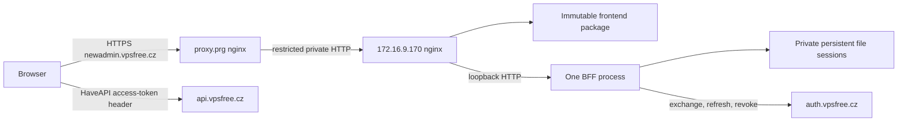

# vpsAdmin WebUI architecture and verification brief

Prepared by architect0 on 2026-09-27 for lead review and implementation assignment.
This document defines the implementation boundaries of the approved
[implementation plan](implementation-plan.md). It is source-based design, not a
claim of implementation, independent review, successful builds or deployment.
The operator retains production activation and secret installation.

## 1. Scope, source and decisions for the lead

Implement the existing React/TypeScript frontend and Node OAuth BFF as one
NixOS service instance at `https://newadmin.vpsfree.cz`, alongside the existing
PHP interface. Repair the documented verification, correctness and localization
defects; preserve the existing interaction and mutation safeguards. Keep the
OpenStreetMap/Nominatim behavior unchanged as directed. The source-contained
`docs/design/` handbook is the maintained specification. Root `UI_REDESIGN.md`
is now a compatibility navigation page pointing to that handbook; it is neither
a competing specification nor a missing requirement to recover.

Source/worktree state confirmed during this assignment:

| Repository | Baseline and current state | Ownership |
| --- | --- | --- |
| `vpsadmin-webui` | `e7ce3d73e799fc60e5933fe23bdb3a979eb4d6b9`, clean session branch `2026-09-27-newadmin-integration` in its canonical session worktree | Frontend, BFF, packages, module, tests and reusable docs |
| `vpsfree-cz-configuration` | `1e8dae229fbe4201b5e1f110721f0f63c4b46944`, clean registered session branch/worktree | Site input/channel, VPS, proxy, DNS, monitoring and operations |
| `vpsadmin` | Services pin `a65a4dfeb92a59df4a80a737a20bcbf8558793ff`; reference head `7045c81b3a5be312eac0d41e8a44f783340abb9f` | Read-only API and terminology authority |
| Workspace | Project-map feature commit `f12ecd1a`; lead owns tracking, publication and review coordination | Coordination only |

The lead reports the new GitHub origin is still empty. Preserve upstream history
and authorship. Registered default branch `main` is metadata, not proof of the
remote's behavior or approval to publish an initial default branch. GitHub may
designate the first pushed feature branch as the default, so a feature-shaped
branch name does not make that first push safe under the workspace integration
gate. Verify remote/default behavior before publication; if no route preserves
the default-branch boundary, obtain explicit user integration approval for the
named repository and target before pushing. Prepare and review local commits
and use local flake override builds meanwhile. Do not enable imported autonomous
issue/deployment runners.

The configuration checkout hook returned nonzero outside its Nix shell because
gems were missing. Subsequent configuration hook setup and commits must run in
`nix develop`; do not bypass Overcommit. Both worktree branches were verified
locally. The architect's initial remote check failed on an SSH configuration
permission check, but the lead subsequently ran a successful
`git ls-remote upstream refs/heads/main`, fetched upstream and fast-forwarded the
clean feature branch from `49c6a51d` to `e7ce3d73`. The architect confirmed the new
local head, clean tracked files and complete four-commit delta. Freshness is
verified at this checkpoint; the earlier transport failure is not a remaining
blocker.

The added commits are `2ee601a` (sidebar release receipt), `ca51e4f`
(self-contained documentation pointers), `17177ab` (documentation-audit fixtures)
and merge `e7ce3d7`. Their source changes in `outageBadges.ts` and `index.css` are
comments only. The delta changes no runtime behavior, BFF/API contract, package
lock, translation catalog or deployment interface. REQ-004 now records the prior
sidebar release; its 256px/full-label behavior remains the accepted baseline.
Do not treat the upstream work log's earlier test receipts as fresh verification
of this session's eventual implementation candidate.

One material verification implication follows from the stricter design audit:
`scripts/audit-design-docs.mjs` now requires the root `UI_REDESIGN.md` and invokes
`git ls-files -z` to reject external redesign references in tracked docs/source.
An ordinary Nix source omits `.git`, so merely adding Git to a check's PATH is
insufficient. W2/W6 must provide deterministic source enumeration for immutable
source checks (or an explicitly prepared temporary index in the check sandbox),
retain the external-reference rejection, and test both checkout and archive/Nix
source forms. The new fixture tests also invoke `git init`/`git add`; Git belongs
in their test dependencies, not in the BFF runtime closure. No architecture or
deployment redesign is needed for this upstream delta.

### Material design clarifications to route through the lead

1. **Bounded runtime configuration:** propose adding public `/config.json` for
   the new required BFF bootstrap while retaining `/config.js` for compatibility.
   This gives fetch-level cancellation, MIME/size checks and data validation
   without evaluating downloaded JavaScript. It is the only proposed new public
   route beyond the plan; lead should accept this interface before its work
   package starts and reconcile the plan/runbook routing lists.
2. **Pagination limits:** `order=asc` alone is not a universal fix. At the site
   API pin, non-admin IP addresses sort by `user_id DESC, id ASC`; interface
   ordering uses IP version/interface order. Accounting uses strict time/byte
   cursors without a tie-breaker. Implement honest bounded/incomplete behavior
   wherever lossless traversal cannot be established. Do not claim all records
   are reachable through an unproven cursor or add backend changes implicitly.
3. **Container profile dependency:** `profiles/ct.nix` resolves the `vpsadminos`
   role. The new host therefore needs `os-staging` as well as `nixos-stable` and
   `vpsadmin-webui`; omitting it breaks evaluation even though no vpsAdmin runtime
   services are required on this VPS.
4. **Existing handbook limits remain real:** pending user-data/IP-history/
   dataset cursor work and the dev soft-delete retention policy are not fixed
   by packaging. A built preview and a fully certified default replacement have
   different acceptance scopes. Keep their limitations in the release receipt;
   do not import rejected backend PR44 or pending dependent frontend PRs.

No implementation blocker prevents starting repository/tooling work. Operator
facts needed before an activation-ready host configuration are its installed
architecture, network/boot baseline and `system.stateVersion`. OAuth client
policy/values and actual deployed API revision are needed before live
certification/activation. License/notice intent and initial repository publication
remain lead/owner decisions, not values to invent from the npm manifest. If no
safe branch-only publication route exists, remote-lock configuration builds are
approval-dependent; this does not prevent local implementation and override builds.

## 2. Boundaries and invariants



- The BFF handles OAuth/session transport. It is not a general API proxy.
  `/session.json` deliberately gives the authenticated browser its access token;
  refresh tokens and client/signing secrets stay server-side. API CORS and
  `X-HaveAPI-OAuth2-Token` remain part of the release contract.
- One BFF process owns one local file store. Its queue encloses session load,
  one-use OAuth state consumption, refresh, logout and final save. No cluster
  workers, overlapping service instances, shared filesystem, Redis migration,
  second VPS or sticky-session infrastructure is introduced.
- Backend authorization remains authoritative. UI gates fail closed on unknown
  permissions/states; member ownership, admin My view and support restrictions
  survive refactoring. An error must not become an empty successful result.
- Preserve mutation target/value snapshots, operation locks, accepted-versus-
  completed state, action receipts and uncertain-result reconciliation.
  Authentication recovery, bootstrap retry and reload never replay writes.
- No database schema, API resource, node protocol, CLI, Terraform provider or
  generated fleet configuration contract changes are planned. No coordinated
  update of running vpsAdminOS nodes is required.
- Public configuration contains no credentials. Persistent state, signing keys
  and session tokens never enter the Nix store, build output, browser logs,
  health-check output, traces committed to Git or public release evidence.
- Keep legacy UI/API/auth/console/download routes and the old clankerdev
  deployment intact. The new origin has fresh host-only cookies and browser
  storage; do not widen cookies to share a parent domain.

## 3. WebUI interfaces, packaging and localization

### Flake and packages

Initial supported build system is `x86_64-linux`, subject to confirming VPS
architecture. Do not claim another system merely by listing a flake attribute.
Use a supported pinned Node 24 toolchain from the selected Nixpkgs revision for
both packages and the development shell; confirm exact availability/version
during implementation. Keep CI/local npm on that tested runtime. Reassess the
jsdom/encoding patches against it before retaining any compatibility shim.

| Interface/path | Contract |
| --- | --- |
| `flake.nix`, `flake.lock` | Lock Nixpkgs and `vpsadmin`; expose packages, module, development shell and explicit checks |
| `packages/frontend.nix`, `packages.<system>.frontend` | Separate root-lock `npmDepsHash`; production Vite build; `$out` contains only public `dist/` contents |
| `packages/bff.nix`, `packages.<system>.bff` | Separate `bff/package-lock.json` hash; production dependencies; no npm build phase; executable `$out/bin/vpsadmin-webui-bff` wraps pinned Node and immutable server files |
| `nixos/modules/webui.nix`, `nixosModules.default` | Reusable `services.vpsadmin-webui` module; no concrete site addresses or secret contents |
| `devShells.<system>.default` | Node/npm, repository check/format tools and browser provisioning compatible with the repository Playwright wrapper |
| `checks.<system>.*` | Named static/unit/package checks plus a separately identifiable NixOS integration test; avoid accidentally running long checks as quick evaluation |

Use `inputs.vpsadmin.url = "github:vpsfreecz/vpsadmin"` and initially lock the
site services revision unless a documented prerequisite requires another.
Make `vpsadmin.inputs.nixpkgs.follows = "nixpkgs"` when composing the standalone
UI flake, leaving vpsAdminOS's own inputs intact. The site replaces the complete
`vpsadmin` input with `vpsadminServices`; its existing dependency graph then owns
the nested follows. Validate the effective lock graph instead of adding circular
follows or attempting to force all staging/production Nixpkgs inputs together.
Input resolution/source checks must not instantiate the API or a kernel build.

Pass `VITE_BUILD_SHA` explicitly from immutable source metadata; `.git` is absent
from Nix sources. Preserve `build-info.json` schema and provide BFF revision
metadata independently, e.g. under `$out/share/vpsadmin-webui-bff/`. Dirty/local
prototype builds must not advertise a clean release SHA. A clean full commit and
matching frontend/BFF derivations are required for a release receipt. Do not
copy `node_modules`, `.env`, source maps containing private material, deployment
backups or source trees into the public webroot. Build/install dependencies only
in the build environment; deployed hosts do no npm installation or compilation.

### Bootstrap and public runtime contract

Select the required BFF mode at build time (proposed `VITE_RUNTIME_MODE=bff` for
the Nix frontend). Do not discover whether configuration is mandatory from the
same optional configuration that may be missing. Preserve explicitly selected
standalone/legacy development modes and their existing tests; production cannot
enter those modes as an error fallback.

Subject to lead acceptance of `/config.json`:

- Generate one public configuration object in the BFF. JSON returns
  `{schemaVersion: 1, api: {url, version}, webuiNext: {...}}`; keep the existing
  `window.vpsAdmin` assignments in `/config.js` as a projection of that object.
  `webuiNext` contains the current login/logout/password-recovery/passkey fields,
  HaveAPI header/meta settings, root base path and `legacyUrl` when configured.
  Neither endpoint contains session state or tokens.
- Required bootstrap fetches same-origin `/config.json`, rejects redirects,
  validates JSON MIME, a bounded response body (64 KiB) and schema, then fetches
  `/session.json` with same-origin credentials and no-store. Use an overall
  15-second bootstrap deadline with cancellation; a test can inject a shorter
  deadline. Do not leave response-body reads outside that deadline.
- Require valid absolute API/auth/legacy URLs and explicit version/header
  settings; reject credentials embedded in URLs, invalid schemes and unexpected
  cross-origin login/logout/session endpoints. Production origins use HTTPS;
  allow HTTP only through an explicit isolated-test/development option.
- Validate session shape before installing any state. Preserve
  `accessToken`, `sessionKey`, `sessionExpiresAt`, including the all-null anonymous
  form. Never persist BFF access/refresh tokens in browser storage. A successful
  anonymous result clears prior standalone credentials as the current code does.
- Missing, stalled, malformed or wrong-MIME configuration/session responses show
  the existing early bilingual failure surface with an explicit retry. Keep this
  surface independent of lazy locale chunks. Retrying installs only the current
  attempt's validated result; late responses must not restore stale credentials.
  Do not log response bodies or credentials in technical details.

Add complete startup validation in the BFF for required URLs, canonical origin,
port and positive bounded durations/limits. Avoid permissive `parseInt` accepting
trailing junk. Revoke URL is required by the Nix production mode. Validate secret
presence/strength and writable session storage before listening, reporting only
the setting name or failure class. Preserve host-only Secure/HttpOnly/SameSite=Lax
cookies, session regeneration, expiry, one-use state and same-origin controls.

### Correctness work and extraction boundaries

Affected source starts at `src/app/runtimeBootstrap.ts`, `src/bootstrap.ts`,
`src/app/config.ts`, `src/lib/auth/bffSession.ts`, `bff/server.js`,
`src/lib/api/{haveapi,networkInterfaces,ipAddresses,networking,actionStates}.ts`
and `src/pages/app/vps/VpsNetworkPage.tsx` with its cards/editors. Find further
critical permission/destructive call sites before changing their decoders.

For collections, return data with explicit completeness/continuation/error
information rather than dropping metadata in `.data`. Use a small domain helper
with page/request bounds, cancellation, ID deduplication, cursor progress checks
and unchanged owner/filter context. Only enable continuation when both selected
ordering and server cursor semantics are established at the pinned API. Sort
complete display data locally when necessary; do not page on a display sort.

Evidence at `a65a4dfe`:

| Resource | Source contract | Implementation consequence |
| --- | --- | --- |
| Network interfaces | HaveAPI adds the ID predicate but no ordering; neither the resource nor model supplies an order | No proven ID traversal at this pin; use the bounded completeness contract in the W4 addendum |
| Host IP addresses | `asc` orders by ID; `interface` orders by IP version/interface order | Use the proven ID path for traversal; preserve display grouping separately |
| IP addresses | Admin `asc` is ID; non-admin `asc` prepends owner grouping; `interface` is not ID order | Do not equate `asc` with global ID order for member/support responses |
| Network accounting | `from_date` or `from_bytes`; strict comparisons on nonunique values | Do not reuse an ID paginator or certify totals from a capped response |

When the API cannot prove a complete collection, show a localized partial-data
state, suppress complete-total claims, and prevent controls whose safety depends
on the missing membership/availability data. Offer only supported filtering or
bounded refresh paths; do not promise a Load more path that skips rows. A capped
result with unknown continuation remains potentially incomplete. Test newly
created-object discovery through supported direct fetch or refreshed filters;
absence from a partial list is not proof a write failed. A lead decision is
required if supported member behavior cannot meet this bounded contract.

Decode positive resource IDs, permission booleans, known states and mutation
receipts at adapter boundaries. Model unknown state explicitly. Extract network
queries and cohesive operation editors/hooks without building a universal
workflow engine. Keep query keys with adapters and keep operation-specific
snapshots, locks and reconciliation visible and testable.

### Localization authority and coverage

Add `docs/agent-instructions/localization.md` and its AGENTS route in the same
work package as the locked input. Require resolving the input from the UI flake,
reading its `docs/i18n-cs.md` and relevant localization procedure, and recording
the exact revision. Validate this example from the finished flake:

```sh
vpsadmin_source=$(nix eval --raw --impure --expr \
  '(builtins.getFlake (toString ./.)).inputs.vpsadmin.outPath')
cat "$vpsadmin_source/docs/i18n-cs.md"
```

Do not apply vpsAdmin's PHP gettext/YAML regeneration commands to TypeScript
catalogs. Do not copy a second glossary or silently use a floating/sibling source
if input resolution fails. This design read the guide at the services pin;
implementation records its own effective pin, including the site override.

Use the TypeScript compiler API to inspect literal catalog definitions before
spread/composition: both quote styles, all module exports, duplicate keys,
en/cs key sets, placeholders and plural categories. Reject nonliteral definitions
the checker cannot interpret rather than silently ignoring them. Runtime parity
alone cannot detect overwritten duplicates. Fix L1–L14 from
[translation-review.md](translation-review.md), including the rendered
`{n}`/`{count}` mismatch, conflicting mailer key and Login/Nickname test.

Track editorial coverage by every catalog module and BFF/early-bootstrap/lazy
error copy. Use `tc` where inflection is needed, testing 0/1/2/4/5/11 and applicable
fractions. Preserve runtime placeholders, URLs, units, keyboard/accessibility
labels and operation semantics. Keep API-provided transaction labels authoritative.
Use informal singular Czech explanations and infinitive action labels; distinguish
Shutdown/Vypnout from Poweroff/Vynutit vypnutí after checking the action.

The implementer owns catalog mechanics and agreed wording edits; the lead owns
the final context-aware English/Czech writing pass with the writing skill. The
reviewer checks terminology/fidelity and coverage. Follow the KB impact workflow,
recording that current legacy PHP captures do not certify the React preview.
Assess/add independent UI/API bindings only within lead-approved KB scope;
retain legacy evidence and do not publish pages or replace screenshots silently.

## 4. Reusable NixOS service contract

The module owns an nginx static/BFF vhost and
`vpsadmin-webui-bff.service`. Keep the existing `vpsadmin.webui` PHP options
separate. Proposed stable options under `services.vpsadmin-webui`:

| Option | Meaning/default |
| --- | --- |
| `enable` | Enable this service, false by default |
| `frontendPackage`, `bffPackage` | Matching flake packages, explicitly overridable |
| `publicOrigin` | Required canonical HTTPS origin; derive nginx host and exact `/oauth/callback` URI |
| `api.url`, `api.version` | Required endpoint/version; site uses `https://api.vpsfree.cz`, `7.0` |
| `oauth.authorizeUrl`, `tokenUrl`, `revokeUrl`, `passwordRecoveryUrl` | Explicit provider endpoints; site values from the runbook |
| `oauth.scope`, `oauth.type` | `all`, `web_server` |
| `legacyWebuiUrl` | Optional URL exposed as `webuiNext.legacyUrl`; site sets legacy origin |
| `haveApi.authHeader`, `haveApi.metaNamespace` | `X-HaveAPI-OAuth2-Token`, `_meta` |
| `environmentFile` | Required absolute **string** path read by systemd at runtime; never a Nix path value or `readFile` |
| `stateDirectory` | Relative systemd StateDirectory name, default `vpsadmin-webui`; derive absolute sessions path |
| `cookieName`, `bffPort` | `vpsadmin_webui_session`, `3001`; BFF binds `127.0.0.1` |
| `nginx.enable`, `nginx.listenAddress`, `nginx.port` | true, loopback by default, 80; site selects private address |
| `nginx.trustedProxyAddresses` | Exact trusted edge addresses/CIDRs, empty by default; required for external forwarded HTTPS |
| `nginx.allowedClientAddresses` | Backend source allowlist, separate from proxy trust; default loopback |
| `security.consoleOrigins`, `security.frameOrigins` | Reviewed extra origins required by the deployed API/integrations; no blanket `https:`/`wss:` default |

Validate option combinations and reject unsafe/malformed origins/ports. Secret
variables `OAUTH_CLIENT_ID`, `OAUTH_CLIENT_SECRET`, `SESSION_SECRET` come only from
the operator environment file; public settings are generated by the module.
Document systemd environment-file syntax and precedence. No generic public
`extraEnvironment` secret escape hatch is needed for the initial contract.

Use a stable dedicated system user/group `vpsadmin-webui-bff`, restrictive state
ownership, `StateDirectoryMode=0700`, `UMask=0077`, one Node process and automatic
restart on failure. Start after networking and ensure storage is writable.
Use `NoNewPrivileges`, empty capabilities, private temporary files/devices,
`ProtectSystem=strict`, `ProtectHome` and suitable kernel/control-group protection.
Test the sandbox with Node; do not enable `MemoryDenyWriteExecute` without proving
JIT compatibility. No shell, compiler, database, PHP, Redis or RabbitMQ dependency
belongs in the BFF runtime closure. The state directory is outside that closure.

Systemd reads `/private/vpsadmin-webui.env` as root. The service user need not read
`/private` directly. Missing files/placeholders/invalid secrets must fail startup
without printing their values. First installation creates new state; packaging
does not migrate or copy sessions from the old hostname. Restarts retain state
and the stable signing secret. Service shutdown/restart must not overlap two
writers to the store.

## 5. nginx routing, headers, assets and proxy trust

| Request | Backend handling and cache contract |
| --- | --- |
| `/`, application deep links | Current `index.html`; revalidate (`no-cache`), never immutable |
| `/build-info.json` | Static JSON, revalidate, exact-file 404 |
| `/assets/*`, favicon and other declared static files | Exact-file lookup; hashed assets immutable; missing assets 404, never SPA HTML |
| `/config.json` (proposed), `/config.js` | Exact BFF routes, JSON/JavaScript MIME respectively, no-store, nosniff |
| `/session.json` | Exact BFF route, same-origin JSON, no-store, CORP same-origin and current Vary contract |
| `/oauth/` prefix | BFF; no SPA fallback, no caching; keep redirects, errors and Set-Cookie |
| `/healthz` | Exact BFF route; small anonymous liveness response; no credentials or readiness overclaim |
| `/config.local.js` in production | 404; never load a local override in required BFF mode |

Treat `/oauth` without the trailing slash explicitly (reject or canonicalize
without losing query data); it must not become a successful SPA route. Keep proxy
timeouts slightly longer than bounded provider requests so error responses can
reach the browser. Do not add proxy caches to auth/config/session paths.

Normalize the two-hop path instead of increasing Express's numeric hop count:

1. Edge vhost overwrites `Host` and `X-Forwarded-Host` with the canonical host,
   sets `X-Forwarded-Proto=https` on the TLS path, and sets a **single**
   `X-Forwarded-For=$remote_addr`. Drop untrusted `Forwarded`/alternate identity
   headers. Do not append client-supplied forwarding chains.
2. Backend accepts the edge only from its metadata-resolved address
   (`172.16.9.140` at this baseline). Trusted scheme values are exactly `http` or
   `https`; malformed/comma-separated values fail. Resolve client IP only from
   that peer's normalized header, then emit one normalized address to the BFF.
   Non-edge health-check callers cannot assert HTTPS/client identity.
3. BFF trusts loopback nginx only (address-based `loopback` is preferred), and
   remains bound to loopback. It receives the public HTTPS scheme and real client
   address even though the edge/backend transport is HTTP. No arbitrary trust
   of the entire private address range or `trust proxy=true`.
4. Audit the *rendered* nginx config for duplicate `proxy_set_header` directives:
   the edge already enables `recommendedProxySettings`. Use per-location
   overrides/default disabling as needed to emit exactly one intended value.
   Apply backend ACLs to the original socket peer if nginx real-IP rewriting is
   enabled; an ACL on rewritten `$remote_addr` can reject legitimate clients or
   admit spoofed peers. Test that interaction explicitly.

This follows the [Express proxy trust contract](https://expressjs.com/en/guide/behind-proxies/).
The approved private HTTP hop assumes the internal network is suitable for
bearer/session traffic; confirm that deployment assumption. If transport
encryption is required, route that scope change through the lead.

The backend owns the application CSP; the edge owns TLS/HSTS. Preserve nosniff,
frame/referrer and BFF response-specific headers through both layers. Avoid a
second blanket CSP that intersects incorrectly with the passkey page's nonce or
OAuth-origin policy. Repeat required security headers in locations that override
nginx `add_header` inheritance and test final responses, including errors.
Retain the existing inline bootstrap hash generation/audit. Permit the exact
Nominatim and OpenStreetMap origins already needed by the accepted behavior;
mock them in tests. Console/download origins require actual pinned API evidence.

OAuth callback query strings contain credentials. Disable access logging for
`/oauth/` at **both** hops or use a dedicated format without query strings,
Referer or credentials. Never log session bodies, authorization headers or
upstream token responses. Health checks record status/MIME/shape, not bodies
containing a logged-in session.

Choose tested user-driven chunk recovery for the initial service instead of a
mutable asset retention cache. `lazyRoute.tsx` already recognizes missing chunks;
complete bilingual handling for route, locale and bootstrap chunks. An old tab
gets a useful reload action, never an automatic mutation retry or reload loop.
Warn before discarding an unsaved draft where applicable; retain existing
persisted uncertain-operation locks across a chosen reload. An immutable Nix
generation alone does not serve old asset URLs. Exercise upgrade *and rollback*
with an already-open tab before accepting this policy.

## 6. Site configuration and dependency ordering

In configuration `flake.nix`, add input `vpsadminWebui` with Nixpkgs following
`nixpkgsStable` and `inputs.vpsadmin.follows = "vpsadminServices"`. Add channel
`vpsadmin-webui` mapping role `vpsadmin-webui` to `vpsadminWebui`. The existing
channel named `vpsadmin` maps to `vpsadminServices`; do not follow a nonexistent
input named `vpsadmin` or move the production/staging API pins.

Source-to-site ordering is mandatory because the canonical origin is empty:

1. Commit and review the WebUI feature candidate, preserving its upstream
   history; quick checks must pass before independent review.
2. Before **any first push**, inspect the canonical remote's branch/default
   state and establish whether publishing the candidate will designate its
   branch as default. A missing remote HEAD or empty branch list does not prove
   a safe branch-only route. Do not test the behavior with a real push, bootstrap
   another branch or change the default as a workaround for the approval gate.
3. If evidence establishes a branch-only route that leaves default branches
   untouched, publish the reviewed feature revision through that route. Otherwise
   stop publication until the user explicitly approves integration of
   `vpsfreecz/vpsadmin-webui` into the named target default branch; record that
   approval before executing it. Review, build or implementation approval does
   not supply integration approval. Verify both the published head and actual
   remote default after an authorized publication.
4. Introduce the configuration input/channel mapping. Once publication is
   authorized and complete, use the published ref in the source URL if the
   fetcher needs it; verify the exact commit is fetchable in a clean context.
5. Inside the configuration worktree's `nix develop`, pin the published commit:

   ```sh
   confctl inputs channel set --commit vpsadmin-webui vpsadmin-webui FULL_WEBUI_COMMIT
   ```

6. Inspect the generated lock diff, including the effective
   `vpsadminWebui.inputs.vpsadmin -> vpsadminServices` follows and unrelated-input
   stability. Record the published UI SHA, effective API SHA and configuration
   SHA, then build the exact feature configuration.

Keep generated input commits separate from functional changes and preserve
their generated messages. Repeat the publication-boundary check and publish/pin
sequence after a material UI fix. Do not manually edit the lock or invent/publish
`main` to make Nix fetch succeed.

While publication is pending, continue package/module/VM and site configuration
evaluation/builds with a local flake input override using the supported Nix/confctl
mechanism. Preserve `vpsadminWebui.inputs.vpsadmin.follows = "vpsadminServices"`
in that composition and verify the effective source/API revisions. Record the
committed local source, override arguments and build scope; do not commit local
paths into the deployable lock or describe override results as remote-lock
certification. If no safe branch-only route exists, mark final remote-lock builds
as awaiting explicit integration approval, not as a failed build or a reason to
stop independent local work. After authorized publication, regenerate the pin
through confctl and validate the final remote-lock configuration. Subsequent
normal published updates use `confctl inputs channel update --commit` through
the same channel.

| Files | Required implementation |
| --- | --- |
| `cluster/cz.vpsfree/vpsadmin/int.vpsadmin-webui1/module.nix` | `spin=nixos`, VPS 30431, `172.16.9.170/32`, host `vpsadmin-webui1.int.vpsfree.cz`, `nixos-stable`/`os-staging`/`vpsadmin-webui` channels, node exporter, manual-update tag, service checks |
| Same host `config.nix` | Import `environments/base.nix`, `profiles/ct.nix` and the input's UI module; resolve `flakeInputs.${inputsInfo."vpsadmin-webui".input}`; pass matching packages and public settings; preserve confirmed stateVersion/networking |
| `cluster/cz.vpsfree/containers/prg/proxy/config.nix` | Metadata-resolved backend, new HTTPS/ACME vhost, normalized forwarding and credential-safe logging |
| Proxy `module.nix` | Local HTTPS static and BFF checks for the new host, keeping current checks |
| Both `configs/{public-dns,internal-dns}/zone.vpsfree.cz.` | `newadmin IN CNAME proxy.prg.vpsfree.cz.` and increased serial |
| Internal zone only | `vpsadmin-webui1.int IN A 172.16.9.170`; no invented backend AAAA |
| `health-checks/vpsadmin-webui.nix` | Separate new-service checks for nginx/BFF unit state, static provenance, liveness and anonymous session shape |
| `modules/clusterconf/monitor/http.nix` and `rules/vpsadmin.nix` | New static/BFF probe entries and alert mapping, plus BFF service alert; retain PHP checks |
| Site `docs/operations/` and `mkdocs.yml` | Reusable installation/settings/monitoring/recovery procedure and index link |

Do not import `../common/all.nix` or `../common/webui.nix` on the new host: these
pull vpsAdmin overlay/service defaults intended for the old service group.
The container profile's OS input is sufficient. Restrict private port 80 to the
edge plus explicitly chosen health-check sources; keep port 3001 unreachable
off-host. Default module loopback access is not permission to open port 80 to
the entire management network. Preserve required SSH/node-exporter policies.

Monitoring must distinguish static availability, BFF liveness and actual login
certification. Public probes for `/build-info.json` (or a stable frontend marker)
and `/healthz` need body/status checks and existing TLS-expiry coverage. Add their
names to the existing explicit alert map; adding a probe alone does not ensure
an alert. Ensure node-exporter includes the BFF unit. Test a stopped/missing unit
and absent scrape series as well as ordinary failure, without inventing token-
collecting synthetic login monitors.

DNS consumers/build targets, subject to final diff confirmation:

```text
cz.vpsfree/vpsadmin/int.vpsadmin-webui1
cz.vpsfree/containers/prg/proxy
cz.vpsfree/containers/ns1
cz.vpsfree/containers/prg/int.ns1
cz.vpsfree/containers/brq/int.ns1
cz.vpsfree/containers/prg/int.mon1
cz.vpsfree/containers/prg/int.mon2
```

Public secondaries receive zone transfers; verify propagation rather than
deploying unrelated machines. Both monitors also consume the internal zone.
No wildcard cluster build/deploy is necessary.

## 7. Compatibility, activation and recovery

| Boundary | Supported transition/recovery |
| --- | --- |
| Old PHP/new UI | Coexist at distinct origins; preserve old deep links, routes and maintenance access |
| Browser/BFF | Retain `/config.js` and session JSON shape; new JSON route is additive. Upgrade BFF before relying on the new frontend; switching paired generations can briefly require reload |
| Browser state | Preserve existing preferences/tasks/locks formats and identity scoping; new origin starts fresh. No new broad domain cookie or storage migration |
| File sessions | Preserve current file/session shape, owner and secret on restart/rollback; incompatible changes need versioning or deliberate reauthentication |
| UI/API | Source compatibility target is pinned, site override recorded separately, deployed revision verified separately. No claim of arbitrary old/new API compatibility |
| Config/NixOS | New option namespace is independent of legacy modules; explicit source and OS pins; host stateVersion retained |
| DB/node/clients | No migration or protocol change and no coordinated fleet update |

Keep exact frontend/BFF/config/API revisions, derivations and previous system
generations in the rollout receipt. The frontend SHA does not prove BFF or API
provenance. API feature probes/real tests must cover current settings PUT,
action states, networking, permissions, OAuth/recovery/passkeys, console and
downloads. Missing capability is a documented incompatibility, not permission
for an invented request or an unapproved backend fix.

The [deployment runbook](deployment-runbook.md) remains proposed until matched
to implemented options and tested commands. Operator sequence: confirm VPS and
network/OS facts, install root-only environment file and dedicated OAuth client,
retain generations, dry-activate exact machines, activate UI VPS and verify the
private path, publish both DNS views, activate edge/ACME, then complete public
acceptance. DNS must reach the edge for HTTP ACME validation. Monitoring may see
a short expected outage during this sequence; account for it operationally.
Agents may prepare/build isolated candidates; they do not activate, install
secrets, register a client or perform a production login under this assignment.

Use callback `https://newadmin.vpsfree.cz/oauth/callback`, login-start URI
`https://newadmin.vpsfree.cz/oauth/login`, a nondefault client with refresh-token
issuance, and the site's approved token/SSO policy. Password recovery uses
`https://auth.vpsfree.cz/oauth2/password-reset`, while OAuth token/authorize/revoke
use the inspected `/_auth/oauth2/` routes. Passkey relying-party origin remains
the authentication origin. Verify these contracts against the deployed API.

For software rollback, restore the recorded paired frontend/BFF/config generation
and compatible live sessions. Do not restore old session snapshots over rotated
refresh tokens. If recovery cannot preserve the session contract, deliberately
invalidate sessions and reauthenticate. A UI rollback cannot undo API mutations.
First-install rollback disables/reverts the new service/vhost and preserves
legacy access. DNS rollback republishes previous contents with a **higher**
serial; blindly activating an old zone serial is insufficient. Retain branches,
VPS and session records; no lifecycle cleanup is part of this handoff.

## 8. Acceptance and verification plan

### Quick checks before committed-change review

Run known short checks in each repository's declared Nix shell. Long or uncertain
dependency installs/suites/builds go to a fresh watcher under the monitor skill.
No tests/builds were launched by this design assignment.

1. Clean locked dependency installs; exact Node/npm/browser provisioning recorded.
   Lint with incremental React Hooks/accessibility rules and formatter checks;
   types for source, tooling/config/E2E boundaries and checked BFF interfaces.
2. Full catalog-definition integrity and design-documentation checks; focused
   bilingual rendered count/login/action cases; startup validation, required
   bootstrap failures, session races and collection completeness regressions.
   Preserve the root redesign navigation page and external-reference rejection;
   exercise the documentation audit without `.git` as well as in a checkout.
3. Nix syntax/format and module evaluation for disabled/enabled states,
   invalid/missing options, exact secret-path handling, effective vpsAdmin
   follows and independent PHP module coexistence. No build for a syntax check.
4. Zone validation with the repository environment's tools, serial increase and
   intended record checks; inspect rendered nginx headers/routing; Prometheus
   rule validation and focused alert tests where rules change.
5. Required repository hooks active/passing. Fix the configuration shell/hook
   setup. Inventory complete final commits/diff, superseded approaches and
   **no migrations**, then pass the committed candidate to mandatory independent
   review before long integration verification. This brief is not that review.

The required CI contract must include production build, design/architecture
audits, lint/types, localization, script/BFF/unit tests. Preserve meaningful
structural limits; use narrow justified exceptions or refactor rather than
silently resetting the baseline. Correct UI-string test-fixture classification
without reducing product coverage. Install Chromium in every job that starts
it, including script tests, and use the repository wrappers. Pin worker count
(start with two) and run desktop/mobile as independent stages. Diagnose all
29 recorded browser failures against the current source; five passing reruns
are not resolution of the other 24. Check official upstream versions before
adding/changing GitHub Actions dependencies.

### Longer checks after independent review

Use fresh policy-selected Luna/low verification watchers for authorized builds,
browser suites, CI and VM/real-API runs. Lead handles diagnosis/retries and
acceptance; watchers do not edit or deploy. Stop an unexpected local kernel
build and investigate cache/provenance under the verification procedure.

| Check | Required evidence |
| --- | --- |
| Immutable packages | Frontend and production-only BFF build from locked source; no host npm; matching provenance; no secret/source leakage in public output |
| Production browser smoke | Built assets through packaged nginx/BFF; deep links, assets and 404s; both languages, desktop/mobile, focus/keyboard/errors; source CSP audit plus emitted-header behavior |
| NixOS topology VM | Edge TLS → private nginx → loopback BFF with mock OAuth; real forwarded scheme/IP, spoof resistance, backend ACLs, no duplicate headers, secure cookie/callback, one-use state and canonical host |
| Session/state VM | Concurrent refresh/logout, stale responses, anonymous/no-origin/cross-origin requests, provider timeouts, malformed replies, missing secrets, store permissions and restart persistence; no cross-user cache leakage |
| Upgrade/rollback VM/browser | Open old tab, switch package generations, lazy route/locale failures and controlled reload; unchanged state loads after restart/rollback; no automatic write replay |
| Real pinned API | Owned isolated cluster, exact UI/API pins, member/support/admin scopes, >100 interfaces/>250 addresses, adversarial ordering/ties, incomplete states, settings, OAuth/recovery/passkeys, action receipts, console/download |
| Data preservation | Synthetic payload/checksum survives each tested restore/migrate/data-preserving storage operation; uncertain/rejected writes are not resubmitted blindly |
| Site machines | Local override builds may proceed before publication, with exact source/API provenance recorded. Final `confctl build` of each target uses the remote-lock feature configuration and depends on authorized publication; closure/config diff shows no unrelated service changes |

Use bridge networking for the owned isolated cluster. Never run historical live
scripts against shared dev/production endpoints by default. Mock external maps
in fixtures without changing product calls. Record browser support separately;
Chromium desktop/mobile evidence does not certify Firefox/WebKit. Measure initial
and route/locale payload performance before setting a small documented budget.

Acceptance is complete when the intended commits and documentation are reviewed,
required checks and exact machine builds pass, translations have recorded full
module coverage, remaining unsupported API behavior is explicitly scoped, and
the operator has a tested runbook/rollback receipt. Production operation and
default-interface readiness remain separate claims. Merge approval is separate
from implementation/build/review approval.

## 9. Implementer work partition and handoff

The retained implementer owns application/configuration edits. Lead owns
coordination, material scope decisions, final language pass and acceptance;
architect owns this brief/prototypes and clarifications. Use bounded work
packages with reviewable commits:

| Order | Deliverable | Dependency/exit |
| --- | --- | --- |
| W1 | Repository identity/provenance, flake/input/dev shell, locked-guide AGENTS route, source-contained docs | Confirm baseline/import scope; restore reproducible tool/hook setup; no activation |
| W2 | Required checks, archive/Nix-safe documentation audit, AST i18n validation, runtime/tooling type/lint boundaries, justified structural fixes | Baseline failures classified and focused checks green; preserve new external-reference rejection and Git fixture dependencies; no blanket suppression |
| W3 | Bootstrap/BFF configuration validation and proposed JSON route; exact auth/state tests | Lead accepts route; compatible JS/session endpoints retained |
| W4 | Collection completeness, critical decoders, cohesive network hooks/editors | Owner/order/cursor evidence and honest partial results; mutation invariants covered |
| W5 | Full catalog/BFF/bootstrap copy pass and rendered regressions | W2 mechanical checks, pinned vocabulary; lead editorial pass and KB impact record |
| W6 | Frontend/BFF derivations, reusable service, nginx/CSP/proxy contract, VM/browser test definitions | W1/W3 interfaces stable; no real secrets; tests are prepared before review and run in the required order |
| W7 | Site input/channel, host/proxy/DNS/monitoring and operations docs | Local override work can proceed; final remote pin requires verified safe publication or explicit integration approval; confirmed host facts before activation-ready config |
| W8 | Whole-branch review, isolated integration/package/machine builds, final operator bundle | Local and remote-lock evidence distinguished; remote-lock completion gated on authorized publication; known limits and rollback proven; user deploys |

W2/W3/W4 can be separate bounded assignments after W1; avoid simultaneous edits
to shared catalogs/bootstrap/BFF files. W7 depends on stable module options,
not completion of every unrelated language edit, but final machine builds must
use the final reviewed UI revision. Keep input-generated commits separate.

Update the WebUI handbook's architecture/API/verification/operations/decisions,
`WORK_LOG.md` and applicable REQ-009/056–066 statuses with implementation, keeping
prepared/tested/deployed distinct. Put reusable site operations in configuration
docs; keep exact rollout revisions/results in the session runbook/receipt.
The lead should link this brief from `state.md` and `portal.yml` and retain its
normal tracking cadence; this architect assignment edits only `design.md`.

Design verification performed: identity/env match, required workspace procedures,
affected repository guidance and source/document cross-checks. Local branch and
baseline checks passed; no application/config files changed. Lead verified remote
freshness at `e7ce3d73`; architect reviewed the four added commits and recorded the
Nix documentation-audit implication above. `report_to_lead` is not exposed in this
thread's tool catalog; the final report must be delivered through the available
team channel when the lead resumes, without pretending that tool ran.

Stable session portal:
https://vpsfree-cz.workspace.aitherdev.int.vpsfree.cz/2026-09-27-newadmin-integration/

## W2b addendum: verification repair at W1

Inspected `2fad90b0d3cdc629d81b4d2ed3656e67b17f4fa3` on 2026-09-27 while
implementer0 owns W2a. This is a bounded implementation proposal; no workflow,
application or test was edited and no long check was started. A read-only
calculation from that commit's Git archive reproduced the structural scanner's
metrics in under one second: **892 casts / 63 files over 500 lines / 7 over
1,000**, against baseline **1,156 / 53 / 9**, with **44 files** violating one or
more per-file rules. The totals improving in two dimensions do not cancel the
per-file regressions. Tests remain part of the measured `src` population.

### Structural policy and bounded scope

Keep `scripts/fixtures/structural-baseline.json` and the existing rule meanings.
Do not regenerate the baseline, exclude test files, count fewer kinds of casts,
raise the global 500-line allowance to 63, or substitute a changed-files-only
check. Add complete machine-readable violation output: the current console
report truncates each category to eight files and cannot serve as the debt
inventory. Include rule, path, old/current metric and aggregate excess.

W2b repairs the gate, not 44 unrelated controllers. Submit the inherited
violations to the lead/reviewer as explicit debt dispositions. Prefer fixing
small causes in separately assigned application work; W4 still owns substantive
network/controller extraction. If temporary exceptions are accepted, put them
in a separate reviewed ledger, not in the baseline: exact path/rule, W1 source
revision and content hash, bounded metric allowance, concrete rationale, owner
and removal condition. No wildcard, global catch-all or automatic acceptance of
all 44 files. Report raw failures and accepted exceptions separately. A source
change invalidates its inherited exception until debt is removed or the narrow
change is reviewed; stale/resolved/deleted-path entries fail validation and must
be removed. Derive any aggregate adjustment solely from active reviewed entries
and continue checking both global and per-file rules. Do not allow a removed
exception to create spare allowance for another file.

Lead acceptance of such a ledger is a prerequisite to a green structural gate
with remaining inherited debt. Until then, keep the gate visibly failing rather
than labeling the baseline repaired. Add focused audit tests for new casts,
threshold crossing, growth, unlisted paths, changed/expired-by-condition entries,
resolved debt and global masking. Keep automatic baseline writing outside CI.

### One check contract with distinct execution costs

Define the following package-script/job mapping and document it in
`docs/design/VERIFICATION.md`; make `ci:pr`/`ci:check` use the same required
non-E2E set rather than maintaining different audit lists. Local aggregate
commands may require prepared Chromium, but the quick command must not.

| Lane | Required contents and execution |
| --- | --- |
| `ci:quick` | Environment, design docs, lint/types, W2a i18n checks, CSP and all currently declared architecture audits, including structural and UI strings. No browser launch, dependency install or production build. Use narrow test-fixture classification for the known UI-string false positives. |
| Unit/script/BFF | Existing unit and nonbrowser script suites plus BFF tests; keep full coverage. Treat aggregate suite duration as measured/uncertain and use a watcher locally. |
| Production build | Explicit `npm run build` required by PR/release CI; record build SHA. This is currently absent from all four workflows. |
| Browser script regression | Move `live-vps-certification-browser-proxy.test.mjs` into an explicit `scripts/browser-tests/` bucket, adjust only imports, and run it in a provisioned required job. Preserve its no-redirect/no-write-replay assertions. Ensure script-test selection covers every test exactly once across both buckets. |
| PR desktop/mobile | Independent matrix entries invoking `e2e:pr:desktop` and `e2e:pr:mobile`, `fail-fast: false`, two workers each. Avoid the current `&&` chain that hides mobile after desktop failure. Distinct report/artifact names per project. |
| Release | Same non-E2E gates plus separately reported broad desktop/mobile, later W6 built-assets/nginx/BFF smoke and pinned-API/VM evidence. Existing nightly/full tests supplement these gates. |

Run short focused audit tests and relevant static checks before committed-change
review. Only after mandatory review launch long browser/build/integration
verification through fresh policy watchers. A job named quick is not a waiver
of the one-minute rule: measure it and delegate if it becomes long. Do not raise
retry/time limits or remove assertions to resolve the 29 historical failures;
preserve first-attempt diagnostics and record their actual causes. W2b prepares
and validates orchestration; it does not certify all browser failures resolved.

### Toolchain, browser and Action versions

All workflows currently select Node 22 and globally force npm 9.9.4 despite
W1's Node 24 shell. Use `node-version-file: .node-version`; align `.node-version`
and `.nvmrc` to the exact locked Nix Node version (lead verified **24.21.0**),
and remove the unrelated npm downgrade. Record/check the bundled npm version
in both environments; resolve any mismatch deliberately rather than silently
running different installers. Keep `npm ci` and both dependency audit thresholds;
cache keys for jobs installing the BFF must include both lockfiles. Registry
advisory audits are online CI evidence, not a hermetic Nix check.

The wrapper claims Playwright is outside the lock but W1 already locks
`@playwright/test` **1.61.0**. Make `scripts/playwright.mjs` invoke that installed
CLI without `npx -y` downloading another graph; check `e2e/PLAYWRIGHT_VERSION`
against the installed/locked version and reject mismatch. Keep its existing
shortcut and explicit local-container behavior. Every job that launches Chromium
must run `npm run e2e:install -- --with-deps chromium` through that wrapper.
For the browser-script job set its executable explicitly to the installed
Playwright Chromium path: its current automatic `findSystemChromium()` otherwise
prefers an unrelated runner browser. Keep automatic system detection/policy
relaxation out of normal CI. Nix browser checks use a declared matched browser
closure and explicit executable, never an install-time network fallback.

Official release pages checked on 2026-09-27 recommend these exact `uses:` refs
for the existing GitHub-hosted Ubuntu jobs:

| Action | Latest release checked / proposed ref |
| --- | --- |
| Checkout | [`actions/checkout@v7.0.1`](https://github.com/actions/checkout/releases/tag/v7.0.1) |
| Node setup | [`actions/setup-node@v7.0.0`](https://github.com/actions/setup-node/releases/tag/v7.0.0), upgrading the current v6 |
| Artifacts | [`actions/upload-artifact@v7.0.1`](https://github.com/actions/upload-artifact/releases/tag/v7.0.1) |

The setup-node v7 metadata retains `node-version-file`/npm cache inputs and runs
on Node 24; its [documented minimum runner](https://github.com/actions/setup-node/blob/v7.0.0/README.md)
is 2.327.1. Checkout's v7 fork protection does not require an unsafe opt-in for
the current `pull_request` trigger. Retain `contents: read` and ordinary PR
triggers. If implementation uses SHA pins, resolve the exact release SHAs from
these official tags; this brief does not invent hashes. Recheck releases if the
workflow implementation is delayed materially.

### Archive-safe design audit

Use one deterministic filesystem enumerator for checkout **and** archive/Nix
sources, replacing the unconditional `git ls-files` call. Walk regular
`.md/.ts/.tsx/.css` source files in sorted order; explicitly prune `.git`,
`node_modules`, `dist`, `.vite`, `work`, `artifacts`, `playwright-report` and
`e2e/test-results`. Do not use a broad hidden-file or whole-test-tree exclusion;
include newly added source files before staging. Do not traverse symlinks outside
the source root; reject an unsupported source symlink rather than silently
dropping coverage. No Git index creation, network or repository mutation is
needed for the audit.

Retain the root `UI_REDESIGN.md`, local-link checks, requirement uniqueness and
references, inventory drift checks, and external-reference detection in both
docs and source. Valid in-repository bridge links and historical mentions still
pass. Update `scripts/design-docs.test.mjs` to prove identical detection on a
plain temporary source tree and a checkout, including an untracked bad reference,
an external source-comment reference, missing bridge/broken link, and excluded
generated output. Remove fixture `git init/add` as a runtime prerequisite for
the archive cases. A plain copied/archive fixture passing these checks is quick
evidence; W6 must also exercise the actual cleaned Nix source.

### Intended files and exit evidence

W2b owns `package.json` check scripts, `.node-version`, `.nvmrc`, the four
`.github/workflows/*.yml`, `scripts/{audit-structural-budgets,audit-design-docs,
playwright}.mjs`, their focused tests, the browser-test relocation, any approved
debt ledger, and verification/work-log documentation. Touch the lockfile only
for an actual dependency change; the wrapper repair needs no Playwright upgrade.
Add Nix tool/check wiring with W6 rather than pretending W1 already exposes
package or browser checks. W2a owns i18n audit/catalog edits; merge script-list
changes after its handoff and preserve its checks.

Exit evidence: full structural inventory/dispositions with unchanged historical
baseline; positive and negative gate fixtures; identical checkout/archive design
audit results; explicit test-bucket coverage; resolved Node/npm/Playwright
versions; reviewed workflow/check mapping and valid YAML. Long build/browser/CI
results remain separately required and are not claimed by this addendum.

## W6 addendum: packaging and module implementation brief

Inspected at WebUI `c639b326b38a6b22b5c56f3275c64994adeabb6f`, while
implementer0 owns W3a. The lock selects Nixpkgs 26.05
`5e2305d577ca00acbba631b05cb1094d172b29f3` and vpsAdmin
`a65a4dfeb92a59df4a80a737a20bcbf8558793ff`. The lead's locked-shell evidence
records Node 24.21.0/npm 11.19.0. W6 must consume W3's final environment/bootstrap
contract rather than the old production defaults still present at this head.
The single VPS, private edge-to-backend HTTP hop, one file-session writer and
site `vpsadminWebui.inputs.vpsadmin.follows = "vpsadminServices"` remain fixed;
the owning API channel is `vpsadmin`, role `vpsadmin`.

### Evaluated packaging choices and limits

Source inspection of the pinned `buildNpmPackage` implementation and npm hooks
supports two separate derivations, each explicitly setting `nodejs =
pkgs.nodejs_24`. This implementation accepts `nodejs` as a derivation argument
and selects matching npm hooks. Its default `fetchNpmDeps` receives `src` and
`sourceRoot`; the install hook runs offline `npm ci --ignore-scripts`, then
`npm rebuild`. Do not globally disable scripts: frontend tooling needs its
normal dependency setup and the root version check must remain executable.

| Output | Source, dependency and install choice |
| --- | --- |
| `packages.x86_64-linux.frontend` | Clean complete repository source; root `package-lock.json`; its own `npmDepsHash`; retain dev dependencies for Vite/TypeScript. Run the archive-safe design audit before `npm run build`, with required BFF mode selected. Override `installPhase` to install only reviewed `dist/` public files directly under `$out`. |
| `packages.x86_64-linux.bff` | Clean `bff/` subtree as `src`, so fetch and install both find its independent lockfile. Its own `npmDepsHash`, `npmInstallFlags = [ "--omit=dev" ]`, and `dontNpmBuild = true` because its manifest has no build script. Custom install copies production `node_modules`, `package.json` and the reviewed runtime module graph under `$out/lib/vpsadmin-webui-bff`; exclude test/fixture/env files. Provide `$out/bin/vpsadmin-webui-bff` and separate revision metadata. |

Use the normal fetcher format initially; these are two projects, not npm
workspaces, so neither `npmWorkspace` nor fetcher version 2 is needed merely to
support two locks. Avoid setting only `npmRoot = "bff"` on a root-source build:
the config hook can change directory while the default dependency fetcher still
reads the root lock. The subtree approach keeps both phases aligned. Preserve
pre/post install hooks around each custom install phase; it replaces the
default `npm pack`/prune install logic, so explicitly own production-only BFF
installation. Compute and review both hashes independently; do not share a hash
or regenerate either lock just to obtain a successful Nix build.

Use a binary wrapper with an absolute Node executable, preferably the matching
`nodejs-slim_24` runtime after closure verification. The build toolchain remains
full `nodejs_24` with npm. Check copied dependency shebangs and runtime references
before claiming the closure excludes full Node/npm. There is no host-side npm,
PM2, writable source deployment or build-on-start. Section 4's runtime dependency
restriction means no added service/build-tool dependency; an absence-of-shell
claim needs actual closure evidence, not just a wrapper choice.

These are source-evaluated choices, **not successful Nix evaluation/build
evidence**. `nix eval --offline --no-write-lock-file` could not connect to the
daemon socket in this architect sandbox (`Operation not permitted`). A read-only
dummy-store attempt could not resolve the pinned source locally; network fallback
could not resolve GitHub. No source substitution, lock change or build was used
to work around that limitation. The lead/implementer must run the evaluations
below in the normal repository Nix environment.

### Immutable provenance and complete source checks

Construct both outputs from one cleaned flake source and one metadata value.
Pass full `self.rev` as `VITE_BUILD_SHA` for a clean Git-backed release; preserve
the existing schema-1 `build-info.json` fields and write matching BFF metadata
outside the public root. Add explicit validated build-time dirty-state input to
`build/buildInfo.ts`: today it silently reports `dirty=false` without `.git`.
For a dirty checkout, carry the underlying revision plus `dirty=true`; a path
source with no trustworthy revision must say unknown/non-release. Do not turn
`dirtyRev` into apparently clean provenance by stripping its suffix alone. A
release check requires a clean full 40-character SHA and equality across the
two outputs. Do not derive identity from `lastModified` or the package version.

W2b already removed Git from the design audit's source discovery. Keep the root
bridge, all linked documentation, source/comments and generated inventory in the
clean source, with TypeScript available for `design-inventory.mjs`. Exclude
generated trees and private/env material, not directories merely to hide audit
findings. Run the same audit on the actual unpacked derivation source without
`.git`, and retain its external-reference and symlink rejection. Public output
must contain no BFF source/dependencies, documentation, local config examples,
env files or unintended source maps. Both packages must build with network
access confined to their fixed-output dependency fetches.

### Module gaps, account decision and runtime contract

The current flake exports only `devShells`; it has no `packages`, `checks` or
`nixosModules`. Add `self` to the output arguments, the package/check outputs and
`nixosModules.default`. Implement section 4's options with disabled-by-default
behavior, lazy required options, typed package overrides and enabled-state
assertions. Resolve defaults from this WebUI flake's packages for the host
system. Do not use `pkgs.vpsadmin-webui`: the pinned vpsAdmin overlay already owns
that name for PHP. Importing the new module must not enable the legacy overlay,
PHP, database, Redis, RabbitMQ or API services. Retain explicit matching package
overrides for site composition; verify effective Nixpkgs and API follows there.

**Accepted by the lead on 2026-09-27:** use the dedicated Unix user/group
**`vpsadmin-webui-bff`**. The pinned
`nixos/modules/vpsadmin/webui.nix` already assigns `vpsadmin-webui` to PHP-FPM.
Sharing that identity would defeat the promised independent state access when
both modules are enabled on one machine. Keep the service name, option namespace,
cookie name, secret-file path and `/var/lib/vpsadmin-webui` state path unchanged.
This is a pre-deployment correction, not a migration of existing accounts or
sessions. Section 4 now records the accepted account name; retain
`StateDirectory=vpsadmin-webui`.

Use `StateDirectory=vpsadmin-webui`, mode 0700, UMask 0077, and an absolute
session subdirectory; systemd owns creation and the BFF validates writability
before binding. The immutable executable runs one Node process as the dedicated
account. Preserve state and signing secret on restart/rollback. Use a root-read
mandatory `EnvironmentFile` string path, never `types.path`, `readFile` or a Nix
secret value. The supported file contains only the three secret variables in
the runbook. Document that systemd environment-file assignments override ordinary
`Environment` entries; do not present module-owned public settings as protected
from arbitrary extra assignments in that file. Validate effective settings at
startup without logging credentials. Missing/invalid secret configuration must
fail closed. Apply section 4's hardening, including writable state under
`ProtectSystem=strict`; leave Node JIT-compatible memory permissions intact.

### nginx implementation and focused VM coverage

Use explicit vhost `listen` entries for the configured private address/port;
never inherit wildcard listeners accidentally. Implement section 5's exact
config/session/health routes and OAuth prefix, missing-asset 404s, SPA deep links,
cache separation, query-log suppression and static/BFF CSP ownership. Disable
`recommendedProxySettings` **on the new proxy locations** at both hops and emit
the complete intended forwarding headers once. The pinned nginx module's
recommended fragment appends X-Forwarded-For and supplies `$scheme`; inheriting
it would break the deliberate single-address/public-HTTPS contract. Preserve
the shared edge's settings for its other vhosts.

Prefer retaining the backend socket peer in `$remote_addr`, checking its ACL
there, and separately validating/extracting the edge's single forwarded client
address; only use real-IP rewriting with explicit original-peer ACL evidence.
Trust scheme/client headers only from configured edge addresses. Exact origin
validation must prevent nginx/CSP injection through option strings. Keep TLS/HSTS
at the edge, static CSP at the backend, and response-specific OAuth/passkey CSP
from the BFF. Verify `add_header` inheritance on successful/error responses and
that hashed assets, HTML, JSON and OAuth each retain the intended policy.

Expose one focused `checks.x86_64-linux.nixos-webui` using the pinned Nixpkgs
`pkgs.nixosTest` machinery. Use edge/backend/client machines, a local mock OAuth
provider and fixture certificates; no real accounts, secrets, DNS or production
API access. Its scenarios are:

- Real TLS edge → restricted backend nginx → loopback-only BFF; foreign peers
  denied, hostile forwarding/Host headers rejected or normalized, trusted client
  identity preserved, and monitor peers unable to assert HTTPS.
- Static/deep-link success, missing assets and `/config.local.js` returning 404,
  correct JSON/JavaScript MIME and cache/security headers, canonical redirects,
  secure host-only cookie, one-use OAuth state and passkey nonce CSP through both
  hops; no callback code/token in access logs or service journal.
- Synthetic login/session survives BFF restart with the same runtime state and
  secret; state is private to its account. Missing/invalid environment fails
  startup. Verify shutdown before restart so two writers never overlap.
- Disabled module has no service/vhost/account side effects. Enabled module and
  legacy PHP configuration can coexist without package/user/state collisions.
  Add a focused previous/new matching-package rollback fixture when both
  candidate outputs exist; browser old-tab recovery remains a separate check.

### Exact implementation and verification order

1. Finish W3's BFF/frontend contract. Add `packages/{frontend,bff}.nix`, module,
   source/provenance helper, `tests/nixos/` fixtures and handbook/work-log updates.
   Prepare named `module-eval`, `design-docs`, `bff-unit`, `package-contents` and
   `nixos-webui` checks; expose the module fixture's assertion results through
   `checks.x86_64-linux.module-eval.passthru.results` for build-free inspection.
2. In `nix develop`, confirm `node --version`, `npm --version`, then run the
   affected `nixfmt --check` files, focused build-info/BFF/script regressions and
   `npm run ci:quick`. Obtain the two dependency hashes with pinned
   `prefetch-npm-deps package-lock.json` and
   `prefetch-npm-deps bff/package-lock.json` (add that tool to the shell).
   Dependency setup of uncertain duration uses the watcher; preserve the locks.
3. Run `nix eval --json .#checks.x86_64-linux.module-eval.passthru.results`
   for disabled, valid, invalid and legacy-coexistence fixtures; force every
   assertion. Then `nix flake check --no-build --no-write-lock-file --option
   allow-import-from-derivation false`. Inspect both package dependency-cache
   derivations, effective input follows and rendered service/nginx settings.
   These are evaluation gates, not package or VM success.
4. Commit the intended changes with hooks and obtain mandatory independent
   review. Resolve findings before the long integration phase. The lead may
   assign ordinary dependency-fetch/build diagnosis earlier as needed, but must
   keep it distinct from integration acceptance.
5. Through the required watcher, build `.#bff` and `.#frontend` first, then
   `.#checks.x86_64-linux.design-docs`, `.#checks.x86_64-linux.bff-unit` and
   `.#checks.x86_64-linux.package-contents`. Check equal provenance, production
   runtime closure and public contents; inspect the realized nginx configuration
   with its matching nginx binary before running the VM test.
6. Run `.#checks.x86_64-linux.nixos-webui` through the watcher. Then run the
   separate packaged desktop/mobile browser smoke and old-tab upgrade/rollback
   checks. Provision the locked Chromium explicitly; do not fold these runs
   into `ci:quick` or confuse existing Vite/mock browser evidence with packaging.
7. Evaluate/build the affected site machines using the local WebUI input override
   and unchanged `vpsadminServices` follow mapping. Remote-lock builds remain
   gated on safe, authorized publication to the currently empty origin; the
   first-feature-branch/default-branch approval issue in section 6 still applies.

   Lead's read-only confctl inspection found no obvious input-override pass-through
   in its build command. After W7 adds the input, evaluate the candidate command
   `nix build --override-input vpsadminWebui path:<registered-WebUI-worktree>
   --no-write-lock-file .#confctl.build.<machineKey>.toplevel` directly, using
   confctl's actual machine key. This is a proposed local-source build route,
   not an executed command or remote-lock certification; keep the API follows
   mapping intact. Do not assume `confctl build` forwards arbitrary Nix flags.

This assignment changed only this design document. No application/configuration
edits, dependency installs, long checks, builds, secret access or deployment were
performed. The lead accepted account separation; the remaining work
implements or makes testable the accepted packaging, provenance and proxy rules.

## W3b addendum: authoritative BFF session and impersonation

The lead accepts explicit production BFF mode with an explicitly selected
standalone development/test path. In BFF mode, validated same-origin
`/session.json` is authoritative: anonymous means no auth, regardless of old
window tokens, stored OAuth tokens or impersonation records. Before mounting the
app or starting API queries, clear old/unbound/mismatched impersonation state and
retain it only when its stored binding matches the validated noncredential
`sessionKey`. Never bind an old record to the current key as a migration. A
missing/malformed session response fails bootstrap; it is not permission to
restore stored credentials. Storage removal failure must not restore eligibility.
Standalone selection retains its existing explicit token behavior.

Review of WebUI `9e2f1f575a33b15780218a16519ba0383c339a38` supports this fix:
BFF logout destroys/revokes its OAuth session and redirects without executing
`OAuthLogoutPage`, while `getRuntimeConfig` currently prioritizes the stored
impersonation token. Preserve these additional invariants in implementation:

- Separate validated **base BFF identity** from effective API auth. The existing
  `getBffSessionKey()` calls `getRuntimeConfig()` and is valid only for effective
  OAuth auth; calling it from config selection creates a cycle and it currently
  returns undefined during impersonation. Refactor the shared state boundary.
  Token rotation retains the binding; login regeneration/account switch clears
  it. Capture the binding before creating an impersonation token and reject a
  late result if the base identity changed; do not bind it to a newer login.
- Banner, start/end controls, idle handling and request headers must use the
  same validated impersonation decision. Keep caches and pending results scoped
  to effective identity, and clear them on identity changes. An impersonation
  failure must not silently restore administrator auth and replay the request.
- Check provider-specific headers: `haveapi.ts` currently applies the configured
  OAuth header to token auth too. Pinned HaveAPI uses
  `X-HaveAPI-OAuth2-Token` for OAuth and `X-HaveAPI-Auth-Token` for token sessions.
  Bound impersonation must select the token provider's header without losing
  standalone/custom-provider compatibility or sending either token twice.
- Test anonymous bootstrap after direct BFF logout, old/unbound/malformed records,
  mismatched/new-login keys, same-session reload and token rotation, inaccessible
  storage, slow creation across logout, expiry and explicit standalone mode.
  Assert zero API requests with discarded tokens and no identity-changing replay.

The lead has assigned the provider-header correction above to the W3b
implementer; this records scope, not verification that the fix has landed.

**Accepted preview-use limitation (lead, 2026-09-27):** this is a browser
restoration/identity fix, not revocation of the separate API token. The current
impersonation token is
`renewable_auto` with a 20-minute interval; that is not a fixed 20-minute maximum
lifetime. BFF logout only knows its OAuth tokens, and an already-running second
tab need not bootstrap again. On any detected anonymous/changed BFF session,
clear the binding and stop acting under it; focus/pageshow revalidation improves
detection but does not provide instantaneous server revocation. If logout must
immediately terminate every impersonation tab/token, the lead must authorize a
separate revocation/lifetime design. Do not claim that guarantee from this W3b
change or automatically retry a mutation during revalidation.

**Narrow follow-up proposal, not implementation authorization:** reuse the
validated BFF session reader for single-flight revalidation on focus/pageshow
and before a borrowed-token mutation. While identity is unknown, suspend that
mutation; on anonymous/mismatched identity, discard impersonation, cancel stale
reads and clear identity-scoped caches. A network failure offers explicit retry,
never administrator fallback or automatic write replay. Abort cannot undo an
already submitted write. A same-origin cross-tab logout notification may trigger
earlier checks, but carries no credentials and is only a hint: direct BFF logout
and suspended tabs can miss it.

For app-controlled End impersonation/Logout, attempt the existing
`POST /user_sessions/:id` close action for the exact borrowed session while its
token is still available, then clear local state and continue BFF logout even
if closure fails. The pinned API permits a user to close its own session; test
that path with the token-provider header and report failed closure honestly.
Do not restore stale credentials after an anonymous bootstrap to attempt cleanup,
or scan/close unrelated sessions. Separately consider replacing `renewable_auto`
with an explicitly approved short `fixed` lifetime through the existing token
creation API; that bounds residual use but changes long-running impersonation
behavior. Neither measure guarantees immediate all-tab revocation. That stronger
guarantee needs an authoritative server-side binding/revocation design, including
logout/creation races and failure recovery, outside accepted W3b/W4 scope.

## W4 addendum: collection correctness and extraction

Baseline: WebUI feature head `9e2f1f575a33b15780218a16519ba0383c339a38`;
implementer0's uncommitted W3b edits are outside this source review. The locked
vpsAdmin revision remains `a65a4dfeb92a59df4a80a737a20bcbf8558793ff`, API
version 7.0. Its packaged `Gemfile.lock` and `gemset.nix` select **HaveAPI 0.29.8**,
whose retained tag resolves to `22fae15809b37e66ffea53a1162544e6321d09ab`.
Evidence below is source inspection and small predicate counterexamples, not a
live API test or proof of the deployed production revision.

### Proven traversal matrix

HaveAPI's `actions/paginable.rb` permits `limit` 0–1000; its
`model_adapters/active_record.rb` aliases `with_pagination` to ascending primary
key filtering (`primary_key > from_id`) but **does not add ORDER BY**. Omitting
the limit is unbounded; zero is an empty limit, not a completeness mechanism.
`actions/default.rb` returns `_meta.total_count` only when `_meta.count=true`
and the resource implements counting. That count is a separate query before the
list, not a cursor, transaction snapshot or proof of stable page membership.

All routes below are relative to the configured `/v7.0` base. Cursor support
depends on the effective API actor/role, not the UI's admin-mode toggle.

| Collection/route | Pinned predicate and order | W4 behavior |
| --- | --- | --- |
| `/host_ip_addresses` | `host_ip_addresses.id > from_id`; explicit `order=asc` sorts that ID for all authorized roles | Safe ascending-ID traversal for unchanged supported filters. `order=interface` sorts IP version/interface order and is not an ID traversal. |
| `/ip_addresses`, effective API admin | `ip_addresses.id > from_id`; `order=asc` explicitly sorts that ID | Safe ascending traversal. `interface` is incompatible; `desc` is not a server choice. Fix current admin code that omits `desc` on the request but uses a descending/minimum-ID cursor. |
| `/ip_addresses`, every non-admin role | Same `id >` predicate, but `asc` orders `user_id DESC, id ASC` | No general ID traversal, even for VPS/interface-scoped lists: nullable/other owner groups are not proven constant. Member requests cannot add `user` to partition the groups; it is not whitelisted. |
| `/network_interfaces` | `id > from_id`, no resource/model/default ORDER BY; no supported `order` input | Bounded single response only. Existing backend specs check `id > boundary`, not exhaustive ordering; they do not establish a cursor contract. |
| `/ip_address_assignments` | `id > from_id`, ordered by `from_date DESC/ASC` for `newest/oldest`, no ID tie-breaker | No lossless ID continuation in either mode. Includes the active-assignment source used by `UserNetworkPage`, not just the history screen. |
| `/network_interface_accountings` | Removes `from_id`; strict `< from_date` for descending created/updated times, or `<`/`> from_bytes` for descending/ascending sums | No ID traversal and no tie-safe scalar continuation. Monthly rows have a composite database key and no output `id`; remove the false required-ID TypeScript assumption. |
| `/network_interface_accountings/user_top` | Strict `SUM(bytes_in)+SUM(bytes_out) < from_bytes`, descending metric order | Bounded top-N result, not a complete ranking or total; tied users can be skipped. `q` is not a supported filter. |
| `/network_interface_monitors` | Cursor uses primary key `network_interface_id`; default order is `-bytes` | Bounded live sample. `order=id` emits unqualified SQL: it can resolve the joined interface ID in a simple admin query but becomes ambiguous with VPS joins, including member scope. Do not expose it as a general ID-order capability. |
| `/action_states` | Custom pending-only query: `id > from_id` for both orders; `oldest` sorts ID ASC, `newest` ID DESC | `oldest` aligns with the predicate, but W4 retains bounded pending-list behavior and makes no complete-traversal claim here. Absence never proves completion or releases a local lock. Poll each known receipt ID. |
| `/vps_user_data`, `/datasets` | User-data has no explicit order; datasets sort `full_name` while filtering `id > from_id` | Existing pending backend limitations remain. Do not enlist either in a universal ID paginator or claim their open requirements are fixed by W4. |

The resource evidence is in `api/lib/vpsadmin/api/resources/{network_interface,
host_ip_address,ip_address,ip_address_assignment,network_interface_accounting,
network_interface_monitor,vps_user_data,dataset}.rb`,
`api/lib/vpsadmin/api/action_state.rb` and the corresponding models/schema.
Counterexamples: member order `[100,101,1,2]` with limit 2 loses IDs 1/2 after
`from_id=101`; an unordered interface page `[30,10]` can lose remaining ID 20;
three equal-byte rows with limit 2 lose the third under a strict byte cursor.
Sorting/deduplicating the received page cannot recover records never returned.

### Request, completeness and safety contract

Use a small explicit ascending-ID loader only for host IP addresses and
effective-admin IP addresses under the matrix's supported filters/order. Start
without `from_id`; request `order=asc` where supported and pass the last validated
ID unchanged as the next cursor (**not** ID+1). Freeze API origin/version,
effective identity, owner/VPS/interface filters, includes, order and limit for
the traversal. Use namespaced resource inputs plus global `_meta.count=true`
where supported; retain response metadata instead of returning only `.data`.
Do not send unsupported `q`, `desc`, non-admin `user`, or invented ordering keys.
Nested includes use the supported `__` paths; expanded relations may still be
absent due to permissions, and must not be replaced by guessed ownership.

Lead-accepted initial budgets: 250 rows/page, at most 20 sequential requests and
5,000 collected rows, a 10-second request timeout and 30-second overall deadline.
Validate these budgets with focused tests and performance evidence; changes need
an explicit recorded rationale. Propagate AbortSignal. Decode positive
safe-integer IDs, require strict page
order and IDs beyond the previous cursor, and stop on duplicates/nonprogress or
contradictory metadata. Deduplication must not conceal a contract failure. An
uncapped short/empty page exhausts the proven traversal; a full final page at a
budget boundary remains partial. Counts can detect inconsistency but must not
drive unvisited page jumps. These guarantees cover a quiescent filtered set;
concurrent reassignment/insertion is not a snapshot and still requires refresh
and mutation-time validation.

For unproven ordering, use one bounded response (up to the server maximum 1000),
with count metadata where valid. A short response can exhaust that bounded
query; a full response remains potentially incomplete. Increasing a supported
limit replaces the snapshot rather than appending a supposed next page. Offer
real filters/direct lookup, refresh and the relevant legacy fallback; label
client-side search/sorting as covering loaded rows. Do not invent timestamp
epsilon cursors, probe ID ranges or omit limits to make the list look complete.

Return an explicit result carrying rows, completeness, reason, optional validated
count and supported continuation. Preserve loaded rows on later-page failure
with partial/error status; distinguish that from an authoritative empty list.
Cancel/discard late results when identity, filters, VPS or mode changes. Query
and cursor keys include that context; legacy unsafe cursor URLs must reset with
an explanation instead of silently resuming. Browser back/forward and limit
changes must not resurrect a cursor from another scope.

Partial data must remain visible with localized status and retry/filter actions.
Counts and traffic sums are loaded-row values, never complete inventory totals.
No 'no available address', 'no dependencies' or completed-operation inference
may follow from absence in a partial list. Disable operations whose selection,
uniqueness, impact preview or absence check requires unseen membership. A
targeted operation such as PTR edit/rename may remain usable after authoritative
object/permission validation; do not disable every control indiscriminately.
Route-via choices must be known assigned host addresses on the selected interface
and IP family, validated again before submission. Never select a hidden default
from incomplete options. For an accepted create, use its returned ID/direct Show
to discover the object; a partial refreshed list is not evidence of failure and
must not trigger a retry. Backend permission/conflict checks remain authoritative.

### Decoder and component boundaries

- Keep transport/envelope/auth recovery in `haveapi.ts`; add focused decoders in
  the owning `networkInterfaces`, `ipAddresses`, `networking` and `actionStates`
  adapters. `expectArray` is not row validation. Preserve missing, explicit null,
  malformed and valid references distinctly; accept only documented legacy
  representations. Validate permission/state booleans literally, positive safe
  IDs, finite counters and nonnegative integer count metadata. Unknown fields
  may survive, but unknown safety facts must not become false/free/enabled.
- Accounting is not an identified-resource list. Do not invent IDs or deduplicate
  by interface/month: its database key also includes owner, which is absent from
  the output. A malformed/missing counter must not silently contribute zero to
  a claimed total. Keep action-state `finished`, `status` and `can_cancel`
  unknown when invalid; only confirmed terminal status settles a known action.
  Preserve ambiguous-write locks and `MissingActionStateError`; synchronous
  host-address Create is allowed its actual object receipt without inventing an
  asynchronous action-state requirement.
- Extract `useVpsNetworkQueries` with adapter-owned keys and completeness, then
  cohesive interface, PTR/host-address and route/ownership editors/hooks from
  `VpsNetworkPage`. Retain captured VPS/target/identity, generation-specific
  local locks, preflight, receipt tracking and reconciliation in each operation.
  Keep `VpsNetworkModel` for pure grouping/display/validation. Include
  `UserNetworkPage`, `AssignIpAddressModal`, `useIpRouteViaAddresses`, host/admin
  IP lists, assignment history and traffic cards in the affected-consumer audit;
  their present caps and `.data` projections lose completeness.
- Do not globally change `useKeysetPagination`, counted jumps or descending
  helpers on behalf of unreviewed resources. Fix the supported call sites and
  make their traversal direction/capability explicit. Treat the separately
  promised `ResourcePackageDetailPage` typed-form/section extraction as its own
  bounded W4 unit. Remove resolved structural-ledger entries; never regenerate
  the baseline or rehash inherited exceptions to conceal changed source.

### Verification, compatibility and lead decisions

Quick fixtures must exercise three-plus safe pages, exact-limit and empty end,
ID gaps, min-versus-max cursor regression, duplicate/reordered/nonprogress pages,
malformed rows/counts, fetch failure after page one, every bound and cancellation.
Reproduce owner-grouped IDs, unordered interfaces, nonmonotonic history IDs/tied
dates, accounting metric ties/zero bytes/no ID, and pending action disappearance.
Assert no unsupported continuation request. Render complete/partial/error/empty
states in cs/en; prove affected safety gates, retained safe targeted edits,
direct discovery after create, and no duplicate mutation. Test scope switches,
stale responses, identity/impersonation changes, browser history and locks during
the extraction. Run focused adapter/model/component/script tests, typecheck,
catalog/design/structural audits and `ci:quick` before committed-change review.

After review, use the watcher for isolated pinned-API and desktop/mobile checks:
seed adversarial ordering and boundary ties, run admin and non-admin requests,
compare all expected IDs only where traversal is promised, and verify bounded
fallback and real mutation rejection elsewhere. Mock pages prove client behavior,
not SQL ordering. Do not modify the backend or import its pending/rejected PRs to
obtain passing tests. No live API or browser checks ran in this design follow-up.

New WebUI with this API pin uses the matrix above; older/unknown API revisions
fall back to bounded reads unless their exact contract has been established.
API version `7.0` or the presence of `from_id` alone is insufficient capability
evidence. Retain legacy documented resource-reference shapes while rejecting
malformed authority/receipt fields. A future backend must explicitly supply a
matching total order and cursor (including tie-breakers) before enabling more
traversal; negotiate that additively without silently changing old-client
defaults. W4 changes no persisted backend schema, daemon protocol or API defaults.

**Accepted by the lead on 2026-09-27:** W4 stays client-only at pinned API
`a65a4dfe`, with no backend scope expansion. Prove traversal only for host IPs
and effective-admin IPs; member IPs, unordered interfaces, assignment/history,
accounting and other unproven lists retain explicit partial state and safety
gates. The initial budgets above are accepted subject to focused test/performance
evidence. Full member inventory completeness cannot be promised at this pin.
Unsupported `desc`/interface controls must become honest display sorting or be
removed; they must not imply complete traversal. The W3b lack of immediate
cross-tab/borrowed-token revocation is recorded as a preview-use limitation;
the follow-up proposal is separate work. The accepted single-instance topology
and API-input mapping are unchanged.
