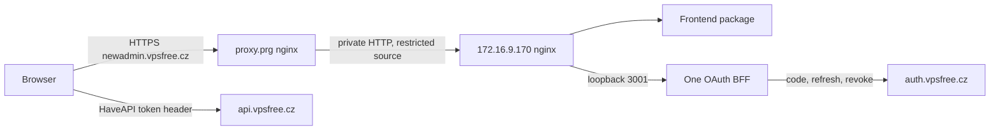

# vpsAdmin WebUI implementation and NixOS integration plan

Prepared 27 September 2026. Status: active implementation brief for the retained
team. The WebUI, NixOS packages/module and site configuration are committed on
feature branches. Controlled browser verification, packaged browser smoke and
final exact-head builds remain. The user will deploy. Build verification is
authorized; host activation is not part of the agents' deliverable.
See [current session status](state.md) for exact revisions and verification.

## Decisions and fixed deployment identity

| Item | Selected value |
| --- | --- |
| Canonical repository | `git@github.com:vpsfreecz/vpsadmin-webui.git` |
| API/terminology reference | Locked `vpsadmin` flake input in the UI repository |
| Site override | UI `inputs.vpsadmin.follows = "vpsadminServices"`, the input backing the `vpsadmin` channel |
| Number of instances | One frontend and one BFF process on one VPS |
| VPS ID | `30431` |
| Confctl machine | `cz.vpsfree/vpsadmin/int.vpsadmin-webui1` |
| Internal hostname | `vpsadmin-webui1.int.vpsfree.cz` |
| Backend IPv4 | `172.16.9.170` |
| Public origin | `https://newadmin.vpsfree.cz` |
| Public edge | Existing `proxy.prg`, machine `cz.vpsfree/containers/prg/proxy` |
| Edge private address in inspected configuration | `172.16.9.140` |
| Existing interface | Retain `https://vpsadmin.vpsfree.cz`; no default-interface cutover |
| Operator secrets | Root-owned `/private/vpsadmin-webui.env` on the new VPS |

Keep the existing OpenStreetMap/Nominatim call unchanged, as explicitly directed.
R1 is therefore outside remediation scope. Preserve the external origins needed
by that feature when configuring CSP. Do not add consent, a map proxy, a new map
provider or rate limiting as an unrequested substitute.

Do not reconstruct the formerly missing `UI_REDESIGN.md` as an external
requirement. Upstream has since added a self-contained pointer at that path;
the source-contained `docs/design/` handbook and explicit user decisions remain
the authority for this work.
The user has superseded the earlier two-instance recommendation.

## Source baseline and ownership

The initial review covered `fd290b5ec1b22900e704e8cb990c5ba050af2394`.
Implementation starts from upstream `e7ce3d73e799fc60e5933fe23bdb3a979eb4d6b9`.
The prior planning baseline `49c6a51d0b32c4a6d5dd1df426e0bac1d8066115` added
the design handbook, documentation checks, favicon and sidebar changes; the
newer baseline adds the self-contained redesign pointer, docs/audit updates and
small source/style changes. Do not carry earlier passing tests forward as
verification of the current revision.

Reference revisions remain:

- vpsAdmin: `7045c81b3a5be312eac0d41e8a44f783340abb9f`.
- Site configuration: `1e8dae229fbe4201b5e1f110721f0f63c4b46944`.
- Its vpsAdmin services input: `a65a4dfeb92a59df4a80a737a20bcbf8558793ff`.

At planning time the new GitHub repository advertises no branches. Its canonical
bare clone is `repos/vpsadmin-webui.git`, with `origin` pointing to the new repo
and a provenance remote `upstream` pointing to `Kerrycek/clankerdev`. The
session feature checkout is `worktrees/2026-09-27-newadmin-integration/vpsadmin-webui`.
The original `clankerdev` review checkout remains available as evidence.

The workspace project-map addition is committed as `f12ecd1a` and pushed in
`worktrees/2026-09-27-newadmin-integration/workspace` on the session feature branch.
It is a small coordination change, not a workspace runtime/package change.
Review and integrate it through the normal workspace feature procedure; the
shared master project map has not been changed. Its existing instruction tests
pass (6 tests, 84 assertions); independent review and integration remain pending.

Affected repositories:

| Repository | Work |
| --- | --- |
| `vpsadmin-webui` | Import provenance, fixes, localization, documentation, Nix packages/modules and tests |
| `vpsfree-cz-configuration` | UI input/channel, new host, proxy, DNS, monitoring and operator runbook |
| `aither64/vpsfree-cz-workspace` | Project map entry and initiative coordination |
| `vpsadmin` | Read-only API, module and terminology reference; no implicit backend changes |
| `vpsfree-kb-contracts` | Assess impact of changed labels/navigation; add work only if current documented/captured behavior requires it |

After the user adds members, check the retained same-session roster and assign:
the architect to `design.md`, the implementer to bounded application changes,
and the reviewer to independent committed-change review. The lead retains the
decisions, technical acceptance and final English/Czech editorial pass. Do not
invent members or start application implementation while the session is solo.

## Work sequence and completion criteria

### 1. Establish the new repository and instructions

1. Fetch both repositories again and compare upstream changes with the planning
   revision. Preserve the original Git history and authorship. Do not combine
   arbitrary pending upstream PRs with the import.
2. Agree the new repository's default branch before first publication. Prepare
   the import and feature branch locally, then publish the explicitly selected
   base/history under the normal integration gate. Do not push an invented
   initial `main` or unrelated upstream automation without review.
3. Adopt the new canonical clone URLs and package identity. Review Actions,
   deployment scripts, badges and repository-specific hooks before enabling
   them in the new namespace. Keep old host runbooks historical; do not run them
   on the new VPS or restart autonomous issue runners.
4. Update `AGENTS.md` to route localization work to a new
   `docs/agent-instructions/localization.md`. That procedure must require reading
   `docs/i18n-cs.md` from the UI's locked `vpsadmin` flake input for English/Czech
   UI terminology work. Resolve the input's store path through Nix, then read
   the file there. Record the exact input revision used. Do not use an unrelated
   sibling checkout, floating `master` or a copied glossary as the authority.
   Keep a source-repository link for discoverability, but the lock selects the
   version. The instruction change and flake input belong in the same work
   package so the prescribed lookup works from a clean clone.
5. Keep the localization procedure specific to TypeScript catalogs and BFF
   strings. vpsAdmin's gettext/YAML regeneration commands are not commands for
   this repository. Reference the workspace writing/KB process where applicable,
   without making the public repository depend solely on private skill paths.
6. Read and maintain `WORK_LOG.md` and `docs/design/`. Record the single-instance
   decision, new ownership/origin and R1 disposition, with source and status.
   Use existing requirement IDs, including REQ-009, 056-066, where relevant;
   add new IDs only when needed. Separate source, test and deployment status.
   Reconcile the BFF README's stale open-tab token-renewal statement with the
   bounded 401 recovery in `src/lib/auth/bffSession.ts`. Keep active documentation
   references local/versioned and run the new design-documentation audit.

Exit: a reproducible source baseline with preserved provenance, correct
instructions and self-contained design entry points. The missing old spec is
not a blocker. Final licensing intent/notice still needs confirmation; do not
invent copyright ownership from the manifest's `ISC` field.

### 2. Repair verification and test setup (R2, R8, R9)

1. Define one documented required PR/release check set. Include the production
   build, design documentation, relevant architecture audits, lint, types,
   catalog integrity, script tests, BFF tests and unit tests. Decide explicitly
   which slower browser/API/VM checks belong in release certification.
2. Pin a supported Node version in Nix/local tooling/CI and make npm use
   consistent. Provision Chromium explicitly for the script test that launches
   a browser, not only for Playwright jobs. Use the repository wrappers.
3. Reproduce the structural audit against the selected new baseline. Refactor
   the affected responsibilities or record narrow justified exceptions; do not
   overwrite the baseline to hide growth. Correct UI-string scanning of test
   fixtures. Keep product-string coverage intact.
4. Replace the single-quote-only i18n scan with parsing that sees all catalog
   keys and detects duplicates before object spreading. Check matching keys,
   interpolation variables and valid plural forms. Include an actual rendered
   regression for the network count placeholder, not just dictionary parity.
5. Add incremental ESLint React Hooks/accessibility rules and formatting checks.
   Extend type checking to tooling/config/E2E boundaries. Use checked JSDoc or a
   bounded type conversion for the BFF. Do not perform a repository-wide style
   rewrite as part of this adoption.
6. Reassess the jsdom/encoding/parser patch using the selected supported runtime.
   Remove obsolete patches; otherwise make the remaining patch version-bound,
   documented, explicitly dependent on its tools and fail on unexpected inputs.
7. Set a deliberate browser worker count. Diagnose the original 29 failures
   using the saved inventory, fresh failure logs, requests/console and traces.
   The five passing one-worker reruns do not close the other failures. Run the
   mobile stage independently so desktop failure cannot conceal its result.
8. Add critical smoke coverage against built static assets and the production
   nginx/BFF route configuration. Vite dev-server checks alone are insufficient.

Exit: required checks are documented, provisioned and passing on the chosen
revision; failures are fixed or explicitly classified with reviewed scope.
No blanket skip, retry inflation or deletion of safety assertions for green CI.

### 3. Correctness and maintainability (R5, R6, R7, R10)

Address these in small behavior-preserving commits, keeping tests close to the
affected contract:

- **Network lists:** replace silent 100-interface/250-route/address truncation
  with supported pagination or an explicit bounded/incomplete state. Verify
  backend ordering before adding ID cursors to `order=interface`. Cover more
  than the current limits, user ownership, deduplication and discoverability of
  newly created objects. Never present a partial sum as a complete total.
- **Bootstrap:** make deployment mode explicit. Production BFF mode requires
  valid runtime configuration and bounded config/session loads with a visible
  bilingual retry path. Validate MIME, shape, origin and endpoint settings.
  Missing configuration must not fall back silently to another API environment.
- **Runtime validation:** add explicit wire/domain types and focused decoders
  for IDs, permissions, action states and mutation receipts. Unknown/malformed
  data fails safely. Remove casts from critical gates and destructive forms
  before spending time on low-risk cosmetic type cleanup.
- **Page responsibilities:** extract domain hooks/editors from network actions
  and the largest touched controllers. Colocate query keys with adapters.
  Preserve target snapshots, locks, accepted-versus-complete distinctions,
  uncertain-result reconciliation and the rule against automatic write replay.
  Do not build a universal workflow framework to satisfy a line-count limit.

Exit: targeted regressions cover the actual defects; refactoring preserves
behavior and permissions. New API requirements must be proposed separately
with exact revisions and compatibility impact. Do not revive rejected backend
work or infer authorization to change vpsAdmin schemas from this UI plan.

### 4. English/Czech localization

The initial findings and exact examples are in [translation-review.md](translation-review.md).
The source scan found 8,164 unique literal keys in each language and no
cross-language placeholder-set mismatches, but this does not certify the prose
or its call sites. Complete the following review across the full catalogs:

1. Review each domain in pairs: shared labels/auth/public, VPS, storage, DNS,
   profile, admin/cluster, operations and requests/mailer. Record coverage by
   module so no domain is accidentally omitted.
2. Apply the authoritative vpsAdmin vocabulary, including Login versus Nickname,
   Status versus State, Node/Nody, Cluster, Lokace, Hostname, Uptime, Loadavg,
   User data, relace, vnořený dataset, odstávka/výpadek and power operations.
   Inspect context before replacing words. A financial `převod` is valid; a
   network transfer uses `přenos`. Do not replace non-VPS process states blindly.
3. Correct the stale test that calls the login field `Přezdívka`. Preserve the
   distinction between graceful Shutdown/Vypnout and immediate
   Poweroff/Vynutit vypnutí. Verify API action semantics before changing labels.
4. Review English for accurate action names, natural errors and concise help.
   Remove unnecessary implementation language from member flows while retaining
   technical details that affect a decision, units or the outcome of an action.
5. Use informal singular Czech explanatory text and infinitive action labels.
   Correct grammar, typography and inconsistent address in BFF pages too.
   Preserve placeholders, URLs, exact technical identifiers and meaning.
6. Exercise Czech/English plurals at 0, 1, 2, 4, 5, 11 and fractional values
   where supported. Use `tc` where inflection is needed. Check number/date/time
   formatting and units, interpolation argument names and unresolved tokens.
7. Check language preference persistence, browser fallback, impersonation,
   initial lazy-catalog loading and failure handling. UI-owned settings need
   not copy the legacy storage mechanism, but their behavior must be deliberate.
8. Review both languages in mobile/desktop layouts, dialogs, validation errors,
   destructive confirmations, accessible labels and keyboard navigation. Update
   related test expectations for the new correct text.
9. The lead applies the English/Czech writing skill directly after facts are
   settled. The independent reviewer checks meaning and terminology. Assess KB
   impact against `vpsfree-kb-contracts`; publication remains a separate action.

Exit: all catalog modules and BFF strings have a recorded language review;
integrity checks and relevant rendered cases pass; key collisions, the network
placeholder defect and documented terminology errors are resolved.

### 5. UI-owned Nix packaging and module (R4)

Proposed public interfaces for architect validation:

| Output/path | Contract |
| --- | --- |
| `packages.<system>.frontend` | Locked frontend build; output contains only static `dist/` contents |
| `packages.<system>.bff` | Locked production BFF dependencies and a wrapper around pinned Node |
| `nixosModules.default`, `nixos/modules/webui.nix` | Reusable nginx and BFF service integration |
| `devShells.<system>.default` | Node/npm, browser/check tooling and formatting tools |
| `checks.<system>.*` | Package, static/unit and module/VM checks |
| `services.vpsadmin-webui` | Domain, packages, API/OAuth settings, environment file, state, port and proxy settings |

Add `inputs.vpsadmin.url = "github:vpsfreecz/vpsadmin"` and commit its lock entry.
Choose the intended compatibility revision deliberately, starting from the
site's service pin when no prerequisite requires a different one. Keep the
reference for API-contract tests and localization together. Avoid conflicting
nixpkgs/vpsAdminOS follows; inspect the actual dependency graph and make shared
inputs consistent without adding vpsAdmin runtime services to the UI closure.

The new localization procedure should provide a command along these lines,
validated against the finished locked flake:

```sh
vpsadmin_source=$(nix eval --raw --impure --expr \
  '(builtins.getFlake (toString ./.)).inputs.vpsadmin.outPath')
cat "$vpsadmin_source/docs/i18n-cs.md"
```

Run from the UI repository root; the task-specific variable does not overwrite
shell environment identity. Resolve the revision from the same flake input for
the review record. This is read-only evaluation/fetching, not an input update.
If the locked source or its instructions are unavailable, report that concrete
problem rather than silently switching versions. Also read the input's relevant
localization procedure when it applies.

Treat this pin as the declared compatibility target. It is not proof that every
API version works or that production runs this revision. Required tests must
actually exercise the pinned API, and deployment verification records the
effective site override and installed API revision separately. Keep source-only
reference checks light; fetching the input must not unconditionally build the
API, kernel or vpsAdminOS.

Use two lockfile-specific dependency hashes. The BFF has no build script; disable
that phase. Pass `VITE_BUILD_SHA` explicitly, since the Nix source may lack `.git`.
Check output for leaked source/private files and deterministic build metadata.
No dependency installation or frontend compilation occurs on the deployed VPS.

Run `vpsadmin-webui-bff.service` as a dedicated unprivileged user with one process,
loopback port 3001, automatic restart, private persistent
`/var/lib/vpsadmin-webui/sessions`, restrictive umask and systemd hardening.
Systemd reads `/private/vpsadmin-webui.env`; Nix records its path, never its
contents. Keep signing secrets and file ownership stable across restarts.
Fail clearly if secrets are absent or invalid, without logging them.

Serve the frontend through nginx on the private VPS port 80. Route exact
`/config.json`, `/config.js`, `/session.json`, `/healthz` and the `/oauth/`
prefix to the BFF; the new JSON route is additive and the JavaScript route
remains for compatibility. Both project from one public configuration object;
never return SPA HTML for those endpoints or missing hashed assets. Preserve
no-store on auth/session output, correct MIME and security headers. Revalidate
HTML/build metadata; cache hashed assets immutably. Include a documented asset
retention or tested chunk-load recovery policy for already-open tabs.

Keep old PHP module options separate. The new service does not need PHP, a local
SQL database, Redis, RabbitMQ or a second instance. Provide runtime legacy URL
configuration for links/heatmaps that still use `https://vpsadmin.vpsfree.cz`.

Exit: frontend/BFF packages build from an immutable source; an isolated VM proves
service startup, routing, secure cookies, persistence and rollback without real
production secrets.

### 6. Site configuration and proxy integration



No new HAProxy backend or stickiness is needed for the selected single instance.
Existing legacy/API HAProxy services remain in place.

| Files | Planned change |
| --- | --- |
| `flake.nix` | Input `vpsadminWebui` with suitable nixpkgs follows and `inputs.vpsadmin.follows = "vpsadminServices"`; channel `vpsadmin-webui` mapping role `vpsadmin-webui` to that input |
| `cluster/cz.vpsfree/vpsadmin/int.vpsadmin-webui1/module.nix` | NixOS metadata, VPS 30431, host name/location/domain, 172.16.9.170/32, channels, node exporter, manual-update policy and service checks |
| Same directory, `config.nix` | Base/container profiles, upstream UI module/packages, public configuration, secret-file path, firewall and confirmed stateVersion |
| `cluster/cz.vpsfree/containers/prg/proxy/config.nix` | Metadata-resolved backend and `newadmin.vpsfree.cz` nginx vhost, ACME/TLS and explicit forwarded-header contract |
| Proxy `module.nix` | Local HTTPS readiness checks for the new hostname |
| `configs/public-dns/zone.vpsfree.cz.` | `newadmin IN CNAME proxy.prg.vpsfree.cz.` and serial increment |
| `configs/internal-dns/zone.vpsfree.cz.` | Same preview CNAME; `vpsadmin-webui1.int IN A 172.16.9.170`; serial increment |
| `health-checks/vpsadmin-webui.nix` | New-service checks, separate from legacy PHP checks |
| `modules/clusterconf/monitor/http.nix` and relevant rules | Public static/BFF availability, certificate monitoring and process alerting without collecting session tokens |
| `docs/` and its existing index | Operator deployment/secret/rollback instructions derived from the tested implementation |

Use the current `nixos-stable`/container conventions, but inspect the VPS's
installed architecture, boot/network configuration and `system.stateVersion`
before selecting its final profile. Do not copy the old host's `22.05` value or
guess it from today's NixOS channel. Avoid importing the legacy WebUI profile or
unneeded vpsAdmin service dependencies just to reuse the inventory directory.

The edge must overwrite untrusted forwarding headers. On the UI VPS accept HTTP
only from the edge and explicitly allowed monitors. Normalize the verified
external HTTPS scheme and client IP for the loopback BFF. The existing
`trust proxy = 1` and nginx `$scheme` examples cannot simply be copied through
two proxies: test secure-cookie issuance and per-client limiting, plus forged
headers. Decide whether backend TLS is needed from the actual network trust;
the initial proposal is restricted private HTTP, following the existing proxy
pattern.

Scope CSP to required API/auth/console, retained map and frame origins. Check
nginx header inheritance and avoid competing edge/backend policies. Disable or
redact query-string access logging on OAuth callback paths so codes/state do not
enter ordinary logs. Do not log session JSON, cookies or token headers.

After the source revision is published, update the new channel using confctl:

```sh
confctl inputs channel set --commit vpsadmin-webui vpsadmin-webui UI_REVISION
```

For later published default-branch updates use
`confctl inputs channel update --commit vpsadmin-webui vpsadmin-webui`.
Inspect the resulting lock diff. Do not hand-edit channel-owned pins. Confirm
the first-input bootstrap with the repository's confctl version, keeping the
source change and generated input update reviewable.

The channel name is `vpsadmin`; its current flake input is `vpsadminServices`.
Nix `follows` uses that input name, not the channel name. Verify the effective
WebUI API input resolves to the same revision as the channel, including after
future service-channel updates. Do not add a second independent production API
pin that can drift. Contract checks must also run with this site override when
it differs from the UI repository's lock; building the static UI alone does not
exercise API compatibility.

Exit: a feature revision contains only intended site changes; the exact host
builds and rendered nginx/systemd/DNS output match the diagram and secret contract.

### 7. API contract, release and operational verification (R11, R12)

Use the documented API capabilities and the new handbook's known cursor gaps.
The UI's domain/API types and mocked responses are not proof of deployed API
behavior. Record the tested UI and API revisions together. Cover OAuth login,
refresh/logout, password recovery/passkey handoff, settings, roles, networking,
action-state receipts, console and download paths in an owned test environment.

For destructive/storage operations assert that intended data survives and that
rejected/uncertain operations are not resubmitted automatically. Preserve the
reviewed framework and existing safeguards. Firefox/WebKit coverage depends on
the declared browser support policy; do not claim it from Chromium results.

Settle maintainership, support/security reporting and release provenance. Measure
initial/route-load performance and locale chunks on representative mobile
conditions before splitting them. Document a small measured budget, not a blanket
failure based on Vite's chunk-size warning.

Exit: an exact release candidate has independent review and reproducible build,
browser, real-API and VM evidence, with clearly stated remaining limits. Produce
a deployment receipt template and final runbook; the user performs deployment.

## Verification order and build targets

1. **Quick checks:** lockfile installs in the declared shell, lint/types,
   localization and documentation checks, focused behavior tests and appropriate
   package evaluation. Run the repository hooks for every commit.
2. **Commit and independent review:** apply `mandatory-change-review` to all
   intended committed changes before long integration tests. Select the retained
   reviewer settings. Include source and configuration diffs, compatibility,
   user decisions, the complete base-to-head series and migration provenance.
   No new database migration is planned. Reconcile every finding and rerun the
   relevant review after material fixes.
3. **Long verification:** use fresh installed-policy Luna/low watchers for
   package builds, browser suites, NixOS VM checks, live isolated integration and
   CI waits. The lead diagnoses failures. Use bridge networking for owned
   development clusters. Do not operate on shared production/test resources.
4. **Configuration builds:** from the configuration feature worktree's
   `nix develop`, build the explicit affected machines below. A build does not
   activate or copy a generation to a production host.
5. **Final review and handoff:** after any rebase, inventory final history and
   exact heads again; preserve supported state and migration lineage. Capture
   comparisons, resolve review/CI findings and prepare the user deployment bundle.

Proposed build commands once implementation exists:

```sh
confctl build cz.vpsfree/vpsadmin/int.vpsadmin-webui1
confctl build cz.vpsfree/containers/prg/proxy
confctl build cz.vpsfree/containers/ns1
confctl build cz.vpsfree/containers/prg/int.ns1
confctl build cz.vpsfree/containers/brq/int.ns1
confctl build cz.vpsfree/containers/prg/int.mon1
confctl build cz.vpsfree/containers/prg/int.mon2
```

The public zone's inspected primary is `containers/ns1`; public secondaries
normally receive the zone by transfer and need propagation checks, not unrelated
configuration deployments. The internal zone is loaded separately on both
internal nameservers and both Prague monitors. Monitor configuration changes
also affect the latter two machines. Re-evaluate this target list from the final
configuration if the topology changes. Do not use broad cluster wildcards.

VM/browser acceptance includes: deep links; asset 404; config/session MIME and
cache headers; spoofed forwarding headers; secure cookie/callback; one-use state;
same-origin controls; concurrent refresh/logout; restart with preserved state;
missing secrets; unavailable API/auth; old-tab assets; both languages and mobile;
and restoring the previous package/configuration generation. Mock external maps
in tests while retaining the product behavior. Check closures/configuration for
secret values using synthetic fixtures rather than production credentials.

## Compatibility and recovery boundaries

- Keep UI/API versions independent and document the minimum supported API
  contract. No API, node protocol, CLI or Terraform behavior change is intended.
- Retain the file-session shape/signing behavior through initial packaging.
  Any later incompatible shape requires an explicit version or intentional
  session invalidation and a tested rollback policy.
- Browser-local settings/tasks/locks must remain compatible; the new origin gets
  fresh cookies and origin storage. Do not widen cookies to all of `vpsfree.cz`.
- Rollback restores the prior UI/BFF packages, configuration and compatible
  session state. It cannot undo completed API mutations. If session-state
  recovery is uncertain, choose controlled reauthentication instead of restoring
  stale rotated refresh tokens blindly.
- A single instance has a maintenance/failure window. Preserve that selected
  tradeoff; no HA store, secondary VPS or session replication is in scope.
- Keep legacy service routes, maintenance access and old public DNS unchanged.
  Promotion to `vpsadmin.vpsfree.cz` needs a later plan and explicit direction.

## Operator handoff and definition of done

The [deployment runbook](deployment-runbook.md) specifies the secret file, OAuth
registration, preparation, deployment order, checks and recovery. Its proposed
unit/option names must be reconciled with the architect's final design and tested
implementation before it is marked executable.

The implementation team must deliver: reviewed commits and branch comparisons;
final source/configuration revisions; successful required checks and machine
builds; the final `/private/` contract; tested operator commands; outstanding
limitations; and rollback artifacts. Agents must not perform live activation,
DNS deployment, secret installation or OAuth client creation for this task.

Remaining operator inputs before activation are the OAuth client values, actual
VPS SSH/OS baseline and any existing private-network access requirements. They
do not prevent implementation planning. The user will add the architect,
implementer and reviewer before application work starts.
