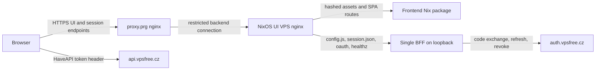

# vpsAdmin WebUI Next: code and integration review

Reviewed 27 September 2026. Status: initial adoption assessment; remediation and
NixOS deployment have not been performed.

Follow-up decisions: use one instance in `vpsfreecz/vpsadmin-webui`, deployed by
the user at `newadmin.vpsfree.cz`. Keep the existing map call. The new upstream
`docs/design/` handbook replaces the missing external specification.
[The implementation plan](implementation-plan.md) is the current scope authority;
this report preserves the original source findings and earlier options analysis.

## Recommendation

Continue with this implementation, subject to the adoption gates below. Its
React/TypeScript SPA, domain API adapters and small OAuth service are a reasonable
foundation. A rewrite or a move to another frontend framework is not justified by
this review. The main work is to make existing behavior easier to maintain and to
establish a reproducible, tested production deployment.

Do not yet replace `vpsadmin.vpsfree.cz`. Repair the verification gates, reconcile
the replacement documentation, package both runtime components, and certify the
important workflows against the actual supported API. Large test counts are
useful evidence, but they do not establish production parity on their own.

## Scope and evidence

| Repository | Reviewed revision | Purpose |
| --- | --- | --- |
| [Kerrycek/clankerdev](https://github.com/Kerrycek/clankerdev/tree/fd290b5ec1b22900e704e8cb990c5ba050af2394) | `fd290b5ec1b22900e704e8cb990c5ba050af2394` | Application, BFF, tests, CI, deployment scripts and docs |
| vpsfreecz/vpsadmin | `7045c81b3a5be312eac0d41e8a44f783340abb9f` | API and existing NixOS module reference |
| vpsfreecz/vpsfree-cz-configuration | `1e8dae229fbe4201b5e1f110721f0f63c4b46944` | Proxy, DNS, host inventory and input channels |

This is a source review with local verification and sampling of representative
high-impact flows: authentication, mutation recovery, networking, requests,
permissions, route boundaries and deployment. It is not an exhaustive audit of
every page, a penetration test, or proof of production feature parity. No live
VPS operations, production login, deployment, repository transfer or upstream
changes were made. Reference `master` revisions describe source configuration;
they do not prove what is currently deployed.

The configuration's `vpsadmin` service channel pins
`a65a4dfeb92a59df4a80a737a20bcbf8558793ff` through `vpsadminServices`; API host
metadata selects that channel. There are no commits changing `api/` or
`plugins/webui/` between that pin and the reviewed API reference head. Actual
deployed revisions and migrations still need checking before certification.

The checkout has 1,823 tracked files, including 293 `*.test.*` files and 230 E2E
specifications. Source-only measurements exclude tests: 1,043 TypeScript/TSX
files, 815 textual `as any` occurrences, 63 files above 500 lines and seven above
1,000 lines.
These are maintenance indicators, not quality scores. The repository's own
structural audit includes test casts and reports 892 `as any` occurrences.

[Verification evidence](verification.md) records commands, outcomes and limits.
The build, all 1,514 unit tests and all 36 BFF tests pass locally. The initial
mocked desktop PR smoke records 349 passes and 29 failures; the chained mobile
stage was not reached. The structural and UI-string audits also fail. The three
string findings are in test fixtures, not untranslated product UI. See the
evidence for focused follow-up and the distinction between application defects,
test configuration and unresolved browser failures.
All five selected failed browser tests passed when run with one worker; the
remaining 24 were not rerun. This supports concurrency/timing sensitivity without
establishing a root cause for the full set.

## What is already good

- TypeScript enables `strict`, `noUncheckedIndexedAccess` and additional strict
  options. API access is largely concentrated in domain adapters instead of
  scattered raw requests throughout pages.
- TanStack Query manages server data; routing, UI primitives, translations,
  permissions and several domain models have distinct homes. Many routes load
  lazily. The existing library choices are suitable for this application.
- The code takes infrastructure mutations seriously: action-state tracking,
  object locks, uncertain-result reconciliation and confirmation workflows are
  present. Authentication recovery deliberately avoids automatically replaying
  writes. Preserve these semantics during refactoring.
- OAuth has useful protections: server-side client/refresh secrets, expiring
  one-use state, session regeneration, secure HttpOnly cookies, bounded provider
  requests, same-origin session JSON, login throttling and concurrent-session
  tests. The process-local queue addresses a real refresh/logout race.
- There is meaningful behavioral coverage, including negative outcomes,
  ambiguous responses, permission boundaries, keyboard/focus behavior, mobile
  layouts, session races and localization. The suite is far beyond a collection
  of happy-path snapshots. Playwright separates mocked CI from manual live work.
- Dependency locks use the public npm registry. The production frontend builds
  from a clean checkout and emits revision information. UI English/Czech key
  parity and the source CSP hash check pass locally.

## Findings and required improvements

Priorities: **P1** before a production-backed pilot or organizational adoption;
**P2** before making this the default interface, with small fixes suitable for the
pilot milestone; **P3** follow-up improvement. An intentionally isolated test-API
preview can proceed before production gates are satisfied.

### R1 — P1: registration details send personal addresses to a third party automatically

Disposition: the user explicitly selected keeping the existing call unchanged.
The original finding below remains evidence; no R1 remediation is planned.

[RequestDetailPage.tsx:106][request-detail] passes `request.address` to
[RequestAddressMapLink.tsx:75][address-map]. The component enables its query
whenever the address is nonempty and immediately calls
`https://nominatim.openstreetmap.org/search?q=<address>`. A returned location also
loads an OpenStreetMap iframe. There is no separate user action to initiate that
external request. This is source-confirmed behavior, not a claim that a real
applicant's data was transmitted during this review.

The public service's [usage policy][nominatim-policy] asks callers not to submit
personal or confidential data, limits the entire application's traffic to one
request per second, and requires a service that can be changed without a software
update. A per-browser query cache and hardcoded URL do not satisfy those operational
requirements.

**Change:** remove automatic external geocoding. Keep address display/copy; decide
whether maps warrant an explicitly configured service with an appropriate data
handling arrangement. A click alone does not resolve the public service's policy
on personal data. Make any retained external map action explicit and document its
data destination.

**Acceptance:** opening a registration detail makes no request to a map/geocoding
origin. Test this at the browser network boundary. A configured optional map
service must have a clear owner, request limits and failure behavior.

### R2 — P1: the declared release checks are not the enforced CI contract

[package.json][package] defines a broad `ci:check`, but
[.github/workflows/ci.yml:45][ci] runs only `ci:pr`. The other workflows run
Playwright suites. None of the four checked workflows invokes `ci:check` or
`npm run build`.

This matters now: `npm run ci:check` fails locally at `audit:structural`, including
63 files above 500 lines against a baseline of 53, added casts and growth in
already over-budget files. The failing gate is not exercised by the main checks
workflow. Playwright starts `npm run dev`; a green browser suite therefore does
not validate Rollup output, production chunking or nginx routing.

Running the previously skipped audits individually also finds three UI-string
violations, all in test fixtures. Fix the audit's scope or document narrow fixture
exceptions; this is not evidence of missing user-visible translations. The PR
browser command selected 32 workers on this host and produced both unfinished
lazy-page loads and pagination assertions. Bound worker counts, collect useful
failure diagnostics and investigate before relying on retries for green checks.

There is also an implicit browser prerequisite in `test:scripts`:
[scripts/live-vps-certification-browser-proxy.test.mjs:59][browser-test] launches
Chromium. The first local `ci:pr` run stopped there because no browser was
installed. The CI checks job does not explicitly install one; it can depend on a
runner's system browser. This is an environment reproducibility gap, not proof
that an inspected GitHub run failed.

**Change:** define one documented set of required PR/release jobs. Run the build
and relevant architecture audits in it. Triage structural exceptions explicitly;
do not merely regenerate a permissive baseline to get green checks. Install and
pin the required browser in every job that uses it, or move that test into a
browser-provisioned job. Keep fast mocked checks separate from slower release
certification.

**Acceptance:** a new runner can execute every declared check using documented
setup; required jobs include the production build and the agreed structural
checks. Run at least critical browser smoke against the built assets through the
production routing configuration.

### R3 — P1: the authoritative specification is missing from the repository

Follow-up: upstream `49c6a51d0b32c4a6d5dd1df426e0bac1d8066115` contains a
self-contained `docs/design/` handbook and updates active entry points. Its
documentation audit passes. The user confirmed the old file is unavailable and
need not be recovered; this finding describes the initial review revision.

[SPEC.md][spec] points to `../UI_REDESIGN.md`; [docs/README.md][docs-readme] and
[docs/CANONICAL_DOCS.md][canonical-docs] point outside the repository too. No such
specification is tracked. These files nevertheless forbid adding requirements
elsewhere and assign release gates, requirements and compatibility truth to the
missing document. A new maintainer cannot discover the supported product contract.
`audit:active-docs` scans terminology; it does not verify that these links resolve.

**Change:** bring the actual maintained specification into this repository with
its provenance, or replace the pointers with a concise current architecture and
support contract. Separate lasting behavior from old rollout notes. Record API
requirements, supported authentication modes, known parity gaps and release
criteria. Add local Markdown-link validation. Update stale BFF documentation:
its final paragraph says an open SPA cannot renew after another tab rotates a
token, while `src/lib/auth/bffSession.ts` now implements bounded 401 recovery.

**Acceptance:** a clone is sufficient to understand the architecture, supported
API and deployment; all normative references resolve within it or to explicit,
versioned external contracts.

### R4 — P1 for NixOS deployment: packaging and service integration do not exist

There are no tracked `.nix` files. [deploy/README.md][deploy-readme] describes an
Ubuntu root script that installs build tooling, modifies the lockfile, builds on
the server and rsyncs into a mutable webroot. That is not an appropriate production
contract for the intended confctl/NixOS deployment. The BFF is a required second
runtime component for the proposed OAuth deployment; packaging only `dist/` would
leave login, configuration and sessions incomplete.

**Change and acceptance:** implement the package/module split and integration
checks described below. Build once from a pinned source revision, activate an
immutable generation, keep secrets and sessions outside the store, and prove
restart/rollback behavior. Site-specific hostnames and addresses belong in the
configuration repository.

### R5 — P2: capped network queries silently present incomplete data

[VpsNetworkPage.tsx:108][vps-network] requests 100 network interfaces and 250 IP
routes/host addresses, then keeps only `.data`. The route and host adapters make
one request, and the cards receive plain arrays without a continuation token or
truncation indicator. The current API reference applies pagination to these
resources. At larger cardinalities, later records are inaccessible from this
view and summaries or assignment choices can appear complete when they are not.
This is established from the request/rendering path; no large live account was
queried.

**Change:** use explicit pagination or an intentionally bounded collection helper
with a visible incomplete-data state. Choose cursor-compatible ordering; these
requests currently use `order=interface`, so simply adding an ID cursor without
checking backend ordering is not sufficient. Treat caps on selection inputs and
accounting aggregation separately from paginated display tables.

**Acceptance:** fixtures above 250 addresses and the interface limit demonstrate
that all records are reachable, summaries do not misrepresent partial data, and
newly created objects remain discoverable.

### R6 — P2: runtime type trust is much broader than the TypeScript settings suggest

[haveapi.ts:206][haveapi] unwraps JSON by casting it to caller-supplied `T`.
`haveapiEnvelope.ts` checks the envelope's boolean status, but not domain fields.
Several resource types have optional fields and an unrestricted string index;
permission/state code still uses `as any`, even for known fields. A backend change
or malformed response can therefore compile successfully and reach UI logic with
unexpected values. Existing fail-closed guards help, but the validation boundary
is inconsistent.

**Change:** introduce explicit wire types and small runtime decoders for critical
resource IDs, states, booleans and mutation outcomes, then normalize to domain
models. Gradually replace casts in gates, task processing and destructive forms.
Use HaveAPI metadata or generated types where useful, with a pinned contract and
a reviewable update process; generation alone does not validate runtime input.
Avoid a wholesale schema-library conversion before the important boundaries are
understood.

**Acceptance:** malformed and unknown states fail safely with useful errors;
critical code does not bypass types, and adapters are checked against actual
supported API responses rather than only fixtures written to match the UI.

### R7 — P2: page components own too many independent responsibilities

[VpsNetworkPage.tsx][vps-network] combines queries, roughly a dozen mutation flows,
permission snapshots, lock handling, reconciliation, cache invalidation, modal
state and markup in over 1,200 lines. Other examples include migration details,
incidents, OOM reports and DNS zones. This makes a change to one operation liable
to affect unrelated controls and encourages divergence in failure handling.

Some model/component extraction already exists and should be extended. Extract
cohesive domain hooks and editors, colocate typed query-key factories with their
adapters, and centralize only genuinely shared mutation mechanics. Keep operation
semantics explicit: deleting a VPS, changing a PTR and reconciling an uncertain
create are not interchangeable operations. Do not introduce a generic workflow
framework simply to reduce line counts.

**Acceptance:** a maintainer can change and test one network action without
editing the whole page; generation checks, target snapshots and no-replay
semantics retain their behavioral coverage. Use structural limits as a review
signal with reasoned exceptions, not as the sole design objective.

### R8 — P2: conventional linting and typechecking leave important code outside the gate

`lint` consists of Tailwind checks and a source-regex blacklist of known mistakes.
It does not provide general React Hooks, dependency-array or accessibility
analysis. [tsconfig.json][tsconfig] includes `src` and `vitest.setup.ts`, leaving
build code, Vite/Playwright configuration and E2E helpers outside its TypeScript
check. The BFF is JavaScript without a comparable static-analysis gate.

**Change:** add a small conventional ESLint setup, including React Hooks, and a
formatter check. Add separate tooling/E2E tsconfigs; use checked JSDoc or TypeScript
for BFF boundaries as a staged change. Keep useful project-specific audits. Apply
rules incrementally without a giant unrelated formatting rewrite. Make Node/npm
versions consistent between local setup, CI and Nix.

**Acceptance:** a hook dependency error and a type error in an E2E/build helper
fail CI. Changed code has an enforceable style and type boundary.

### R9 — P2: tests patch their own DOM implementation before running

Every `npm test` runs
[scripts/patch-html-encoding-sniffer.mjs][test-patch], which rewrites installed
jsdom/encoding dependencies, adds an undeclared shim, bundles parse5 and alters
package exports. Replacement targets that disappear can be silently skipped.
This introduces a second, locally modified dependency graph and makes test
semantics and upgrades harder to reason about. It is particularly awkward for a
reproducible Nix check.

**Change:** choose a supported Node/jsdom combination and test whether these
compatibility patches remain necessary. Remove obsolete patches. If a patch is
still required, make it explicit, version-bound, documented and fail on an
unexpected upstream input. Declare build-tool dependencies directly where used.

**Acceptance:** a fresh install has a predictable test runtime; dependency updates
cannot silently skip an essential patch. Existing behavior tests still pass.

### R10 — P2: optional, unbounded bootstrap can conceal deployment failures

[src/bootstrap.ts][bootstrap] awaits optional runtime scripts and
`loadBffRuntimeSession()` before mounting React. The session request at
[runtimeBootstrap.ts:155][runtime-bootstrap] has no timeout/abort signal; the
script loader also has no application deadline. An unresponsive endpoint can
leave the UI waiting without its normal recovery screen. Failed configuration
loads are swallowed, and `config.ts` has production API defaults. A broken test
configuration can consequently fall back to an unintended backend.

**Change:** make the selected deployment mode explicit. A BFF deployment should
require valid configuration and bounded bootstrap, with a visible retryable error.
Retain optional fallback only for documented standalone/legacy modes. Validate
BFF URLs, ports and duration settings at startup; keep production endpoint choices
in deployment configuration.

**Acceptance:** blocked, missing, malformed and wrong-MIME config/session endpoints
produce bounded, understandable failures and never silently change backend.

### R11 — P2: expand contract and release testing, not just fixture volume

The current mocked E2E suite is valuable and should remain fast. It does not
establish that a user, support user and administrator can perform the same flows
against the deployed HaveAPI version. Manual/live scripts exist, but several are
bound to particular hosts, API fingerprints and disposable resources. Their
existence is not evidence that a new deployment has passed them.

**Change:** add a small reproducible integration layer using the actual API in an
owned test environment and disposable fixtures. Cover OAuth callback/refresh/logout,
user settings, permission distinctions, keyset pagination and action-state
completion. Certify storage/destructive workflows with explicit data-preservation
assertions. Add Firefox/WebKit smoke for core navigation/auth/forms if those are
supported browsers; the checked Playwright config currently defines desktop and
mobile Chromium only. Establish focused coverage expectations for gates, adapters
and reconciliation rather than chasing one global percentage.

**Acceptance:** a pinned UI/API pair has recorded results; tested failures include
expired sessions, malformed responses, loss of connectivity after a write, route
changes during mutations, and role restrictions. Production-built static assets
and the packaged BFF/nginx path participate in release tests.

### R12 — P3: reduce release and ownership ambiguity

`package.json` calls the project `webui-next`, version `1.0.0`, with an ISC license
field; no top-level LICENSE/COPYING file is tracked. Maintainers should explicitly
settle the license and notices before organization adoption. Add an owner/support
entry point, contribution instructions, vulnerability reporting and a release
policy. Preserve imported history/provenance. Do not infer a licensing decision
from a starter manifest field.

The build also warns about large locale chunks: English is approximately 546 kB
minified (118 kB gzip), Czech 576 kB (132 kB gzip). Measure the actual initial
request graph and route load performance on ordinary mobile hardware before
splitting further; a chunk warning alone is not a performance defect. Keep a
small bundle/performance budget once that baseline exists.

## Proposed NixOS support

### Ownership and layout

Put reusable packaging and modules in the UI repository, as vpsAdmin does for its
own services. Keep site infrastructure in `vpsfree-cz-configuration`. A suitable
initial interface is:

| Output/path | Responsibility |
| --- | --- |
| `packages.<system>.frontend` / `packages/frontend.nix` | Build root lockfile and install only `dist/` |
| `packages.<system>.bff` / `packages/bff.nix` | Install locked production BFF dependencies and wrap the pinned Node executable |
| `nixosModules.default` / `nixos/modules/webui.nix` | Configure nginx, BFF service, runtime config, session state and secret-file references |
| `devShells.<system>.default` | Consistent Node/npm and check tooling |
| `checks.<system>.*` | Build, focused tests and module/VM integration checks |

`buildNpmPackage` with separate dependency hashes for the two lockfiles is a
reasonable starting point. The BFF has no build script, so disable that phase
explicitly. Install only required output; avoid shipping the checkout, tests and
operational artifacts as a public webroot. Pass the revision explicitly as
`VITE_BUILD_SHA`, since a Nix source normally lacks `.git`. Nixpkgs documents the
[buildNpmPackage contract][nix-npm].

Use a stable option namespace such as `services.vpsadmin-webui`, independent of
the temporary public hostname. Keep the old PHP UI's `vpsadmin.webui` options
separate so both can coexist. A single instance is sufficient initially. Suggested
options: frontend/BFF packages, domain/public origin, API URL/version, OAuth
endpoint/client ID settings, credentials environment-file path, BFF port, session
state directory, cookie name, trusted proxy configuration and nginx enablement.
These are proposed interfaces, not implemented options.

Keep client and session secrets in the site's protected secret files and reference
them through systemd `EnvironmentFile` (or add explicit credential-file support).
Never generate secret values with Nix string interpolation or put them in
`/config.js`. Store sessions in a private persistent `StateDirectory`, set a
restrictive umask, run as an unprivileged service user, and retain the existing
systemd hardening. Test extra restrictions with Node before enabling them;
blanket executable-memory restrictions can conflict with the JavaScript runtime.

Run exactly one BFF process per file session store. A second instance cannot
safely share that store: serialization is process-local. Separate instances with
independent stores and cookie affinity are a different, feasible deployment, with
the failover limits described below. Adding Redis alone would not replace the
queue semantics.

### Two instances behind HAProxy

Historical option analysis: the user subsequently selected a single instance.
Replication, sticky sessions and shared session storage are outside the current
implementation plan.

Two UI hosts are feasible and useful for host maintenance and failure recovery.
The static SPA has no server-side session state, so identical assets can be
served by either host. The authentication service needs a deliberate session
policy. The [current vpsAdmin HAProxy module][current-haproxy] generates ordinary
round-robin WebUI backends without cookie persistence; that policy cannot be
copied unchanged for two independent BFF stores.

| Deployment | What survives a UI host failure | Additional requirements |
| --- | --- | --- |
| Two static servers, one BFF | Static files remain available; login/session recovery still depends on the single BFF | Separate routing for static and authentication endpoints |
| Two complete instances, separate local session stores | The service can accept new logins on the surviving instance; sessions from the failed instance are unavailable there | Cookie affinity from login initiation through callback, session reads, refresh and logout; tested reauthentication |
| Two complete instances, shared session storage | Session continuity can survive a UI host failure, subject to in-flight OAuth/provider failures | Shared available storage, consistent signing/configuration and correct distributed session serialization |

For the separate-store option, use a dedicated HAProxy affinity cookie rather than
hashing the application session ID: the BFF regenerates that ID during login.
[HAProxy documents cookie persistence][haproxy-persistence]. Both instances serve
the same public origin and OAuth callback. Keep one BFF process and persistent
store per host; do not copy live session files between them or place the existing
stores on a shared filesystem.

With affinity, a healthy session stays on its original instance. On failover,
an affected user must establish a new BFF session, and an interrupted OAuth
callback must restart login. An already open SPA can continue using a valid
access token against the API until it needs session recovery; failover does not
necessarily interrupt every open page immediately. These consequences follow
from the source and have not yet been exercised in a two-host test.

Session-preserving failover needs more than replacing the file store with Redis.
The current queue encloses session loading, OAuth-state consumption, refresh,
logout and the final save within one process. A shared-store design must preserve
those guarantees across both processes, including crash/lease expiry, stale
writes and session-ID regeneration. Use compatible state formats and consistent
session signing keys. Make the store sufficiently available, otherwise it becomes
the new failure point. Also account for the currently process-local login limiter.

My proposed path is one instance for the preview, then two complete instances on
different underlying nodes for the final service, with cookie affinity if
reauthentication after host failure is acceptable. Choose shared sessions only if
preserving logins justifies the extra implementation and operating complexity.
This is a recommendation, not a selected availability contract. Because most
work runs in the browser and API calls bypass the BFF, capacity alone is unlikely
to justify two UI hosts without load evidence. The main benefit is availability.

Before production, test host loss during login, refresh and logout; recovery when
the old host returns; maintenance draining; and mixed-version asset loading.
Retain old hashed assets on both hosts during upgrades so a surviving server can
serve requests from an older open tab. Health checks must cover both static and
BFF service readiness. Two hosts do not remove dependency on `proxy.prg`, API or
OAuth availability, or protect against a bug deployed to both hosts.

### Request paths and trust

The present BFF is an OAuth/session service, not a general API proxy. Access
tokens are deliberately delivered to JavaScript by `/session.json`; client
secrets and refresh tokens remain server-side. Keep that boundary explicit. A
full API BFF would change CORS, CSRF, request streaming and console/download
behavior; evaluate it separately if hiding bearer tokens from JavaScript becomes
a requirement.

The new two-proxy topology needs deliberate handling. Today `bff/server.js` uses
`trust proxy = 1`, and the deployment scripts commonly set `X-Forwarded-Proto`
from nginx's local scheme. Blindly copying them behind a TLS-terminating
`proxy.prg` can mark a secure external request as HTTP, suppress secure session
cookies, and make login limiting use the edge proxy's IP for every user.

At the public edge overwrite client-supplied forwarding headers. Permit backend
access only from the intended proxy/monitoring sources. At the UI nginx, accept
forwarded scheme/client identity only from that trusted edge and normalize what
the BFF receives. Test spoofed headers and every supported route to the backend.
Do not solve it by unconditionally trusting arbitrary `X-Forwarded-*` values.
This follows the [Express proxy-trust contract][express-proxy]. Decide whether the
backend connection requires TLS based on its actual network placement.

Serve `/config.js`, `/session.json`, `/oauth/*` and `/healthz` through exact,
reviewed routes; never let them fall through to `index.html`. Auth/session output
must be `no-store`. Serve hashed assets with immutable caching and missing assets
as 404, while HTML and build metadata remain revalidatable. Retain previous
hashed assets for an upgrade window or prove an acceptable reload/recovery path
for tabs opened before deployment. A Nix generation switch alone does not keep
old URLs accessible from the new nginx document root.

Generate CSP from the endpoints the application actually needs. Existing examples
permit all HTTPS/WSS connections and all HTTPS frames. Narrow this to the API,
OAuth/passkey, console and any explicitly approved optional services. Preserve
headers on nginx locations that set their own `add_header` directives and avoid
conflicting duplicate policies between edge and backend. Test the emitted policy,
not only the source hash.

### Module acceptance tests

Use a local mock OAuth provider plus the packaged service in a NixOS VM test:
static and deep-link routing; absent assets; runtime MIME/cache headers; secure
cookie creation through the two-proxy path; code/state exchange and replay
rejection; refresh/logout races; store permissions and restart persistence;
invalid settings; and upgrade/rollback. Verify one user's token never appears in
another response or cache. Add external availability checks for static readiness
and the BFF, without logging session bodies, OAuth codes or authorization headers.
A plain `ok` from `/healthz` alone does not prove OAuth or store readiness.

## Changes anticipated in vpsfree-cz-configuration

| Area | Concrete location / proposed work |
| --- | --- |
| UI source pin | `flake.nix`: a dedicated input and confctl channel mapping for the selected repository; follow the existing channel conventions |
| UI VPS | New `cluster/cz.vpsfree/.../<host>/{module,config}.nix`; select the actual inventory path, VPS identity and address before implementation; import the upstream module |
| Edge frontend | `cluster/cz.vpsfree/containers/prg/proxy/config.nix`: a new hostname virtual host pointing to the UI VPS, with ACME/TLS and the reviewed header contract |
| Health checks | Proxy `module.nix`, UI host metadata and appropriate reusable checks; include session endpoint MIME and route checks without recording credentials |
| Public DNS | `configs/public-dns/zone.vpsfree.cz.`: chosen preview name as CNAME to `proxy.prg.vpsfree.cz.`, with serial update |
| Internal DNS | `configs/internal-dns/zone.vpsfree.cz.`: corresponding name and serial update; internal resolvers are authoritative for their own copy |
| Secrets/OAuth | Protected site secret files and an OAuth client registration for the exact callback; registrations are not established by a DNS or flake change |
| Final replacement | `cluster/cz.vpsfree/vpsadmin/common/frontend.nix`: preserve/adjust existing frontend, maintenance, HAProxy and `network-graphs` behavior during the later cutover |

The reviewed public zone currently points `clankerdev` directly at its own A/AAAA
addresses. The new preview need not reuse or disturb that deployment. Both the
public and internal zones contain the existing `proxy.prg`/vpsAdmin service names;
changing only the public zone would leave internal DNS clients without the new
name.

Use `confctl inputs channel update --commit` for normal published input updates,
or `channel set --commit` for an exact feature revision. Do not hand-edit a
channel-owned lockfile. Build and dry-activate only the explicitly affected
hosts, then deploy the selected feature revision when that phase is authorized.

Verify the browser's CORS preflight and `X-HaveAPI-OAuth2-Token` behavior against
the intended API. Register the exact HTTPS callback and configure authorize,
token **and revoke** URLs. Keep passkey registration at the authentication
origin: the referenced API derives WebAuthn origins from `auth_url`. Do not change
the WebAuthn relying-party identity merely because the UI preview hostname changes.
Confirm minimum API capabilities, including user settings, action states,
networking and password recovery. Their presence on current source `master` does
not establish deployment or schema readiness.

## Compatibility, rollout and recovery

1. **Repair and establish the baseline.** Resolve R1–R3, document supported API
   capabilities and finish the targeted correctness fixes. Establish ownership
   and repository name. Independent review of fixes follows the workspace change
   review procedure; this report is not a substitute for reviewing those patches.
2. **Package and test.** Add UI-owned Nix packages/modules, a dev shell and the
   VM/production-build checks. Publish a reviewable feature revision. Package the
   SPA and BFF from the same revision while testing any supported mixed-version
   upgrade window.
3. **Use an isolated preview first.** Allocate the NixOS VPS, secret files and
   OAuth client; test the complete edge/backend route using the test API. Verify
   both DNS views, IPv4/IPv6, TLS, authentication, console and download paths.
4. **Opt-in production pilot.** After the production gates pass, point the chosen
   preview origin at production API/auth with a distinct OAuth registration.
   Keep the existing PHP UI available. Record known parity gaps and support both
   interfaces. A preview connected to production can perform real mutations.
5. **Replacement gate.** Certify member, support and admin workflows; accessibility
   and mobile behavior; destructive/storage data preservation; monitoring; and
   an exercised rollback. Update KB text/screenshots and route/deep-link guidance
   under the normal publication process before promoting it as the default.
6. **Final cutover, separately directed.** Register/configure the final callback,
   switch the existing `vpsadmin.vpsfree.cz` frontend while preserving maintenance
   access and special routes, and keep a reachable legacy fallback for the agreed
   period. Map old PHP `?page=...` links where necessary; returning SPA HTML at `/`
   does not preserve old navigation semantics.

The UI has no application database, but it is not stateless: file sessions contain
OAuth credentials; browser-local task/lock/preferences data also need compatible
handling; some settings persist through the API. Preserve session signing secrets
and directory ownership across restarts. Version persisted shapes before changing
them, or explicitly invalidate sessions with a planned login interruption. A
hostname change does not carry host-only cookies or origin-scoped browser storage;
plan for a fresh login. Avoid broad domain cookies solely to share preview logins.

Rollback should restore the previous UI/BFF package generation and configuration,
with compatible session state or deliberate invalidation. Keep the old frontend
routing available. Restoring a UI cannot undo successful VPS/API mutations. No
new database migration or coordinated node update is proposed; if contract tests
expose an API prerequisite, treat it as a separately scoped compatibility change
and deploy it before relying on it in the new UI. Do not infer that a frontend
rollback makes a changed backend schema reversible.

## Repository and hostname suggestions

My preference is **`vpsfreecz/vpsadmin-webui`** for the repository and
**`newadmin.vpsfree.cz`** for the temporary public preview. The repository name
states the lasting relationship to vpsAdmin and still fits after replacement;
the hostname clearly distinguishes the preview while keeping the familiar product
name. Continue using **vpsAdmin** as the product name.

| Candidate | Assessment |
| --- | --- |
| `vpsadmin-webui` | Preferred: specific, recognizable, no temporary technology/version claim |
| `vpsadmin-ui` | Good shorter alternative |
| `vpsadmin-web` | Usable, but less clearly distinguished from a public website |
| `newadmin`, `clankerdev`, `webui-next` | Poor permanent repository names: temporary status or development history becomes the identity |
| `newadmin.vpsfree.cz` | Preferred from the proposed preview hostnames |
| `newui.vpsfree.cz` | Short, but less clearly associated with vpsAdmin |
| `beta.vpsadmin.vpsfree.cz` | Clear alternative if you want an explicit preview label and nested hostname |

Choose one canonical preview origin. If aliases are added, redirect them to it
before OAuth starts; do not create several competing cookie/callback origins.
Keep the final address `vpsadmin.vpsfree.cz` as planned. These are naming
recommendations, not claims that the GitHub names or DNS labels are reserved.
After transfer, update clone URLs, Actions/environment ownership, badges, OAuth
operational ownership and documentation references. Preserve commit history.

## Suggested work packages

| Order | Deliverable | Exit condition |
| --- | --- | --- |
| 1 | Privacy, missing specification, checks and reproducible test setup | R1–R3 fixed; agreed required checks pass from a clean checkout |
| 2 | Correctness and maintainability changes | Pagination/bootstrap regressions covered; critical types/hooks improved without changing mutation guarantees |
| 3 | UI-owned Nix packaging and modules | Immutable SPA/BFF builds and module/VM tests pass; documented runtime/state contract |
| 4 | Configuration feature branch | Named VPS, input/channel, both DNS views, proxy/TLS, OAuth and monitoring are reviewable together |
| 5 | Preview and parity certification | Recorded test/pilot evidence and an exercised rollback |
| 6 | Default-interface migration | Explicit cutover decision, KB updates, legacy-link plan and retained fallback |

Outstanding operator choices are the final repository name, preview hostname,
VPS identity/network placement, intended availability level, minimum supported API
revision and disposition of optional map functionality. They do not prevent the
initial fixes and packaging design from proceeding.

[request-detail]: https://github.com/Kerrycek/clankerdev/blob/fd290b5ec1b22900e704e8cb990c5ba050af2394/src/pages/app/admin/RequestDetailPage.tsx#L106
[address-map]: https://github.com/Kerrycek/clankerdev/blob/fd290b5ec1b22900e704e8cb990c5ba050af2394/src/pages/app/admin/RequestAddressMapLink.tsx#L75
[package]: https://github.com/Kerrycek/clankerdev/blob/fd290b5ec1b22900e704e8cb990c5ba050af2394/package.json
[ci]: https://github.com/Kerrycek/clankerdev/blob/fd290b5ec1b22900e704e8cb990c5ba050af2394/.github/workflows/ci.yml#L45
[browser-test]: https://github.com/Kerrycek/clankerdev/blob/fd290b5ec1b22900e704e8cb990c5ba050af2394/scripts/live-vps-certification-browser-proxy.test.mjs#L59
[spec]: https://github.com/Kerrycek/clankerdev/blob/fd290b5ec1b22900e704e8cb990c5ba050af2394/SPEC.md
[docs-readme]: https://github.com/Kerrycek/clankerdev/blob/fd290b5ec1b22900e704e8cb990c5ba050af2394/docs/README.md
[canonical-docs]: https://github.com/Kerrycek/clankerdev/blob/fd290b5ec1b22900e704e8cb990c5ba050af2394/docs/CANONICAL_DOCS.md
[deploy-readme]: https://github.com/Kerrycek/clankerdev/blob/fd290b5ec1b22900e704e8cb990c5ba050af2394/deploy/README.md
[vps-network]: https://github.com/Kerrycek/clankerdev/blob/fd290b5ec1b22900e704e8cb990c5ba050af2394/src/pages/app/vps/VpsNetworkPage.tsx#L108
[haveapi]: https://github.com/Kerrycek/clankerdev/blob/fd290b5ec1b22900e704e8cb990c5ba050af2394/src/lib/api/haveapi.ts#L206
[tsconfig]: https://github.com/Kerrycek/clankerdev/blob/fd290b5ec1b22900e704e8cb990c5ba050af2394/tsconfig.json
[test-patch]: https://github.com/Kerrycek/clankerdev/blob/fd290b5ec1b22900e704e8cb990c5ba050af2394/scripts/patch-html-encoding-sniffer.mjs
[bootstrap]: https://github.com/Kerrycek/clankerdev/blob/fd290b5ec1b22900e704e8cb990c5ba050af2394/src/bootstrap.ts
[runtime-bootstrap]: https://github.com/Kerrycek/clankerdev/blob/fd290b5ec1b22900e704e8cb990c5ba050af2394/src/app/runtimeBootstrap.ts#L155
[nominatim-policy]: https://operations.osmfoundation.org/policies/nominatim/
[express-proxy]: https://expressjs.com/en/guide/behind-proxies/
[nix-npm]: https://nixos.org/manual/nixpkgs/stable/#javascript-buildNpmPackage
[current-haproxy]: https://github.com/vpsfreecz/vpsadmin/blob/7045c81b3a5be312eac0d41e8a44f783340abb9f/nixos/modules/vpsadmin/haproxy.nix#L137
[haproxy-persistence]: https://www.haproxy.com/documentation/haproxy-configuration-tutorials/proxying-essentials/session-persistence/
